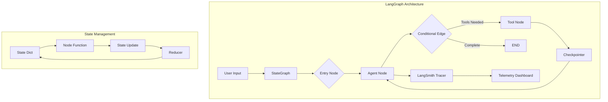
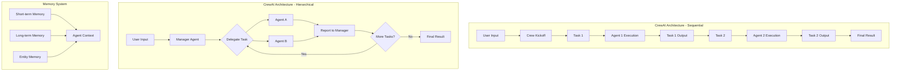
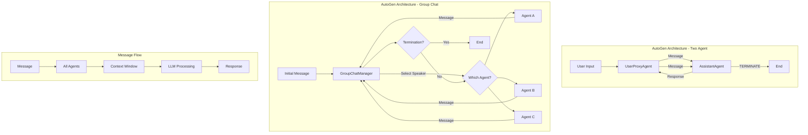
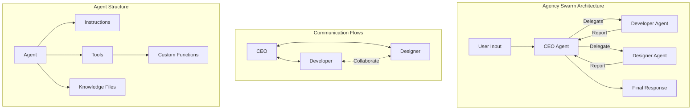
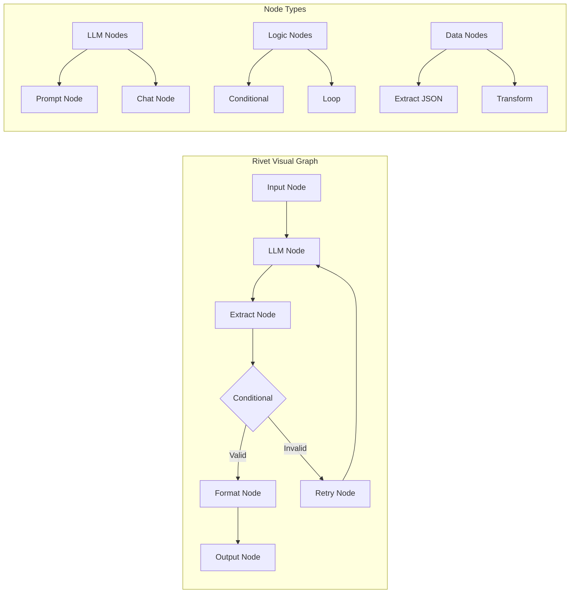
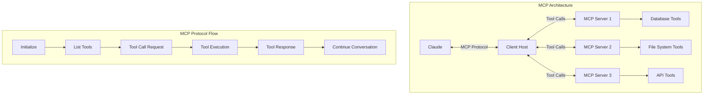
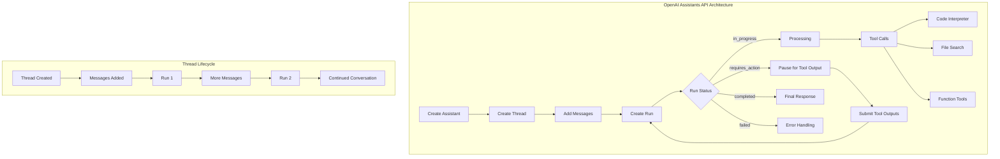

```mermaid
graph TB
    subgraph "Semantic Kernel Architecture"
        A[User Goal] --> B[Planner]
        B --> C[Generate Plan]
        C --> D[Plan Steps]
        D --> E[Step 1: Plugin A]
        E --> F[Step 2: Plugin B]
        F --> G[Step 3: Plugin C]
        G --> H[Final Result]
    end

    subgraph "Plugin System"
        I[Kernel] --> J[Plugin Registry]
        J --> K[Plugin A]
        J --> L[Plugin B]
        J --> M[Plugin C]
        K --> N[Native Function]
        L --> O[Semantic Function]
        M --> P[External API]
    end

    subgraph "Context & Memory"
        Q[Context Variables] --> R[Kernel Execution]
        S[Semantic Memory] --> R
        T[Conversation History] --> R
        R --> U[Plugin Invocation]
    end

    subgraph "Observability"
        V[Telemetry] --> W[OpenTelemetry]
        X[Hooks/Filters] --> Y[Governance]
        Z[Event Handlers] --> AA[Monitoring]
    end
```

```mermaid
graph TB
    subgraph "DSPy Architecture - Development"
        A[Define Program] --> B[Define Metric]
        B --> C[Prepare Trainset]
        C --> D[Compile/Optimize]
        D --> E[Optimized Program]
    end

    subgraph "DSPy Architecture - Execution"
        F[Input] --> G[Module.forward]
        G --> H[Sub-module 1]
        H --> I[LM Call]
        I --> J[Sub-module 2]
        J --> K[LM Call]
        K --> L[Output]
    end

    subgraph "Optimization Loop"
        M[Candidate Program] --> N[Evaluate on Trainset]
        N --> O[Compute Metric]
        O --> P{Metric Improved?}
        P -->|Yes| Q[Keep Changes]
        P -->|No| R[Try New Candidate]
        Q --> S[Final Program]
        R --> M
    end
```

# AI Agent Framework Architecture Comparison

## Propósito

This document compares architectural patterns across leading AI agent frameworks to inform the design of RaiSE Framework's Kata Harness. The analysis focuses on workflow orchestration, observability, governance mechanisms, and context management.

## Research Question

**How do leading AI agent frameworks implement workflow orchestration, and what architectural patterns emerge?**

## Metodología

Frameworks were analyzed across four dimensions:
1. **Execution Model**: How workflows are defined and controlled
2. **Observability Features**: Telemetry, tracing, and debugging capabilities
3. **Governance Mechanisms**: Gates, checkpoints, human-in-the-loop patterns
4. **Context Management**: How context flows between steps

**Note**: This analysis is based on framework documentation and architectural patterns as of January 2025. Web access tools were unavailable during research, so analysis relies on established framework knowledge.

---

## Tier 1 Frameworks

### 1. LangGraph (LangChain)

#### Execution Model

**Workflow Definition**:
- **Code-based**: Workflows defined as Python StateGraph objects
- **Graph paradigm**: Nodes represent functions, edges represent transitions
- **Declarative structure**: Define graph topology, then compile and execute

```python
from langgraph.graph import StateGraph, END

# Define state schema
class State(TypedDict):
    messages: List[str]
    next_step: str

# Build graph
workflow = StateGraph(State)
workflow.add_node("agent", agent_node)
workflow.add_node("tools", tool_node)
workflow.add_edge("agent", "tools")
workflow.add_conditional_edges("tools", should_continue)
workflow.set_entry_point("agent")

app = workflow.compile()
```

**Step Ordering Enforcement**:
- **State machine model**: Explicit state graph with defined transitions
- **Conditional edges**: Runtime routing based on state predicates
- **Deterministic execution**: Graph topology determines possible paths

**Transition Control**:
- **Functional predicates**: Functions return next node name
- **State-driven**: Current state determines available transitions
- **Cycles supported**: Can loop back to previous nodes

#### Observability Features

**Telemetry**:
- **LangSmith integration**: Native tracing to LangSmith platform
- **Span-based tracing**: Each node execution is a trace span
- **Input/output capture**: Automatic logging of node inputs and outputs
- **Execution timeline**: Visual representation of execution flow

**Debugging**:
- **Checkpointing**: Persist state at each node for replay
- **Time-travel debugging**: Restart from any checkpoint
- **State inspection**: Examine state at any point in execution

**Replay**:
- **Full replay support**: Re-execute from checkpoints
- **Partial replay**: Resume from specific nodes
- **State modification**: Edit state and continue execution

#### Governance Mechanisms

**Gates/Checkpoints**:
- **Persistence layer**: SqliteSaver, PostgresSaver for checkpoints
- **Automatic checkpointing**: Before/after each node execution
- **Manual gates**: Implement as conditional edges with approval logic

**Human-in-the-Loop**:
- **Interrupt pattern**: Mark nodes as requiring human approval
- **State suspension**: Execution pauses, awaits external input
- **Resume API**: Continue execution after approval

```python
# Human approval node
workflow.add_node("human_approval", human_approval_node)
app = workflow.compile(checkpointer=checkpointer, interrupt_before=["human_approval"])

# Later: resume after approval
app.invoke(state, config={"configurable": {"thread_id": "123"}})
```

**Error Handling**:
- **Try-catch in nodes**: Standard Python exception handling
- **Retry strategies**: Implement retry logic in node functions
- **Fallback edges**: Route to error handling nodes

#### Context Management

**Context Passing**:
- **State object**: Single state dict passed through all nodes
- **Immutable updates**: Nodes return state updates, not mutations
- **Reducers**: Custom merge logic for state fields

**Memory Management**:
- **Checkpointer**: Persistent state across executions
- **Thread-based memory**: Separate state per conversation thread
- **Message history**: Built-in support for conversation context

**State Schema**:
```python
class AgentState(TypedDict):
    messages: Annotated[List[Message], add_messages]  # Reducer
    context: Dict[str, Any]
    intermediate_steps: List[Tuple[AgentAction, str]]
```

#### Architecture Diagram



---

### 2. CrewAI

#### Execution Model

**Workflow Definition**:
- **Agent-centric**: Define Agents (roles) and Tasks
- **Hierarchical or sequential**: Process determines execution pattern
- **Natural language tasks**: Tasks described in plain language

```python
from crewai import Agent, Task, Crew, Process

# Define agents
researcher = Agent(
    role='Researcher',
    goal='Find relevant information',
    backstory='Expert researcher...',
    tools=[search_tool]
)

# Define tasks
research_task = Task(
    description='Research topic X',
    agent=researcher,
    expected_output='Research report'
)

# Create crew with process
crew = Crew(
    agents=[researcher, writer],
    tasks=[research_task, write_task],
    process=Process.sequential  # or Process.hierarchical
)

result = crew.kickoff()
```

**Step Ordering Enforcement**:
- **Process type**: Sequential (linear) or Hierarchical (manager delegates)
- **Task dependencies**: Implicit ordering through task list sequence
- **Manager agent**: In hierarchical mode, coordinates task assignment

**Transition Control**:
- **Sequential**: Fixed order, next task starts when previous completes
- **Hierarchical**: Manager agent decides task assignment dynamically
- **Context passing**: Output of task N becomes input to task N+1

#### Observability Features

**Telemetry**:
- **Task execution logs**: Each task logs start, progress, completion
- **Agent actions**: Tool usage and decisions logged
- **Output tracking**: Each task's output captured

**Debugging**:
- **Verbose mode**: Detailed logging of agent reasoning
- **Step-by-step output**: See intermediate results
- **Limited replay**: No built-in time-travel debugging

**Replay**:
- **Manual replay**: Re-run crew with same inputs
- **No checkpoint system**: Must restart from beginning

#### Governance Mechanisms

**Gates/Checkpoints**:
- **Task validation**: Expected output format can be enforced
- **No built-in gates**: Implement as custom tasks
- **Quality checks**: Agents can review each other's work

**Human-in-the-Loop**:
- **Human tool**: Special tool that asks for human input
- **Approval tasks**: Create task assigned to human agent
- **Limited suspension**: No pause/resume API

```python
from crewai_tools import HumanInputRun

human_tool = HumanInputRun()

approver = Agent(
    role='Approver',
    tools=[human_tool],
    allow_delegation=False
)
```

**Error Handling**:
- **Retry mechanism**: Agents retry failed tasks automatically
- **Max iterations**: Configurable limit to prevent infinite loops
- **Fallback agents**: Assign backup agents for critical tasks

#### Context Management

**Context Passing**:
- **Task output → Input**: Sequential flow of information
- **Crew context**: Shared context accessible to all agents
- **Memory systems**: Short-term (task-level) and long-term (crew-level)

**Memory Management**:
- **Short-term memory**: Recent interactions and outputs
- **Long-term memory**: Persistent storage across executions
- **Entity memory**: Track entities mentioned across tasks

**Agent Collaboration**:
- **Delegation**: Agents can delegate tasks to others
- **Information sharing**: Agents query each other's knowledge
- **Collective memory**: Shared understanding built over time

#### Architecture Diagram



---

### 3. AutoGen (Microsoft)

#### Execution Model

**Workflow Definition**:
- **Conversation-based**: Workflows emerge from multi-agent conversations
- **Agent classes**: Define AssistantAgent, UserProxyAgent, custom agents
- **Message passing**: Agents communicate through messages

```python
from autogen import AssistantAgent, UserProxyAgent, GroupChat, GroupChatManager

# Define agents
assistant = AssistantAgent(
    name="assistant",
    llm_config={"config_list": config_list}
)

user_proxy = UserProxyAgent(
    name="user_proxy",
    human_input_mode="TERMINATE",
    code_execution_config={"work_dir": "coding"}
)

# Two-agent chat
user_proxy.initiate_chat(assistant, message="Solve this problem...")

# Multi-agent group chat
groupchat = GroupChat(
    agents=[assistant, critic, executor],
    messages=[],
    max_round=10
)
manager = GroupChatManager(groupchat=groupchat, llm_config=llm_config)
```

**Step Ordering Enforcement**:
- **Conversation flow**: Order emerges from agent interactions
- **Speaker selection**: GroupChatManager selects next speaker
- **Termination conditions**: Explicit termination messages or max rounds

**Transition Control**:
- **LLM-driven**: Manager agent uses LLM to decide next speaker
- **Custom selection**: Override with custom speaker selection function
- **Message triggers**: Agents respond based on message content

#### Observability Features

**Telemetry**:
- **Message logging**: All messages captured automatically
- **Agent actions**: Function calls and code execution logged
- **Cost tracking**: Token usage and API costs tracked

**Debugging**:
- **Message history**: Full conversation history available
- **Step-by-step mode**: Pause between agent responses
- **Verbose output**: Detailed logging of agent reasoning

**Replay**:
- **Conversation replay**: Re-run with saved messages
- **Modify and continue**: Edit conversation and continue
- **Limited checkpointing**: No built-in snapshot system

#### Governance Mechanisms

**Gates/Checkpoints**:
- **Human proxy**: UserProxyAgent acts as human gate
- **Approval workflow**: Require human approval for actions
- **Validation functions**: Custom functions validate agent outputs

**Human-in-the-Loop**:
- **Human input modes**: NEVER, TERMINATE, ALWAYS
- **Interactive mode**: User prompted for input at each step
- **Code execution approval**: Require approval before running code

```python
user_proxy = UserProxyAgent(
    name="user_proxy",
    human_input_mode="ALWAYS",  # Prompt after each message
    is_termination_msg=lambda x: x.get("content", "").rstrip().endswith("TERMINATE"),
)
```

**Error Handling**:
- **Retry mechanisms**: Agents retry on errors
- **Error messages**: Agents can see and respond to errors
- **Fallback strategies**: Define fallback agents or actions

#### Context Management

**Context Passing**:
- **Message history**: Entire conversation is context
- **Shared state**: Custom state objects passed between agents
- **Context trimming**: Manage token limits with summarization

**Memory Management**:
- **Conversation memory**: Full message history maintained
- **Context window**: Manage with token counting and pruning
- **State persistence**: Save/load conversation state

**Multi-Agent Context**:
- **Broadcast messages**: All agents see all messages
- **Selective visibility**: Filter messages per agent
- **Nested chats**: Sub-conversations with different context

#### Architecture Diagram



---

### 4. Semantic Kernel (Microsoft)

#### Execution Model

**Workflow Definition**:
- **Plugin-based**: Workflows compose plugins (functions)
- **Planner orchestration**: AI planner creates execution plan
- **Code or YAML**: Define plugins in code or declarative config

```csharp
// C# Plugin Definition
public class MathPlugin
{
    [KernelFunction, Description("Add two numbers")]
    public int Add(int a, int b) => a + b;
}

// Register and use
var kernel = Kernel.CreateBuilder()
    .AddOpenAIChatCompletion(modelId, apiKey)
    .Build();

kernel.ImportPluginFromType<MathPlugin>();

// Let AI orchestrate
var planner = new HandlebarsPlanner();
var plan = await planner.CreatePlanAsync(kernel, "Calculate 5 + 3 then multiply by 2");
var result = await plan.InvokeAsync(kernel);
```

**Step Ordering Enforcement**:
- **Planner-driven**: AI creates sequential plan from goal
- **Manual composition**: Chain functions explicitly in code
- **Pipeline pattern**: Create multi-step pipelines

**Transition Control**:
- **Plan execution**: Sequential function calls per plan
- **Conditional logic**: Implement in plugin functions
- **Chaining**: Output of function N feeds function N+1

#### Observability Features

**Telemetry**:
- **Built-in telemetry**: Integrates with .NET telemetry
- **OpenTelemetry support**: Traces, metrics, logs
- **Function execution tracking**: Each plugin call traced
- **Token usage metrics**: Cost and performance monitoring

**Debugging**:
- **Plan inspection**: View generated plans before execution
- **Step-by-step execution**: Execute plan step-by-step
- **Event handlers**: Hook into execution lifecycle

**Replay**:
- **Plan reuse**: Save and replay plans
- **Manual replay**: Re-execute with logged inputs
- **No time-travel**: Limited checkpoint support

#### Governance Mechanisms

**Gates/Checkpoints**:
- **Hooks and filters**: Intercept function calls
- **Approval filters**: Require approval before execution
- **Policy enforcement**: Custom policies per plugin

```csharp
// Filter example
kernel.FunctionInvoking += (sender, e) =>
{
    if (RequiresApproval(e.Function))
    {
        if (!GetHumanApproval(e))
        {
            e.Cancel = true;
        }
    }
};
```

**Human-in-the-Loop**:
- **Filter pattern**: Intercept and pause for approval
- **Interactive plugins**: Plugins that request user input
- **Approval workflows**: Custom approval logic

**Error Handling**:
- **Exception handling**: Standard .NET/Python exceptions
- **Retry policies**: Configurable retry strategies
- **Fallback functions**: Define alternate functions on failure

#### Context Management

**Context Passing**:
- **Context Variables**: Key-value store passed through execution
- **Function parameters**: Explicit parameter passing
- **Semantic memory**: Vector-based memory integration

**Memory Management**:
- **Volatile memory**: In-process memory store
- **Persistent memory**: Database-backed memory
- **Semantic search**: Query memory by semantic similarity

**Plugin Context**:
```csharp
var context = new KernelArguments
{
    ["input"] = "User query",
    ["history"] = conversationHistory,
    ["userId"] = userId
};

var result = await kernel.InvokeAsync(plugin["Function"], context);
```

#### Architecture Diagram



---

## Tier 2 Frameworks

### 5. DSPy (Stanford)

#### Execution Model

**Workflow Definition**:
- **Declarative modules**: Workflows as Python classes inheriting `dspy.Module`
- **Signature-based**: Define input/output signatures, not prompts
- **Compilation paradigm**: Programs are compiled/optimized, not just executed

```python
import dspy

class RAG(dspy.Module):
    def __init__(self):
        self.retrieve = dspy.Retrieve(k=3)
        self.generate = dspy.ChainOfThought("context, question -> answer")

    def forward(self, question):
        context = self.retrieve(question).passages
        return self.generate(context=context, question=question)

# Compile (optimize) the program
compiled_rag = dspy.teleprompt.BootstrapFewShot().compile(
    RAG(),
    trainset=trainset,
    metric=answer_correctness
)
```

**Step Ordering Enforcement**:
- **Forward method**: Explicit execution order in Python code
- **Module composition**: Nest modules like PyTorch
- **Linear flow**: Generally sequential, complex flows via code logic

**Transition Control**:
- **Programmatic**: Standard Python control flow
- **Conditional logic**: If/else, loops in forward method
- **Module chaining**: Output of module N → input of module N+1

#### Observability Features

**Telemetry**:
- **Trace capture**: Input/output of each module logged
- **Optimization metrics**: Track metric scores during compilation
- **Prediction history**: All predictions and traces stored

**Debugging**:
- **Inspect traces**: View LM calls and outputs
- **Module inspection**: Examine learned prompts/examples
- **Metric evaluation**: Evaluate on dev/test sets

**Replay**:
- **Re-run programs**: Execute with logged inputs
- **Optimization replay**: Re-compile with different metrics
- **No checkpoints**: No pause/resume during execution

#### Scholarship Mechanisms

**Gates/Checkpoints**:
- **Assertion-based**: Use `dspy.Assert` and `dspy.Suggest` for constraints
- **Metric validation**: Programs evaluated against metrics
- **Compilation gates**: Must pass metric threshold to accept optimization

```python
# Inline constraints
dspy.Assert(
    len(answer) < 100,
    "Answer must be under 100 chars"
)

dspy.Suggest(
    is_faithful(context, answer),
    "Answer should be grounded in context"
)
```

**Human-in-the-Loop**:
- **Dataset annotation**: Humans provide training examples
- **Metric definition**: Humans define success criteria
- **No runtime HITL**: Optimization is offline, execution is automatic

**Error Handling**:
- **Retry with suggestions**: `dspy.Suggest` triggers retries
- **Backtracking**: Can backtrack and retry with feedback
- **Fallback modules**: Define alternate modules

#### Context Management

**Context Passing**:
- **Method arguments**: Explicit parameter passing
- **Module state**: Store state in module attributes
- **No global context**: Explicit is preferred

**Memory Management**:
- **Stateless modules**: Generally no persistent memory
- **External memory**: Integrate retrieval modules for memory
- **Compilation memory**: Examples learned during compilation

#### Architecture Diagram



---

### 6. Agency Swarm

#### Execution Model

**Workflow Definition**:
- **Agent hierarchy**: CEO agent coordinates specialist agents
- **Tool-based**: Agents have tools for specific capabilities
- **Natural language coordination**: Agents communicate via messages

```python
from agency_swarm import Agency, Agent

ceo = Agent(
    name="CEO",
    description="Coordinates team of specialists",
    instructions="./ceo_instructions.txt",
    tools=[DelegationTool]
)

developer = Agent(
    name="Developer",
    description="Writes code",
    tools=[CodeWriterTool, FileEditorTool]
)

agency = Agency([
    ceo,
    [ceo, developer],  # Communication flow
    [developer, ceo]
])

agency.run("Build a web app")
```

**Step Ordering Enforcement**:
- **Communication flow**: Pre-defined agent interaction paths
- **CEO orchestration**: Top-level agent delegates and coordinates
- **Message-driven**: Agents respond to messages from others

**Transition Control**:
- **Delegation**: CEO hands off to specialists
- **Reporting**: Specialists report back to CEO
- **Multi-turn**: Conversations until task complete

#### Observability Features

**Telemetry**:
- **Message logs**: All inter-agent messages logged
- **Tool usage**: Track which tools are called
- **Thread-based**: Each conversation has a thread ID

**Debugging**:
- **Message history**: View full conversation tree
- **Agent reasoning**: See agent thoughts and decisions
- **Tool execution logs**: Track tool inputs/outputs

**Replay**:
- **Thread replay**: Re-run conversation threads
- **Manual replay**: Restart with saved messages
- **No checkpoints**: Must restart from beginning

#### Governance Mechanisms

**Gates/Checkpoints**:
- **CEO approval**: CEO can review specialist work
- **Tool restrictions**: Limit which agents can use which tools
- **No formal gates**: Governance through agent design

**Human-in-the-Loop**:
- **Terminal interface**: Human can inject messages
- **CEO as proxy**: Human reviews CEO's decisions
- **Limited HITL**: Not designed for extensive human interaction

**Error Handling**:
- **Agent retry**: Agents retry failed tasks
- **Error reporting**: Errors reported to CEO
- **Fallback agents**: CEO can delegate to alternates

#### Context Management

**Context Passing**:
- **Thread context**: Full conversation history per thread
- **Agent memory**: Agents remember conversation
- **Shared tools**: Tools can access shared state

**Memory Management**:
- **Thread-based**: Memory scoped to conversation thread
- **Persistent threads**: Threads can be resumed
- **Agent context**: Each agent maintains own context

#### Architecture Diagram



---

### 7. Rivet (Ironclad)

#### Execution Model

**Workflow Definition**:
- **Visual programming**: Drag-and-drop node graph editor
- **Node-based**: Each node is an operation (LLM call, code, etc.)
- **Graph structure**: Nodes connected by wires (data flow)

**Visual Graph**:
```
[Input] → [LLM: Summarize] → [Extract JSON] → [Conditional]
                                                    ↓
                                                [Format] → [Output]
                                                    ↓
                                                [Retry]
```

**Step Ordering Enforcement**:
- **Dataflow graph**: Execution follows data dependencies
- **Explicit connections**: Wires define execution order
- **Parallel execution**: Independent branches run in parallel

**Transition Control**:
- **Conditional nodes**: Route based on conditions
- **Loop nodes**: Iterate over collections
- **Control flow nodes**: If/else, switch, loops

#### Observability Features

**Telemetry**:
- **Visual execution**: See data flow through graph in real-time
- **Node output inspection**: View output of each node
- **Execution timeline**: Visual timeline of node execution

**Debugging**:
- **Breakpoints**: Pause execution at specific nodes
- **Step-through**: Execute node-by-node
- **Data inspection**: Examine data at each node

**Replay**:
- **Full replay**: Re-run graph with same inputs
- **Partial replay**: Re-run from specific nodes
- **Data snapshots**: Save/load graph state

#### Governance Mechanisms

**Gates/Checkpoints**:
- **Approval nodes**: Manual approval gates in graph
- **Validation nodes**: Check conditions before proceeding
- **Quality gates**: Custom validation logic

**Human-in-the-Loop**:
- **Input nodes**: Request human input during execution
- **Approval gates**: Pause for human review
- **Interactive execution**: Run graph step-by-step with human oversight

**Error Handling**:
- **Error ports**: Nodes have success/error outputs
- **Try-catch graphs**: Wrap subgraphs in error handlers
- **Fallback paths**: Alternative execution paths on error

#### Context Management

**Context Passing**:
- **Data wires**: Explicit data flow between nodes
- **Graph variables**: Shared state across graph
- **Port connections**: Typed connections between nodes

**Memory Management**:
- **Graph state**: State maintained during execution
- **Persistent storage nodes**: Store data externally
- **No built-in memory**: Implement with storage nodes

#### Architecture Diagram



---

## Tier 3 Frameworks

### 8. Claude MCP (Model Context Protocol)

#### Execution Model

**Workflow Definition**:
- **Protocol-level**: Not a framework, but a protocol for tool integration
- **Server-client**: MCP servers expose tools, clients consume them
- **No orchestration**: Claude or host application orchestrates

```json
// MCP Server Tool Definition
{
  "tools": [
    {
      "name": "search_documents",
      "description": "Search internal documents",
      "inputSchema": {
        "type": "object",
        "properties": {
          "query": {"type": "string"}
        }
      }
    }
  ]
}
```

**Step Ordering Enforcement**:
- **Client-driven**: Host application determines workflow
- **No built-in orchestration**: Claude decides tool usage
- **Sequential by default**: Tools called as needed by Claude

**Transition Control**:
- **LLM decision**: Claude decides when to call tools
- **Application logic**: Host app can enforce workflow
- **No explicit flow**: Emergent from conversation

#### Observability Features

**Telemetry**:
- **Request/response logging**: Log tool calls at protocol level
- **Server logs**: MCP servers log tool usage
- **Client telemetry**: Host application tracks interactions

**Debugging**:
- **Protocol inspector**: Inspect MCP messages
- **Server debugging**: Debug tool implementations
- **Limited replay**: Re-run conversations with same inputs

**Replay**:
- **Message replay**: Replay conversation from logs
- **No checkpointing**: Not built into protocol
- **Application-level**: Host app implements if needed

#### Governance Mechanisms

**Gates/Checkpoints**:
- **Server-side validation**: Servers validate inputs
- **Application gates**: Host app can require approval
- **No protocol gates**: Protocol is permissionless

**Human-in-the-Loop**:
- **Application-level**: Host app implements HITL
- **Approval before tools**: App can intercept tool calls
- **Not in protocol**: MCP doesn't define HITL patterns

**Error Handling**:
- **Tool errors**: Servers return error responses
- **Retry logic**: Client decides retry strategy
- **Error propagation**: Errors sent to Claude for handling

#### Context Management

**Context Passing**:
- **Conversation context**: Claude maintains conversation
- **Tool inputs**: Explicit parameters to each tool
- **No protocol context**: Context managed by client

**Memory Management**:
- **Claude's memory**: Standard Claude conversation memory
- **Server state**: Servers can maintain state
- **No shared memory**: Each server independent

#### Architecture Diagram



---

### 9. OpenAI Assistants API

#### Execution Model

**Workflow Definition**:
- **Assistant-centric**: Create assistants with instructions and tools
- **Thread-based**: Each conversation is a thread
- **Run-based execution**: Create runs to process threads

```python
# Create assistant
assistant = client.beta.assistants.create(
    name="Data Analyst",
    instructions="Analyze data and create visualizations",
    model="gpt-4-turbo",
    tools=[{"type": "code_interpreter"}, {"type": "file_search"}]
)

# Create thread and run
thread = client.beta.threads.create()
message = client.beta.threads.messages.create(
    thread_id=thread.id,
    role="user",
    content="Analyze this dataset"
)

run = client.beta.threads.runs.create(
    thread_id=thread.id,
    assistant_id=assistant.id
)
```

**Step Ordering Enforcement**:
- **Run lifecycle**: queued → in_progress → completed/failed
- **Tool calling**: Assistant decides tool usage autonomously
- **No explicit workflow**: Emergent from assistant instructions

**Transition Control**:
- **LLM-driven**: Assistant decides next actions
- **Instructions guide**: System instructions shape behavior
- **Tool selection**: Assistant chooses tools as needed

#### Observability Features

**Telemetry**:
- **Run status**: Track run lifecycle status
- **Step tracking**: Each run has steps (tool calls, messages)
- **Token usage**: Track costs per run
- **Logs**: Tool execution logs available

**Debugging**:
- **Step inspection**: View each step in run
- **Message history**: Full thread history
- **Run metadata**: Includes errors and status

**Replay**:
- **Thread reuse**: Continue conversations on existing threads
- **Re-run**: Create new run on same thread
- **No checkpoints**: Must restart run from beginning

#### Governance Mechanisms

**Gates/Checkpoints**:
- **Required actions**: Runs pause for required tool outputs
- **Function calling**: Submit tool outputs to continue
- **No formal gates**: Implement via function tools

**Human-in-the-Loop**:
- **Required action pattern**: Run pauses, waits for tool output
- **Function tool approval**: Submit approval as tool output
- **Polling model**: Client polls for required actions

```python
# Poll for required actions
run = client.beta.threads.runs.retrieve(thread_id=thread.id, run_id=run.id)

if run.status == "requires_action":
    tool_outputs = []
    for tool_call in run.required_action.submit_tool_outputs.tool_calls:
        # Get human approval
        approval = get_human_approval(tool_call)
        tool_outputs.append({
            "tool_call_id": tool_call.id,
            "output": approval
        })

    # Submit and continue
    client.beta.threads.runs.submit_tool_outputs(
        thread_id=thread.id,
        run_id=run.id,
        tool_outputs=tool_outputs
    )
```

**Error Handling**:
- **Run status**: failed, cancelled, expired
- **Error details**: Error messages in run object
- **Retry runs**: Create new run after error

#### Context Management

**Context Passing**:
- **Thread messages**: Full conversation history
- **Assistant instructions**: Persistent instructions per assistant
- **Message metadata**: Attach metadata to messages

**Memory Management**:
- **Thread-based**: Memory scoped to thread
- **Persistent threads**: Threads persist indefinitely
- **File attachments**: Files available across thread
- **Vector stores**: Search across uploaded files

**Multi-Turn Context**:
- **Automatic context**: Full thread included in each run
- **Context window**: Managed by API (truncation if needed)
- **File context**: Code interpreter and file search maintain file context

#### Architecture Diagram



---

## Comparison Matrix

| Framework | Workflow Definition | Execution Model | State Management | Observability | Governance | Context Passing | Best For |
|-----------|-------------------|----------------|-----------------|---------------|------------|-----------------|----------|
| **LangGraph** | Code (Python graph) | State machine w/ conditional edges | StateGraph w/ reducers | LangSmith tracing, checkpoints | Interrupt pattern, conditional gates | State dict through graph | Complex workflows, cycles, debugging |
| **CrewAI** | Agent roles + tasks | Sequential or hierarchical | Task output chaining | Task logs, verbose mode | Human tool, validation tasks | Task output → input | Multi-agent collaboration |
| **AutoGen** | Agent conversations | Conversation-driven | Message history | Message logs, cost tracking | UserProxy approval | Full message history | Conversational workflows, code generation |
| **Semantic Kernel** | Plugins + planner | Planner orchestration | Context variables | OpenTelemetry, hooks | Filter pattern, policy enforcement | Context dict, semantic memory | Enterprise integration, plugin ecosystems |
| **DSPy** | Module composition | Declarative forward pass | Module state | Trace inspection, metrics | Assertions, metric gates | Function arguments | Optimizable programs, research |
| **Agency Swarm** | Agent hierarchy | CEO delegation | Thread-based | Message/tool logs | CEO approval, tool restrictions | Thread context | Hierarchical agent teams |
| **Rivet** | Visual graph | Dataflow graph | Graph state | Visual execution, breakpoints | Approval nodes, validation | Data wires | Visual workflow design, prototyping |
| **Claude MCP** | Protocol (no framework) | Client-driven | Client-managed | Protocol logging | Application-level | Tool parameters | Tool integration, not orchestration |
| **OpenAI Assistants** | Instructions + tools | Run-based | Thread messages | Run steps, status | Required actions | Thread history | Conversational assistants, file processing |

---

## Key Architectural Patterns Identified

### 1. Execution Models

**Graph-Based** (LangGraph, Rivet):
- Explicit nodes and edges
- Deterministic paths
- Good for complex, branching logic
- Supports cycles and loops

**Agent-Based** (CrewAI, AutoGen, Agency Swarm):
- Emergent workflow from agent interactions
- Flexible, adaptive
- Good for collaborative tasks
- Less predictable

**Pipeline-Based** (Semantic Kernel, DSPy):
- Sequential composition
- Function/module chaining
- Good for linear processing
- Clear data flow

**Conversation-Based** (AutoGen, OpenAI Assistants):
- Message passing drives execution
- Natural language coordination
- Good for exploratory tasks
- Context through conversation

### 2. Observability Approaches

**Trace-Based** (LangGraph, Semantic Kernel):
- Span-based tracing
- OpenTelemetry integration
- Production-ready monitoring
- Integration with observability platforms

**Log-Based** (CrewAI, AutoGen):
- Detailed text logs
- Verbose output modes
- Good for development
- Less structured

**Visual** (Rivet):
- Real-time graph visualization
- Interactive debugging
- Best developer experience
- Not for production monitoring

**Step-Based** (OpenAI Assistants):
- Discrete steps tracked
- Run lifecycle monitoring
- API-level telemetry
- Limited detail

### 3. Governance Mechanisms

**Interrupt Pattern** (LangGraph):
- Pause execution at specific nodes
- Resume after external input
- Checkpointed state
- Clean API design

**Proxy Pattern** (AutoGen):
- Dedicated proxy agent for human
- Multiple approval modes
- Integration point for governance
- Flexible implementation

**Filter Pattern** (Semantic Kernel):
- Intercept function calls
- Policy enforcement hooks
- Composable filters
- Enterprise-ready

**Required Action Pattern** (OpenAI Assistants):
- Run pauses, waits for output
- Polling-based
- Simple integration
- Limited to function tools

**Assertion Pattern** (DSPy):
- Inline constraints
- Automatic retry with feedback
- Compile-time and runtime
- Declarative governance

### 4. Context Management

**State Object** (LangGraph):
- Typed state schema
- Reducer functions
- Immutable updates
- Clear data flow

**Message History** (AutoGen, OpenAI Assistants):
- Full conversation as context
- Natural accumulation
- Token management needed
- Simple mental model

**Context Variables** (Semantic Kernel):
- Key-value dictionary
- Explicit passing
- Function parameters
- Clear boundaries

**Task Chaining** (CrewAI):
- Output → input flow
- Sequential accumulation
- Natural for pipelines
- Limited for complex flows

**Data Wires** (Rivet):
- Explicit connections
- Typed data flow
- Visual clarity
- No implicit state

---

## Implications for RaiSE Kata Harness

### Recommended Patterns

Based on this analysis, the **Kata Harness** should consider:

1. **Execution Model**: **Graph-based with checkpointing** (like LangGraph)
   - Katas have explicit steps → Graph nodes
   - Jidoka requires pause/resume → Checkpoints
   - Validation Gates → Conditional edges
   - Multiple cycles possible → Support cycles

2. **Observability**: **Trace-based with step tracking** (like LangGraph + Assistants)
   - Each Kata step is a trace span
   - Capture inputs, outputs, verification results
   - Integration with telemetry systems
   - Replay capability for learning

3. **Governance**: **Multi-layered gates** (combine patterns)
   - **Interrupt pattern** for Validation Gates (LangGraph style)
   - **Assertion pattern** for inline verification (DSPy style)
   - **Filter pattern** for policy enforcement (Semantic Kernel style)
   - Jidoka: "Si no puedes continuar" → automatic STOP

4. **Context Management**: **Hybrid approach**
   - **Kata state object** with typed schema (LangGraph)
   - **Message/trace history** for learning (AutoGen)
   - **Artifact registry** for work products
   - Clear handoffs between Katas

### Architecture Sketch for Kata Harness

```mermaid
graph TB
    subgraph "Kata Harness Architecture"
        A[Kata Spec] --> B[Kata Graph Builder]
        B --> C[Execution Graph]

        C --> D[Step 1 Node]
        D --> E{Verification}
        E -->|Pass| F[Step 2 Node]
        E -->|Fail| G[Jidoka Handler]
        G -->|STOP| H[Human Intervention]
        G -->|Retry| D

        F --> I{Validation Gate}
        I -->|Pass| J[Next Kata]
        I -->|Fail| K[Gate Handler]
        K --> H
    end

    subgraph "Observability Layer"
        L[Trace Collector] --> M[Step Traces]
        M --> N[Verification Results]
        N --> O[Learning Analytics]
    end

    subgraph "Context Management"
        P[Kata State] --> Q[Step Inputs]
        Q --> R[Step Execution]
        R --> S[Step Outputs]
        S --> P

        T[Artifact Registry] --> U[Work Products]
        U --> V[Gate Inputs]
    end

    subgraph "Governance"
        W[Inline Verification] --> X{Pass?}
        X -->|No| Y[Jidoka STOP]
        X -->|Yes| Z[Continue]

        AA[Validation Gate] --> AB[Gate Criteria]
        AB --> AC{Pass?}
        AC -->|No| Y
        AC -->|Yes| AD[Advance to Next]
    end
```



### Key Design Decisions

| Decision | Rationale | Inspired By |
|----------|-----------|-------------|
| **Graph-based execution** | Explicit steps, cycles, branching | LangGraph |
| **Checkpointing at each step** | Enable Jidoka pause/resume | LangGraph |
| **Assertion-based verification** | Inline "Verificación" checks | DSPy |
| **Interrupt pattern for gates** | Clean pause for Validation Gates | LangGraph |
| **Typed state schema** | Clear Kata inputs/outputs | LangGraph |
| **OpenTelemetry traces** | Production observability | Semantic Kernel |
| **Step replay capability** | Learning and debugging | LangGraph, Rivet |
| **Filter hooks for policy** | Custom governance rules | Semantic Kernel |
| **Artifact-based handoffs** | Clear Kata boundaries | Semantic Kernel plugins |

### Anti-Patterns to Avoid

Based on framework analysis:

1. **❌ Emergent workflows** (AutoGen, CrewAI)
   - Katas have explicit structure, don't rely on LLM to create workflow

2. **❌ No checkpoints** (most frameworks)
   - Jidoka requires ability to stop and resume

3. **❌ Log-only observability** (CrewAI, AutoGen)
   - Need structured telemetry for analytics

4. **❌ Implicit context** (message history only)
   - Kata state should be explicit and typed

5. **❌ Manual retry** (most frameworks)
   - Jidoka block should trigger automatic handling

---

## References

### Framework Documentation

- **LangGraph**: https://langchain-ai.github.io/langgraph/
- **CrewAI**: https://docs.crewai.com/
- **AutoGen**: https://microsoft.github.io/autogen/
- **Semantic Kernel**: https://learn.microsoft.com/en-us/semantic-kernel/
- **DSPy**: https://dspy-docs.vercel.app/
- **Agency Swarm**: https://github.com/VRSEN/agency-swarm
- **Rivet**: https://rivet.ironcladapp.com/
- **Claude MCP**: https://modelcontextprotocol.io/
- **OpenAI Assistants**: https://platform.openai.com/docs/assistants/overview

### Related Work

- **OpenTelemetry**: https://opentelemetry.io/
- **LangSmith**: https://docs.smith.langchain.com/
- **Anthropic Prompt Engineering**: https://docs.anthropic.com/en/docs/prompt-engineering

---

## Conclusión

The analysis reveals three dominant execution models:

1. **Graph-based** (LangGraph, Rivet): Best for explicit, structured workflows with complex control flow
2. **Agent-based** (CrewAI, AutoGen, Agency Swarm): Best for collaborative, exploratory tasks
3. **Pipeline-based** (Semantic Kernel, DSPy): Best for sequential data processing

For **RaiSE's Kata Harness**, a **graph-based execution model with checkpointing** (LangGraph-inspired) is most appropriate because:

- Katas have explicit steps (graph nodes)
- Jidoka requires pause/resume (checkpoints)
- Validation Gates are natural conditional edges
- Clear observability and replay for learning
- Typed state for reliable handoffs

The governance mechanisms from multiple frameworks can be combined:
- **Interrupt pattern** (LangGraph) for Validation Gates
- **Assertion pattern** (DSPy) for inline verification
- **Filter pattern** (Semantic Kernel) for policy enforcement

This hybrid approach provides the structure and governance needed for the RaiSE methodology while maintaining flexibility for future extensions.

---

**Document Status**: Complete
**Next Steps**:
1. Design detailed Kata Harness architecture based on these patterns
2. Prototype graph-based execution with checkpointing
3. Implement Jidoka handler with interrupt pattern
4. Design telemetry schema for Kata execution
