# Agent Framework Architecture Visual Comparison

## Propósito

This document provides side-by-side visual comparisons of execution flows, governance patterns, and context management strategies across the analyzed AI agent frameworks.

**Companion Document**: `agent-frameworks-architecture-comparison.md`

---

## Execution Flow Comparison

### Linear Pipeline vs Graph-Based

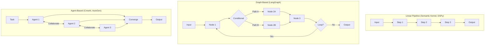

**Key Differences**:
- **Pipeline**: Fixed sequence, no branching
- **Graph**: Explicit branching, cycles, conditional logic
- **Agent**: Emergent flow from collaboration

---

## Governance Pattern Comparison

### Human-in-the-Loop Patterns

```mermaid
graph TB
    subgraph "Interrupt Pattern (LangGraph)"
        A1[Execute Step] --> B1{Interrupt Point?}
        B1 -->|Yes| C1[Checkpoint State]
        C1 --> D1[Pause Execution]
        D1 --> E1[Await Human Input]
        E1 --> F1[Resume from Checkpoint]
        F1 --> G1[Continue]
        B1 -->|No| G1
    end

    subgraph "Proxy Pattern (AutoGen)"
        A2[Agent Message] --> B2[UserProxy Agent]
        B2 --> C2{Approval Mode}
        C2 -->|ALWAYS| D2[Request Human Input]
        C2 -->|TERMINATE| E2[Check Termination]
        C2 -->|NEVER| F2[Auto-continue]
        D2 --> G2[Human Response]
        G2 --> H2[Continue Conversation]
        E2 --> H2
        F2 --> H2
    end

    subgraph "Required Action Pattern (OpenAI Assistants)"
        A3[Run Processing] --> B3{Requires Action?}
        B3 -->|Yes| C3[Pause Run]
        C3 --> D3[Client Polls Status]
        D3 --> E3[Submit Tool Output]
        E3 --> F3[Resume Run]
        B3 -->|No| G3[Complete Run]
        F3 --> G3
    end

    subgraph "Filter Pattern (Semantic Kernel)"
        A4[Function Call] --> B4[Filter Hook]
        B4 --> C4{Policy Check}
        C4 -->|Pass| D4[Execute Function]
        C4 -->|Fail| E4[Block Execution]
        C4 -->|Approval| F4[Request Approval]
        F4 --> G4{Approved?}
        G4 -->|Yes| D4
        G4 -->|No| E4
    end
```

**Pattern Strengths**:
- **Interrupt**: Clean state management, easy resume
- **Proxy**: Flexible modes, conversation-native
- **Required Action**: API-driven, scalable
- **Filter**: Composable, policy-driven

---

## Context Management Comparison

### State Propagation Strategies

```mermaid
graph TB
    subgraph "State Object (LangGraph)"
        A1[Step 1] --> B1[State Update]
        B1 --> C1[Merged State]
        C1 --> D1[Step 2]
        D1 --> E1[State Update]
        E1 --> F1[Merged State]

        style C1 fill:#e1f5ff
        style F1 fill:#e1f5ff
    end

    subgraph "Message History (AutoGen)"
        A2[Agent 1 Message] --> B2[Append to History]
        B2 --> C2[Full History]
        C2 --> D2[Agent 2 Sees All]
        D2 --> E2[Agent 2 Message]
        E2 --> F2[Append to History]
        F2 --> C2

        style C2 fill:#fff4e1
    end

    subgraph "Context Variables (Semantic Kernel)"
        A3[Function 1] --> B3[Context Dict]
        B3 --> C3[Explicit Keys]
        C3 --> D3[Function 2]
        D3 --> E3[Updated Context]
        E3 --> B3

        style B3 fill:#e1ffe1
        style E3 fill:#e1ffe1
    end

    subgraph "Task Output Chain (CrewAI)"
        A4[Task 1] --> B4[Output 1]
        B4 --> C4[Task 2 Input]
        C4 --> D4[Task 2]
        D4 --> E4[Output 2]
        E4 --> F4[Task 3 Input]

        style B4 fill:#ffe1f5
        style E4 fill:#ffe1f5
    end
```

**Trade-offs**:
- **State Object**: Structured, typed, but requires schema design
- **Message History**: Natural, flexible, but token-limited
- **Context Variables**: Explicit, clear, but verbose
- **Task Output Chain**: Simple, linear, but limited for complex flows

---

## Observability Architecture Comparison

### Telemetry Approaches

```mermaid
graph TB
    subgraph "Span-Based Tracing (LangGraph, Semantic Kernel)"
        A1[Start Execution] --> B1[Root Span]
        B1 --> C1[Step 1 Span]
        C1 --> D1[LLM Call Span]
        D1 --> E1[Tool Call Span]
        E1 --> F1[Step 2 Span]
        F1 --> G1[End Span]

        B1 -.->|Parent| C1
        C1 -.->|Parent| D1
        C1 -.->|Parent| E1
        B1 -.->|Parent| F1

        H1[Trace Collector] --> I1[OpenTelemetry]
        I1 --> J1[Analysis Platform]
    end

    subgraph "Log-Based (CrewAI, AutoGen)"
        A2[Task Start] --> B2[Log Entry]
        B2 --> C2[Agent Action] --> D2[Log Entry]
        D2 --> E2[Tool Call] --> F2[Log Entry]
        F2 --> G2[Task End] --> H2[Log Entry]

        I2[Log Aggregator] --> J2[Text Search]
    end

    subgraph "Visual (Rivet)"
        A3[Graph Execution] --> B3[Node Highlight]
        B3 --> C3[Data Flow Animation]
        C3 --> D3[Output Display]
        D3 --> E3[Timeline View]

        F3[Real-time UI] --> G3[Developer Insight]
    end

    subgraph "Step-Based (OpenAI Assistants)"
        A4[Run Created] --> B4[Step 1: Message]
        B4 --> C4[Step 2: Tool Call]
        C4 --> D4[Step 3: Tool Response]
        D4 --> E4[Step 4: Message]
        E4 --> F4[Run Completed]

        G4[API Polling] --> H4[Step Inspection]
    end
```

**Observability Maturity**:
- **Span-Based**: Production-ready, industry-standard
- **Log-Based**: Development-friendly, limited for production
- **Visual**: Best DX, not for production monitoring
- **Step-Based**: API-native, limited granularity

---

## Error Handling & Recovery Patterns

### Retry and Fallback Strategies

```mermaid
graph TB
    subgraph "Assertion with Retry (DSPy)"
        A1[Execute Module] --> B1[Check Assertion]
        B1 -->|Pass| C1[Continue]
        B1 -->|Fail| D1[Generate Feedback]
        D1 --> E1{Retry Count}
        E1 -->|< Max| F1[Retry with Feedback]
        F1 --> A1
        E1 -->|>= Max| G1[Fail]
    end

    subgraph "Error Edge Routing (LangGraph)"
        A2[Execute Node] --> B2{Success?}
        B2 -->|Yes| C2[Success Edge]
        B2 -->|No| D2[Error Edge]
        D2 --> E2[Error Handler Node]
        E2 --> F2{Recoverable?}
        F2 -->|Yes| G2[Retry Node]
        F2 -->|No| H2[Fail Node]
        G2 --> A2
    end

    subgraph "Agent Retry (CrewAI, AutoGen)"
        A3[Task Execution] --> B3{Success?}
        B3 -->|No| C3[Agent Sees Error]
        C3 --> D3[Agent Reasons]
        D3 --> E3{Retry Strategy}
        E3 -->|Retry| F3[Re-attempt Task]
        E3 -->|Delegate| G3[Ask Other Agent]
        E3 -->|Fail| H3[Report Failure]
        F3 --> A3
    end

    subgraph "Exception Handling (Semantic Kernel)"
        A4[Call Function] --> B4[Try Block]
        B4 --> C4{Exception?}
        C4 -->|Yes| D4[Catch Block]
        C4 -->|No| E4[Success]
        D4 --> F4[Retry Policy]
        F4 --> G4{Should Retry?}
        G4 -->|Yes| B4
        G4 -->|No| H4[Fallback Function]
        H4 --> I4{Fallback Success?}
        I4 -->|Yes| E4
        I4 -->|No| J4[Error]
    end
```

**Recovery Sophistication**:
- **Assertion with Retry**: Automatic, feedback-driven
- **Error Edge Routing**: Explicit, flexible
- **Agent Retry**: Emergent, LLM-driven
- **Exception Handling**: Traditional, policy-based

---

## Checkpoint & Resume Patterns

### State Persistence Strategies

```mermaid
graph TB
    subgraph "LangGraph Checkpointing"
        A1[Step N] --> B1[Before Node Execution]
        B1 --> C1[Save Checkpoint]
        C1 --> D1[Execute Node]
        D1 --> E1[After Node Execution]
        E1 --> F1[Save Checkpoint]
        F1 --> G1[Step N+1]

        H1[Resume Request] --> I1[Load Checkpoint]
        I1 --> J1[Continue from Step N]
        J1 --> G1

        style C1 fill:#ffcccc
        style F1 fill:#ffcccc
    end

    subgraph "OpenAI Assistants Thread Persistence"
        A2[Run 1] --> B2[Complete]
        B2 --> C2[Thread Saved]
        C2 --> D2[Later: Run 2]
        D2 --> E2[Load Thread History]
        E2 --> F2[Continue Conversation]

        style C2 fill:#ccccff
    end

    subgraph "Rivet Graph State"
        A3[Execution] --> B3[Graph State]
        B3 --> C3[Export Snapshot]
        C3 --> D3[Save File]

        E3[Import Snapshot] --> F3[Restore State]
        F3 --> G3[Resume Execution]

        style D3 fill:#ccffcc
    end

    subgraph "No Checkpoint (Most Frameworks)"
        A4[Execution Start] --> B4[Step 1]
        B4 --> C4[Step 2]
        C4 --> D4[Error/Stop]

        E4[Restart] --> F4[Must Restart from Beginning]
        F4 --> A4

        style D4 fill:#ffdddd
        style F4 fill:#ffdddd
    end
```

**Checkpoint Capabilities**:
- **LangGraph**: Automatic, granular, production-ready
- **OpenAI Assistants**: Thread-level, conversation-focused
- **Rivet**: Manual snapshots, development tool
- **Most Frameworks**: No built-in checkpointing

---

## Workflow Complexity Support

### Capability Matrix Visualization

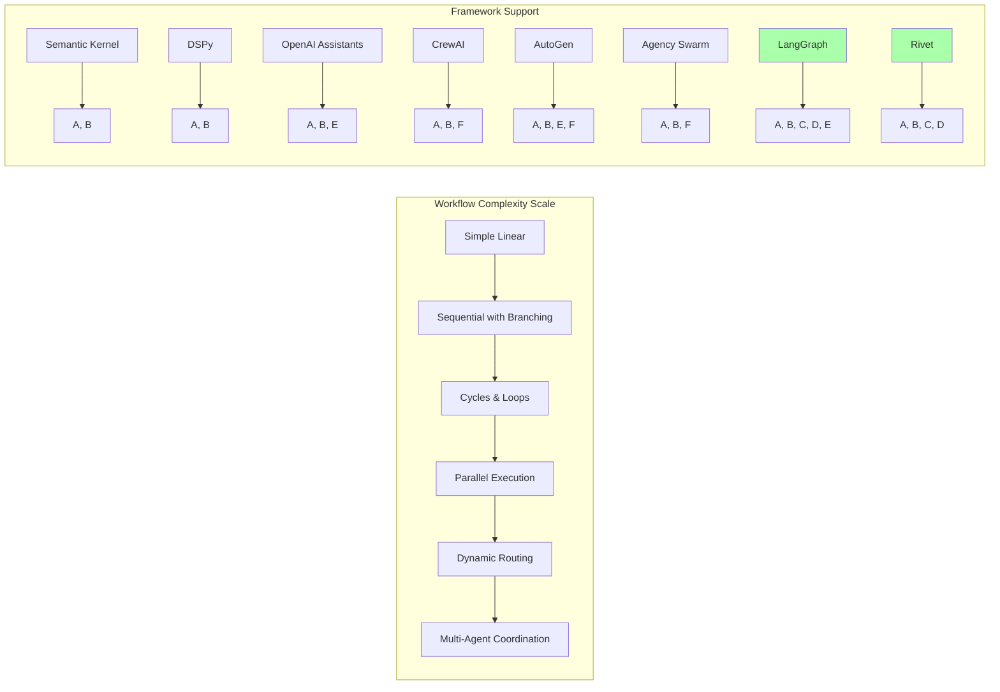

**Complexity Champions**:
- **LangGraph**: Supports all complexity patterns
- **Rivet**: Visual support for complex flows
- **AutoGen**: Agent-based complexity handling
- **Others**: Limited to linear or simple branching

---

## Memory & Context Window Management

### Strategies for Long Conversations

```mermaid
graph TB
    subgraph "Full History (AutoGen, OpenAI)"
        A1[Message 1] --> B1[History]
        C1[Message 2] --> B1
        D1[Message 3] --> B1
        E1[Message N] --> B1

        B1 --> F1{Token Limit}
        F1 -->|Exceeded| G1[Truncate/Summarize]
        F1 -->|OK| H1[Pass to LLM]

        style B1 fill:#ffffcc
    end

    subgraph "State-Based (LangGraph)"
        A2[Step 1] --> B2[State Update]
        B2 --> C2[Compact State]
        C2 --> D2[Step 2]
        D2 --> E2[State Update]
        E2 --> C2

        C2 --> F2[Always Bounded Size]

        style C2 fill:#ccffcc
    end

    subgraph "Semantic Memory (Semantic Kernel)"
        A3[Interaction 1] --> B3[Store in Vector DB]
        C3[Interaction 2] --> B3
        D3[Interaction N] --> B3

        E3[Current Query] --> F3[Semantic Search]
        F3 --> B3
        B3 --> G3[Retrieve Relevant]
        G3 --> H3[Compact Context]

        style B3 fill:#ccccff
    end

    subgraph "Task Output Only (CrewAI)"
        A4[Task 1 Output] --> B4[Task 2]
        B4 --> C4[Task 2 Output]
        C4 --> D4[Task 3]

        E4[Only Recent Output Kept]

        style E4 fill:#ffcccc
    end
```

**Memory Strategies**:
- **Full History**: Complete context, token-limited
- **State-Based**: Bounded, requires compression
- **Semantic Memory**: Scalable, requires infrastructure
- **Task Output Only**: Minimal, loses intermediate context

---

## Integration & Extensibility Patterns

### How Frameworks Handle Custom Logic

```mermaid
graph TB
    subgraph "Plugin Architecture (Semantic Kernel)"
        A1[Core Kernel] --> B1[Plugin Registry]
        B1 --> C1[Plugin 1]
        B1 --> D1[Plugin 2]
        B1 --> E1[Plugin N]

        F1[Add Plugin] --> B1
        G1[Standard Interface] -.-> C1
        G1 -.-> D1
        G1 -.-> E1

        style B1 fill:#e1e1ff
    end

    subgraph "Tool System (LangGraph, AutoGen)"
        A2[Agent/Node] --> B2[Tool Binding]
        B2 --> C2[Tool 1]
        B2 --> D2[Tool 2]

        E2[Custom Tool] --> F2[Implement Interface]
        F2 --> B2

        style B2 fill:#ffe1e1
    end

    subgraph "Custom Nodes (LangGraph)"
        A3[Graph] --> B3[Standard Node]
        A3 --> C3[Custom Node 1]
        A3 --> D3[Custom Node 2]

        E3[Define Function] --> F3[Add as Node]
        F3 --> A3

        style A3 fill:#e1ffe1
    end

    subgraph "Protocol-Based (MCP)"
        A4[Client] --> B4[MCP Protocol]
        B4 <--> C4[Server 1]
        B4 <--> D4[Server 2]
        B4 <--> E4[Server N]

        F4[Any Server] --> G4[Implement Protocol]
        G4 --> B4

        style B4 fill:#fff4e1
    end
```

**Extensibility Models**:
- **Plugin**: Structured, discoverable, enterprise-ready
- **Tool**: Flexible, function-based, agent-native
- **Custom Node**: Maximum flexibility, code-based
- **Protocol**: Interoperable, language-agnostic

---

## Production Readiness Comparison

### Enterprise Features Matrix

```mermaid
graph TB
    subgraph "Production Requirements"
        A[Observability] --> A1[Tracing]
        A --> A2[Metrics]
        A --> A3[Logs]

        B[Reliability] --> B1[Error Handling]
        B --> B2[Retry Logic]
        B --> B3[Checkpointing]

        C[Security] --> C1[Auth/AuthZ]
        C --> C2[Policy Enforcement]
        C --> C3[Audit Logs]

        D[Scalability] --> D1[Async Execution]
        D --> D2[Distributed]
        D --> D3[Load Management]

        E[Governance] --> E1[Human Gates]
        E --> E2[Validation]
        E --> E3[Compliance]
    end

    subgraph "Framework Scores (1-5)"
        F1["LangGraph: 4.5"] --> G1[Strong: A1,A2,B3,E1,E2]
        F2["Semantic Kernel: 4.5"] --> G2[Strong: A1,A2,C2,C3,D1]
        F3["OpenAI Assistants: 4.0"] --> G3[Strong: A3,B1,D1]
        F4["AutoGen: 3.0"] --> G4[Medium: A3,B1,B2]
        F5["CrewAI: 3.0"] --> G5[Medium: A3,B2]
        F6["DSPy: 3.5"] --> G6[Strong: A1,E2 | Weak: D1]
        F7["Rivet: 2.5"] --> G7[Dev Tool | Weak: Production]
        F8["Agency Swarm: 2.5"] --> G8[Early Stage]

        style F1 fill:#aaffaa
        style F2 fill:#aaffaa
        style F3 fill:#ccffaa
        style F7 fill:#ffcccc
        style F8 fill:#ffcccc
    end
```

**Production Leaders**:
- **LangGraph**: Checkpointing, tracing, governance
- **Semantic Kernel**: Enterprise patterns, telemetry
- **OpenAI Assistants**: Managed service, scalability

**Development Tools**:
- **Rivet**: Excellent for prototyping, not production
- **Agency Swarm**: Early stage, limited enterprise features

---

## Synthesis: Pattern Clusters

### Three Dominant Paradigms

```mermaid
graph TB
    subgraph "Paradigm 1: Explicit Orchestration"
        A1[LangGraph] --> B1[Graph Definition]
        A2[Rivet] --> B1
        A3[Semantic Kernel] --> C1[Pipeline/Plan Definition]

        B1 --> D1[Deterministic Flow]
        C1 --> D1

        D1 --> E1[Use Cases]
        E1 --> F1[Structured Workflows]
        E1 --> G1[Repeatable Processes]
        E1 --> H1[Compliance-Heavy]

        style D1 fill:#aaffaa
    end

    subgraph "Paradigm 2: Conversational Emergence"
        I1[AutoGen] --> J1[Multi-Agent Conversation]
        I2[OpenAI Assistants] --> K1[Thread-Based Interaction]

        J1 --> L1[Emergent Flow]
        K1 --> L1

        L1 --> M1[Use Cases]
        M1 --> N1[Exploratory Tasks]
        M1 --> O1[Creative Work]
        M1 --> P1[Adaptive Problem-Solving]

        style L1 fill:#ccccff
    end

    subgraph "Paradigm 3: Collaborative Execution"
        Q1[CrewAI] --> R1[Role-Based Teams]
        Q2[Agency Swarm] --> R1

        R1 --> S1[Delegation Flow]

        S1 --> T1[Use Cases]
        T1 --> U1[Multi-Specialty Tasks]
        T1 --> V1[Research & Analysis]
        T1 --> W1[Content Creation]

        style S1 fill:#ffffcc
    end

    subgraph "Paradigm 4: Optimizable Programs"
        X1[DSPy] --> Y1[Module Composition]

        Y1 --> Z1[Declarative + Compile]

        Z1 --> AA1[Use Cases]
        AA1 --> AB1[ML Pipelines]
        AA1 --> AC1[Research Iteration]
        AA1 --> AD1[Performance-Critical]

        style Z1 fill:#ffccff
    end
```

---

## Recommended Architecture for RaiSE Kata Harness

### Hybrid Pattern: Structured Graph + Governance Layers

```mermaid
graph TB
    subgraph "Kata Harness - Proposed Architecture"
        A[Kata Definition] --> B[Graph Builder]
        B --> C[Execution Graph]

        C --> D[Step 1 Node]
        D --> E[Inline Verification]
        E --> F{Verificación Pass?}

        F -->|No| G[Jidoka Handler]
        G --> H[STOP Execution]
        H --> I[Checkpoint State]
        I --> J[Human Intervention]
        J --> K{Resume}
        K --> D

        F -->|Yes| L[Step 2 Node]
        L --> M[Step 2 Verification]

        M --> N[Validation Gate]
        N --> O{Gate Pass?}
        O -->|No| G
        O -->|Yes| P[Next Kata]
    end

    subgraph "Observability Layer"
        Q[OpenTelemetry Traces] --> R[Step Spans]
        R --> S[Verification Results]
        S --> T[Learning Analytics]
        T --> U[Dashboard]
    end

    subgraph "Governance Layer"
        V[Assertion System] --> W[Inline Checks]
        X[Gate System] --> Y[Validation Rules]
        Z[Filter System] --> AA[Policy Enforcement]

        W --> AB[Auto-STOP on Fail]
        Y --> AB
        Z --> AB
    end

    subgraph "Context Layer"
        AC[Kata State] --> AD[Typed Schema]
        AD --> AE[Step Context]
        AF[Artifact Registry] --> AG[Work Products]
        AG --> AH[Gate Inputs]
        AH --> AI[Next Kata Inputs]
    end

    style G fill:#ffcccc
    style I fill:#ccffcc
    style AB fill:#ffcccc
```

**Key Components**:

1. **Execution**: Graph-based (LangGraph-inspired)
2. **Checkpointing**: Automatic at each step
3. **Verification**: Assertion-based (DSPy-inspired)
4. **Gates**: Interrupt pattern (LangGraph-inspired)
5. **Observability**: OpenTelemetry (Semantic Kernel-inspired)
6. **Context**: Typed state + artifact registry

**Why This Hybrid?**

| Requirement | Pattern Choice | Source Framework |
|-------------|----------------|------------------|
| Explicit Kata steps | Graph nodes | LangGraph |
| Jidoka pause/resume | Checkpointing | LangGraph |
| Inline verification | Assertions | DSPy |
| Validation Gates | Interrupt pattern | LangGraph |
| Policy enforcement | Filters | Semantic Kernel |
| Production telemetry | OpenTelemetry | Semantic Kernel |
| Clear handoffs | Artifact registry | Semantic Kernel plugins |
| Learning analytics | Replay capability | LangGraph + Rivet |

---

## Conclusión

**For RaiSE Kata Harness, adopt a hybrid architecture**:

1. **Core Execution**: LangGraph-style state graph
2. **Governance**: Multi-layered (Assertions + Gates + Filters)
3. **Observability**: Semantic Kernel-style OpenTelemetry
4. **Context**: Hybrid (State object + Artifact registry)

This combines the **structure** of explicit orchestration with the **governance** needed for learning workflows.

---

**Document Status**: Complete
**Companion Document**: `agent-frameworks-architecture-comparison.md`
