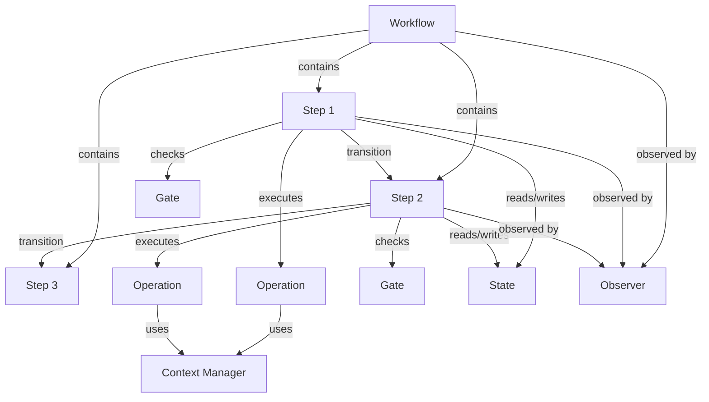

# Kata Harness First Principles: Execution Primitives Taxonomy

## Executive Summary

This research establishes the foundational primitives required for executing multi-step AI agent workflows with deterministic guarantees, addressing RaiSE's Kata Harness capability requirements. The research synthesizes patterns from workflow orchestration, agent frameworks, state machines, and cognitive architecture to propose a **hybrid execution model** that balances LLM flexibility with governance enforcement.

**Key Findings:**

1. **Traditional workflow engines achieve determinism through explicit state machines** - AI agent systems cannot directly adopt this without sacrificing flexibility
2. **"Deterministic" may be the wrong goal** - "Verifiable" and "Observable" are more achievable for LLM-based systems
3. **The fundamental tension**: Markdown-based flexibility vs. enforced execution semantics
4. **Hybrid architectures emerge as the solution** - Separate planning (LLM) from execution (state machine)
5. **Context management is THE bottleneck** - Token windows constrain multi-step execution more than any other factor

**Primary Recommendation:**

Adopt a **3-layer execution architecture**:
- **Layer 1 (Control)**: State machine orchestrator (deterministic, observable, enforceable)
- **Layer 2 (Decision)**: LLM interpreter (probabilistic, context-aware, adaptive)
- **Layer 3 (Action)**: Skill executors (atomic, deterministic, traceable)

---

## Table of Contents

1. [RQ1: First Principles of Agentic Workflow Execution](#rq1-first-principles-of-agentic-workflow-execution)
2. [RQ2: Market Landscape Analysis](#rq2-market-landscape-analysis)
3. [RQ3: Deterministic Execution Patterns](#rq3-deterministic-execution-patterns)
4. [RQ4: Observability & Tracing](#rq4-observability--tracing)
5. [RQ5: Governance-as-Code Architecture](#rq5-governance-as-code-architecture)
6. [RQ6: Kata Harness Design Recommendations](#rq6-kata-harness-design-recommendations)
7. [Implementation Roadmap](#implementation-roadmap)
8. [References](#references)

---

## RQ1: First Principles of Agentic Workflow Execution

### 1.1 Execution Primitives Taxonomy

#### The Minimal Set of Abstractions

Based on analysis of workflow engines (Temporal, Prefect, Airflow) and agent frameworks (LangGraph, CrewAI, AutoGen), the minimal execution primitives are:

```
┌────────────────────────────────────────────────────────────────┐
│  EXECUTION PRIMITIVE HIERARCHY                                  │
├────────────────────────────────────────────────────────────────┤
│                                                                 │
│  1. OPERATION (Atomic)                                          │
│     - Smallest unit of work                                     │
│     - Inputs → Process → Outputs                               │
│     - Deterministic or probabilistic                            │
│     - Examples: execute_query, call_llm, write_file            │
│                                                                 │
│  2. STEP (Contextual)                                          │
│     - Single operation with pre/post conditions                 │
│     - Gate checks before and/or after execution                │
│     - Has identity, status, observability                       │
│     - Examples: "Load PRD", "Validate design", "Generate code" │
│                                                                 │
│  3. TRANSITION (Control Flow)                                   │
│     - How to move from Step A to Step B                        │
│     - Conditional, sequential, parallel, or branching           │
│     - Can be static (DAG) or dynamic (agent decides)           │
│     - Examples: "on_success", "if_confidence > 0.8", "wait_for"│
│                                                                 │
│  4. STATE (Context)                                            │
│     - Persistent data shared across steps                       │
│     - Scoped (workflow-level, step-level, global)              │
│     - Versioned, immutable, or mutable                          │
│     - Examples: loaded_documents, user_feedback, token_budget  │
│                                                                 │
│  5. WORKFLOW (Composition)                                      │
│     - Directed graph of Steps connected by Transitions          │
│     - Has lifecycle: pending → running → complete/failed       │
│     - Maintains execution history                               │
│     - Examples: "Discovery Kata", "Feature Implementation"     │
│                                                                 │
│  6. GATE (Validation)                                          │
│     - Checkpoint that enforces criteria before progression      │
│     - Can halt execution (blocking gate)                        │
│     - Can warn but continue (advisory gate)                     │
│     - Examples: "PRD completeness check", "Security audit"     │
│                                                                 │
│  7. CONTEXT MANAGER (Memory)                                   │
│     - Controls what information is available to operations      │
│     - Handles token budget allocation                           │
│     - Manages context window across multi-turn execution        │
│     - Examples: "Load MVC", "Prune irrelevant context"         │
│                                                                 │
│  8. OBSERVER (Telemetry)                                       │
│     - Captures execution traces for debugging/auditing          │
│     - Logs inputs, outputs, decisions, timing, errors           │
│     - Enables replay and deterministic debugging                │
│     - Examples: "OpenTelemetry tracer", "Execution log"        │
│                                                                 │
└────────────────────────────────────────────────────────────────┘
```

**Relationships:**



#### Mapping to RaiSE Ontology

| Generic Primitive | RaiSE v2.3 Term | Current Implementation | Gap |
|-------------------|-----------------|------------------------|-----|
| **Operation** | Skill | YAML definitions (planned) | ✅ Concept exists |
| **Step** | Kata step | Markdown H3 sections | ⚠️ No enforcement |
| **Transition** | (implicit in Kata) | LLM interpretation of sequence | ❌ Not formalized |
| **State** | Context / Golden Data | Files loaded into LLM context | ⚠️ No explicit state management |
| **Workflow** | Kata | Markdown document | ⚠️ No execution semantics |
| **Gate** | Validation Gate | Markdown checklist executed by LLM | ⚠️ Advisory, not blocking |
| **Context Manager** | MVC retrieval | `context/get` skill (planned) | ✅ Concept exists |
| **Observer** | Observable Workflow | § principle, not implemented | ❌ No telemetry layer |

**Critical Gap**: RaiSE has strong conceptual primitives but lacks an **execution harness** that interprets and enforces them.

---

### 1.2 Traditional Workflow Guarantees vs. AI Agent Execution

#### How Traditional Engines Guarantee Step Ordering

**Temporal.io Example:**

```typescript
// Workflow definition (deterministic)
export async function orderFulfillment(orderId: string): Promise<void> {
  // Step 1: Validate order (atomic activity)
  await activities.validateOrder(orderId);

  // Step 2: Charge payment (atomic activity)
  const paymentResult = await activities.chargePayment(orderId);

  // Step 3: Ship order (atomic activity)
  if (paymentResult.success) {
    await activities.shipOrder(orderId);
  }

  // Step 4: Send confirmation (atomic activity)
  await activities.sendConfirmation(orderId);
}
```

**Guarantees provided:**

1. **Sequential execution**: Step 2 never runs before Step 1 completes
2. **State persistence**: If workflow crashes at Step 3, restart from Step 3 (not Step 1)
3. **Deterministic replay**: Event history allows exact reconstruction of what happened
4. **Failure isolation**: If Step 2 fails, Step 1 doesn't re-execute
5. **Visibility**: Every step transition is logged with timestamp, inputs, outputs

**Mechanism**: A **state machine orchestrator** controls execution. The workflow code is declarative - the orchestrator interprets it.

---

#### Why AI Agent Execution is Different

**Fundamental differences:**

| Aspect | Traditional Workflow | AI Agent Workflow |
|--------|---------------------|-------------------|
| **Control flow** | Explicit (if/else, loops) | Implicit (LLM interprets instructions) |
| **Determinism** | Same inputs → same outputs | Probabilistic (temperature > 0) |
| **Step boundary** | Function call boundaries | Semantic interpretation |
| **Failure modes** | Exceptions, timeouts | Hallucination, context drift, misinterpretation |
| **State** | Explicit variables | Context window content |
| **Verification** | Type checking, assertions | Semantic validation (gates) |
| **Replay** | Execute same code | Re-prompt same instructions (may diverge) |

**The core challenge**: An LLM reading a Markdown Kata is fundamentally **interpretive**, not **compiled**. The "step boundaries" exist only in the LLM's understanding.

**Example of the problem:**

```markdown
## Outline

1. **Paso 1: Cargar Vision y Contexto**:
   - Cargar `specs/main/solution_vision.md`
   - **Verificación**: El archivo existe
   - > **Si no puedes continuar**: Vision no encontrada → Ejecutar `/raise.vision`

2. **Paso 2: Generar Tech Design**:
   - Analizar la vision
   - Crear `specs/main/tech_design.md`
   - **Verificación**: Tech Design tiene todas las secciones
```

**What can go wrong:**

- LLM might skip Paso 1 if it "assumes" the vision is already loaded
- LLM might hallucinate that the verification passed
- LLM might ignore the Jidoka block if it's "confident" it can proceed
- Context window might truncate, causing the LLM to forget earlier steps

**Current RaiSE approach**: Rely on LLM's instruction-following ability + hope.

**Industry approaches**: Separate control plane from data plane (see RQ2).

---

### 1.3 Control Flow Patterns in Agent Workflows

#### Pattern 1: Sequential (Chain)

```
Step 1 → Step 2 → Step 3 → Step 4
```

**Use case**: Fixed process (e.g., Discovery → Vision → Design)

**Guarantees**: Order is enforced by orchestrator

**RaiSE equivalent**: Current Kata structure (but not enforced)

---

#### Pattern 2: Conditional Branching (Decision Tree)

```
Step 1 → [Decision] → Step 2a (if condition A)
                   → Step 2b (if condition B)
```

**Who decides**:
- **Harness decides** (deterministic): Check a condition in state
- **Agent decides** (probabilistic): LLM evaluates and chooses path

**Use case**: Brownfield vs Greenfield paths in `/setup/analyze`

**Guarantees**: Decision rationale is logged for audit

---

#### Pattern 3: Parallel Execution (Fan-out/Fan-in)

```
        ┌→ Step 2a ─┐
Step 1 ─┼→ Step 2b ─┼→ Step 3 (wait for all)
        └→ Step 2c ─┘
```

**Use case**: Generate multiple design options, then synthesize

**Guarantees**: Step 3 only runs when all parallel branches complete

**RaiSE challenge**: LLMs are inherently sequential (single context window)

**Solution**: Multi-agent crews (CrewAI pattern) or parallel API calls

---

#### Pattern 4: Loop (Iteration)

```
Step 1 → [Loop: while condition] → Step 2 → [Check condition] → Step 1 or Step 3
```

**Use case**: Iterative refinement (generate → validate → fix → validate)

**Guarantees**: Maximum iteration count to prevent infinite loops

**RaiSE example**: Jidoka "try up to 3 times" pattern

---

#### Pattern 5: Event-Driven (Reactive)

```
[Event: PR created] → Trigger Workflow → Step 1 → Step 2 → ...
```

**Use case**: CI/CD integration, user feedback incorporation

**Guarantees**: Event triggers are idempotent (same event doesn't re-trigger)

---

#### Pattern 6: Human-in-the-Loop (Escalation)

```
Step 1 → [Gate: confidence < 0.8] → Pause → Human approval → Step 2
```

**Use case**: Architectural decisions, first-time patterns

**Guarantees**: Execution pauses until human input received

**RaiSE equivalent**: Escalation Gate (§ principle, not implemented)

---

### 1.4 Interruption and Resumption Patterns

#### Checkpointing Strategies

**1. Event Sourcing (Temporal, LangGraph)**

```json
{
  "workflow_id": "kata-discovery-f1",
  "events": [
    {"type": "step_started", "step": "paso-1", "timestamp": "..."},
    {"type": "step_completed", "step": "paso-1", "output": {...}},
    {"type": "step_started", "step": "paso-2", "timestamp": "..."},
    {"type": "workflow_paused", "reason": "human_approval", "timestamp": "..."}
  ]
}
```

**Resume logic**: Replay events up to pause point, continue from there.

**Pros**: Exact state reconstruction, deterministic replay

**Cons**: Storage overhead, complex for long workflows

---

**2. State Snapshots (Prefect, Airflow)**

```json
{
  "workflow_id": "kata-discovery-f1",
  "current_step": "paso-2",
  "state": {
    "loaded_documents": ["vision.md", "prd.md"],
    "current_feature": "F1.4",
    "token_budget_remaining": 50000
  },
  "completed_steps": ["paso-1"]
}
```

**Resume logic**: Load state snapshot, continue from `current_step`.

**Pros**: Simpler, less storage

**Cons**: Can't replay history, harder to debug

---

**3. Hybrid (LangGraph)**

- Store full event log for observability
- Maintain state snapshot for fast resume
- Allow "time travel" debugging by replaying from any event

---

#### RaiSE Current Approach

**Example from `/raise.feature.implement`**:

```markdown
1. **Initialize Environment**:
   - Load or create `specs/features/{feature-id}/progress.md`
   - Determine starting point (--start-from, progress.md, or T1)
```

**Mechanism**: `progress.md` file as **state snapshot**

```markdown
# Progress: Feature F1.4

Status: in_progress
Started: 2026-01-29T10:30:00Z

## Completed Tasks
- [x] T1: Setup project structure (2026-01-29T10:35:00Z)
- [x] T2: Implement core logic (2026-01-29T11:00:00Z)

## Current Task
- [ ] T3: Add validation (started: 2026-01-29T11:15:00Z)

## Blocked Tasks
None
```

**Pros**: Human-readable, Git-friendly, simple

**Cons**:
- LLM must correctly parse and update the file
- No enforcement (LLM could skip updating)
- No event log for replay

**Gap**: No observability layer capturing step-by-step execution.

---

## RQ2: Market Landscape Analysis

### 2.1 Framework Comparison Matrix

Based on existing research (`command-kata-skill-ontology-report.md`) and first principles analysis:

| Framework | Execution Model | Step Ordering | Observability | Governance | Context Management |
|-----------|----------------|---------------|---------------|------------|-------------------|
| **LangGraph** | State graph + LLM nodes | State machine enforced | LangSmith integration | Conditional edges | Checkpointing API |
| **CrewAI** | Task → Agent → Tool | Agent coordination | Telemetry hooks | Task validation | Shared memory |
| **AutoGen** | Conversation rounds | Implicit (turn-taking) | Message logging | Termination conditions | Conversation history |
| **Semantic Kernel** | Function calling | Linear (deprecated planners) | Plugin telemetry | Function metadata | Kernel state |
| **Temporal** | Workflow DSL | Event-sourced state machine | Full event history | Activities isolation | Durable execution |
| **Prefect** | Task graph | DAG enforced | Real-time dashboard | Task retries | Context managers |
| **Airflow** | DAG definition | Task dependencies | UI + logs | SLAs, alerts | XCom (cross-communication) |

---

### 2.2 Architecture Deep Dives

#### LangGraph: The Gold Standard for Agent Orchestration

**Core concept**: Workflows are **state graphs** where nodes are LLM calls or tools, and edges are state transitions.

```python
from langgraph.graph import StateGraph, END

# Define state schema
class WorkflowState(TypedDict):
    messages: List[Message]
    current_step: str
    verification_passed: bool

# Build graph
workflow = StateGraph(WorkflowState)

# Add nodes (steps)
workflow.add_node("load_vision", load_vision_node)
workflow.add_node("generate_design", generate_design_node)
workflow.add_node("validate_design", validate_design_node)

# Add edges (transitions)
workflow.add_edge("load_vision", "generate_design")
workflow.add_conditional_edges(
    "validate_design",
    # Decision function
    lambda state: "generate_design" if not state["verification_passed"] else END,
    # Possible transitions
    {"generate_design": "generate_design", END: END}
)

# Compile to executable
app = workflow.compile()

# Execute with checkpointing
result = app.invoke(
    {"messages": [], "current_step": "start"},
    config={"checkpoint": SQLiteSaver("./checkpoints.db")}
)
```

**Key features:**

1. **Explicit state machine**: Graph structure is code, not interpretation
2. **Checkpointing**: Every state transition is saved, enabling resume
3. **Conditional edges**: Deterministic branching based on state
4. **LangSmith integration**: Every node execution is traced
5. **Type safety**: State schema enforced at compile time

**What RaiSE can learn:**

- State graphs provide **enforcement** (not just suggestions)
- Checkpointing enables **resumption** without re-execution
- Conditional edges formalize **decision points**
- Type schemas provide **verification** before runtime

**Trade-off**: Requires coding workflows, not Markdown. Less accessible to non-developers.

---

#### CrewAI: Multi-Agent Coordination

**Core concept**: Workflows are **crews** of specialized agents working on **tasks**.

```python
from crewai import Agent, Task, Crew, Process

# Define agents (specialists)
architect = Agent(
    role="Solution Architect",
    goal="Design technical solutions",
    tools=[load_docs_tool, analyze_tool]
)

validator = Agent(
    role="Quality Validator",
    goal="Verify designs meet standards",
    tools=[run_gate_tool]
)

# Define tasks
design_task = Task(
    description="Create tech design from vision",
    agent=architect,
    expected_output="Complete tech_design.md"
)

validate_task = Task(
    description="Validate tech design against gate",
    agent=validator,
    context=[design_task],  # Depends on design_task
    expected_output="Validation report"
)

# Create crew
crew = Crew(
    agents=[architect, validator],
    tasks=[design_task, validate_task],
    process=Process.sequential  # Or hierarchical
)

# Execute
result = crew.kickoff()
```

**Key features:**

1. **Task dependencies**: `context=[task1]` enforces ordering
2. **Agent specialization**: Different agents for different roles
3. **Process types**: Sequential, hierarchical, or consensual
4. **Expected outputs**: Contract enforcement
5. **Telemetry**: Every task execution is logged

**What RaiSE can learn:**

- Task dependencies formalize **ordering**
- Expected outputs provide **verification criteria**
- Agent specialization aligns with **ShuHaRi** (different agents for different mastery levels)

**Trade-off**: Multi-agent coordination adds complexity and cost.

---

#### Temporal: Durable Execution

**Core concept**: Workflows are **durable** - execution state persists across failures, restarts, and deployments.

```typescript
// Workflow (deterministic)
export async function discoveryWorkflow(featureId: string): Promise<void> {
  // Step 1: Load PRD
  const prd = await activities.loadDocument(`specs/main/prd.md`);

  // Step 2: Extract requirements (can fail, will retry)
  const requirements = await activities.extractRequirements(prd);

  // Step 3: Human approval (can pause for hours/days)
  const approved = await signals.waitForHumanApproval(requirements);

  if (!approved) {
    throw new Error("Discovery rejected by human");
  }

  // Step 4: Generate stories
  await activities.generateUserStories(requirements);
}
```

**Guarantees:**

1. **Durable state**: If server crashes during Step 3, workflow resumes at Step 3 (not Step 1)
2. **Event sourcing**: Every step is logged with inputs/outputs
3. **Deterministic replay**: Workflow code is deterministic - no random() calls, no Date.now()
4. **Timeouts**: Each activity has a timeout, preventing infinite hangs
5. **Retries**: Failed activities auto-retry with exponential backoff

**What RaiSE can learn:**

- **Durable execution** is critical for long-running workflows (multi-day projects)
- **Event sourcing** enables perfect audit trails
- **Activity isolation** prevents cascading failures

**Trade-off**: Requires Temporal server infrastructure. Determinism constraints limit LLM flexibility.

---

### 2.3 Emerging Patterns

**Pattern 1: Thin LLM, Thick Orchestrator**

```
Orchestrator (State Machine) → LLM (Decision Only) → Tools (Execution)
```

- **Orchestrator**: Controls flow, enforces gates, manages state
- **LLM**: Makes decisions ("which path?", "is this sufficient?")
- **Tools**: Execute atomic operations (deterministic)

**Examples**: LangGraph, Semantic Kernel (post-planners)

**Benefit**: Governance is enforced by orchestrator, not suggested to LLM

---

**Pattern 2: LLM as Planner, Code as Executor**

```
LLM generates plan → Compile to executable graph → State machine executes
```

- **Phase 1 (Planning)**: LLM reads Kata, generates execution plan (JSON/YAML)
- **Phase 2 (Execution)**: Plan is compiled to state machine and executed

**Examples**: DSPy (LLM generates Python code), OpenAI Code Interpreter

**Benefit**: Best of both worlds - LLM flexibility for planning, determinism for execution

---

**Pattern 3: Multi-Agent Verification**

```
Agent 1 (Generator) → Agent 2 (Critic) → Agent 3 (Arbiter)
```

- **Generator**: Proposes solution
- **Critic**: Validates against criteria
- **Arbiter**: Decides if verification passed

**Examples**: Constitutional AI, CrewAI consensual process

**Benefit**: Reduces hallucination risk through multi-perspective validation

---

## RQ3: Deterministic Execution Patterns

### 3.1 The Determinism Spectrum

**Insight**: "Deterministic" is not binary - it's a spectrum:

```
Pure Stochastic ←――――――――――――――――――――――――→ Pure Deterministic
│                                                        │
│ LLM with temperature=1.0                               │
│                                                        │
├─ LLM with temperature=0.0 (reproducible, not deterministic)
│                                                        │
├─ Structured output (JSON mode, function calling)       │
│                                                        │
├─ Grammar-constrained generation (Outlines, Guidance)   │
│                                                        │
├─ LLM-generated code → compiled execution               │
│                                                        │
└─ Workflow engine executing predefined graph           Pure deterministic
```

**Key distinction**:

- **Reproducible** (temperature=0): Same input → same output (within a model version)
- **Deterministic**: Same input → same output (across all contexts, forever)

**LLMs can be reproducible but not truly deterministic** because:
- Model updates change behavior
- Context window variations affect output
- Tokenization differences matter

---

### 3.2 Structured Output Enforcement

#### Pattern: JSON Mode + Schema Validation

**Goal**: Force LLM to produce outputs in a specific format

**Mechanism**:

```typescript
const response = await openai.chat.completions.create({
  model: "gpt-4",
  messages: [
    {role: "system", content: "You are a tech design generator"},
    {role: "user", content: "Create a tech design for feature F1.4"}
  ],
  response_format: {
    type: "json_schema",
    json_schema: {
      name: "tech_design",
      schema: {
        type: "object",
        properties: {
          architecture: {type: "string"},
          components: {type: "array", items: {type: "string"}},
          dependencies: {type: "array", items: {type: "string"}},
          validation_passed: {type: "boolean"}
        },
        required: ["architecture", "components", "validation_passed"]
      }
    }
  }
});

// Guaranteed to be valid JSON matching schema
const design = JSON.parse(response.choices[0].message.content);

// Enforce gate
if (!design.validation_passed) {
  throw new Error("Design did not pass internal validation");
}
```

**Benefit**: Output structure is **enforced**, not hoped for

**Limitation**: Content can still hallucinate - structure doesn't guarantee correctness

---

#### Pattern: Grammar-Constrained Generation

**Tools**: Outlines, Guidance, LMQL, llama.cpp grammars

**Mechanism**: Constrain token generation to only produce valid outputs

```python
from outlines import models, generate

# Load model
model = models.transformers("mistralai/Mistral-7B-v0.1")

# Define grammar
grammar = """
?start: step+

step: "## Paso " INT ": " title "\\n"
      "- " action+ "\\n"
      "**Verificación**: " verification "\\n"
      "> **Si no puedes continuar**: " jidoka "\\n"

title: /[A-Za-z ]+/
action: /[^\\n]+/ "\\n"
verification: /[^\\n]+/
jidoka: /[^\\n]+/
"""

# Generate (guaranteed to match grammar)
generator = generate.cfg(model, grammar)
output = generator("Generate a discovery kata")
```

**Benefit**: **Impossible** to generate invalid output

**Limitation**: Grammar can be complex, model must support constraint decoding

---

### 3.3 State Machine Approaches

#### Pattern: XState + LLM Integration

**Concept**: Define workflow as a formal state machine, use LLM only for content generation

```typescript
import { createMachine, interpret } from 'xstate';

const discoveryKataMachine = createMachine({
  id: 'discovery',
  initial: 'loadPRD',
  context: {
    prd: null,
    requirements: null,
    stories: null
  },
  states: {
    loadPRD: {
      invoke: {
        src: 'loadPRDService',
        onDone: {
          target: 'extractRequirements',
          actions: 'storePRD'
        },
        onError: 'handleError'
      }
    },
    extractRequirements: {
      invoke: {
        src: 'callLLMService',  // LLM extracts requirements
        onDone: {
          target: 'validateRequirements',
          actions: 'storeRequirements'
        }
      }
    },
    validateRequirements: {
      invoke: {
        src: 'runGateService',
        onDone: [
          {
            target: 'generateStories',
            cond: 'gatePassedCheck'
          },
          {
            target: 'extractRequirements',  // Retry if gate failed
            actions: 'logGateFailure'
          }
        ]
      }
    },
    generateStories: {
      invoke: {
        src: 'callLLMService',
        onDone: {
          target: 'complete',
          actions: 'storeStories'
        }
      }
    },
    complete: {
      type: 'final'
    },
    handleError: {
      // Jidoka: stop on error
      type: 'final'
    }
  }
});

// Interpreter guarantees state machine semantics
const service = interpret(discoveryKataMachine).start();
```

**Guarantees:**

1. **State transitions are enforced** - cannot skip states
2. **Conditional logic is explicit** - `cond: 'gatePassedCheck'`
3. **Error handling is formalized** - `onError` transitions
4. **State is managed** - `context` is updated via actions
5. **Observable** - Every transition emits an event

**What RaiSE can learn:**

- State machines provide the **enforcement layer**
- LLMs become **services** invoked by the machine
- Gates become **guard conditions** on transitions

---

### 3.4 Hybrid Architectures

#### Recommended Pattern for RaiSE: "Interpreted Kata, Enforced Execution"

```
┌─────────────────────────────────────────────────────────────┐
│  LAYER 1: KATA DEFINITION (Markdown)                         │
│  ━━━━━━━━━━━━━━━━━━━━━━━━━━━━━━━━━━━━━━━━━━━━━━━━━━━━━━━  │
│  Human-authored, flexible, pedagogical                       │
│  Example: flujo-04-discovery.md                              │
└─────────────────────────────────────────────────────────────┘
                              ↓
                    [Kata Compiler/Parser]
                              ↓
┌─────────────────────────────────────────────────────────────┐
│  LAYER 2: EXECUTION PLAN (JSON/YAML)                         │
│  ━━━━━━━━━━━━━━━━━━━━━━━━━━━━━━━━━━━━━━━━━━━━━━━━━━━━━━━  │
│  Machine-readable workflow definition                        │
│  {                                                           │
│    "steps": [                                                │
│      {                                                       │
│        "id": "paso-1",                                       │
│        "type": "llm_task",                                   │
│        "skill": "load_document",                             │
│        "inputs": {"path": "specs/main/prd.md"},              │
│        "verification": {"gate": "gate-prd-exists"},          │
│        "on_failure": {"action": "escalate", "to": "human"},  │
│        "next": "paso-2"                                      │
│      },                                                      │
│      {...}                                                   │
│    ]                                                         │
│  }                                                           │
└─────────────────────────────────────────────────────────────┘
                              ↓
                [Kata Harness Runtime]
                              ↓
┌─────────────────────────────────────────────────────────────┐
│  LAYER 3: STATE MACHINE EXECUTION                            │
│  ━━━━━━━━━━━━━━━━━━━━━━━━━━━━━━━━━━━━━━━━━━━━━━━━━━━━━━━  │
│  Enforced step ordering, gate checks, observability          │
│  - Load step definition                                      │
│  - Check pre-conditions (gates)                              │
│  - Execute skill (LLM call, tool invocation)                 │
│  - Check post-conditions (verification)                      │
│  - Log execution trace                                       │
│  - Transition to next step OR halt (Jidoka)                  │
└─────────────────────────────────────────────────────────────┘
                              ↓
                        [Observable]
                              ↓
┌─────────────────────────────────────────────────────────────┐
│  TELEMETRY & TRACES                                          │
│  ━━━━━━━━━━━━━━━━━━━━━━━━━━━━━━━━━━━━━━━━━━━━━━━━━━━━━━━  │
│  - Execution logs (JSONL)                                    │
│  - OpenTelemetry traces                                      │
│  - Gate pass/fail records                                    │
│  - Token usage per step                                      │
│  - Replay capability                                         │
└─────────────────────────────────────────────────────────────┘
```

**How it works:**

1. **Authoring**: Humans write Katas in Markdown (familiar, pedagogical)
2. **Compilation**: Parser extracts steps, gates, dependencies → JSON execution plan
3. **Execution**: State machine harness runs plan, enforces gates, logs traces
4. **Flexibility**: LLM interprets step instructions (adaptive)
5. **Governance**: Harness enforces gates and ordering (deterministic)

**Example compilation**:

```markdown
## Paso 1: Cargar PRD
- Cargar `specs/main/prd.md`
- Verificar que existe
**Verificación**: El archivo existe y tiene frontmatter YAML
> **Si no puedes continuar**: PRD no encontrado → Ejecutar `/raise.discovery`
```

**Compiles to**:

```json
{
  "id": "paso-1",
  "description": "Cargar PRD",
  "actions": [
    {"type": "load_document", "path": "specs/main/prd.md"},
    {"type": "check_file_exists", "path": "specs/main/prd.md"}
  ],
  "verification": {
    "type": "gate",
    "id": "gate-prd-loaded",
    "criteria": [
      {"check": "file_exists", "path": "specs/main/prd.md"},
      {"check": "has_yaml_frontmatter", "path": "specs/main/prd.md"}
    ]
  },
  "on_failure": {
    "action": "escalate",
    "suggestion": "Ejecutar `/raise.discovery`"
  },
  "next": "paso-2"
}
```

**Benefits**:

✅ **Markdown authoring** (accessible, version-controlled, human-readable)
✅ **Enforced execution** (state machine guarantees ordering)
✅ **Observable** (every step transition logged)
✅ **Jidoka-compliant** (halts on verification failure)
✅ **Resumable** (state persisted as checkpoint)

---

## RQ4: Observability & Tracing

### 4.1 The Observability Stack (MELT)

From RaiSE Constitution §8:

| Pillar | What to Capture | How to Store | Example |
|--------|----------------|--------------|---------|
| **Metrics** | Quantitative measures | Time-series DB | Tokens per step, latency, error rate |
| **Events** | Discrete occurrences | Event log | Gate passed, escalation triggered |
| **Logs** | Contextual messages | Structured logs (JSONL) | "Loaded PRD", "Verification failed" |
| **Traces** | End-to-end flows | Distributed tracing | Complete kata execution path |

---

### 4.2 Trace Data Model for Kata Execution

**Proposed schema** (JSON Lines format for simplicity):

```json
{
  "trace_id": "kata-discovery-f14-20260129-103045",
  "kata_id": "flujo-04-discovery",
  "feature_id": "F1.4",
  "started_at": "2026-01-29T10:30:45Z",
  "status": "in_progress",
  "current_step": "paso-2",
  "steps": [
    {
      "step_id": "paso-1",
      "description": "Cargar PRD",
      "started_at": "2026-01-29T10:30:50Z",
      "completed_at": "2026-01-29T10:31:10Z",
      "status": "success",
      "actions": [
        {
          "type": "load_document",
          "path": "specs/main/prd.md",
          "result": "success",
          "tokens_used": 1250
        }
      ],
      "verification": {
        "gate_id": "gate-prd-loaded",
        "result": "pass",
        "criteria_checked": [
          {"criterion": "file_exists", "result": "pass"},
          {"criterion": "has_yaml_frontmatter", "result": "pass"}
        ]
      }
    },
    {
      "step_id": "paso-2",
      "description": "Extraer Requirements",
      "started_at": "2026-01-29T10:31:15Z",
      "status": "running",
      "actions": [
        {
          "type": "llm_call",
          "model": "claude-sonnet-4-5",
          "prompt_tokens": 3200,
          "status": "running"
        }
      ]
    }
  ],
  "context": {
    "total_tokens_used": 4450,
    "escalations": 0,
    "warnings": []
  }
}
```

**Storage**: JSONL file per kata execution, optionally exported to OpenTelemetry

**Queryability**:

```bash
# How many times did gate-prd-loaded fail?
cat traces/*.jsonl | jq '.steps[].verification | select(.gate_id == "gate-prd-loaded" and .result == "fail")' | wc -l

# What was the average token usage for paso-2?
cat traces/*.jsonl | jq '.steps[] | select(.step_id == "paso-2") | .actions[].tokens_used' | jq -s 'add/length'

# Which features had escalations?
cat traces/*.jsonl | jq 'select(.context.escalations > 0) | .feature_id'
```

---

### 4.3 Real-Time vs Post-Hoc Observability

| Type | Use Case | Implementation | RaiSE Priority |
|------|----------|----------------|----------------|
| **Real-time** | Human-in-the-loop intervention | Streaming execution updates to UI | Phase 2 |
| **Post-hoc** | Debugging, audit, improvement | Replay from trace logs | Phase 1 (MVP) |

**Recommendation**: Start with post-hoc (simpler), add real-time later.

---

### 4.4 Replay Capability

**Goal**: Given a trace log, reproduce the exact execution

**Challenge**: LLM calls are non-deterministic

**Solution**: Store LLM responses in trace

```json
{
  "step_id": "paso-2",
  "actions": [
    {
      "type": "llm_call",
      "model": "claude-sonnet-4-5",
      "prompt": "Extract requirements from this PRD: ...",
      "response": {
        "content": "Requirements:\n1. User can...",
        "finish_reason": "stop",
        "tokens": {"prompt": 3200, "completion": 450}
      },
      "cached_response": true  // For replay, use cached response
    }
  ]
}
```

**Replay logic**:

```typescript
async function replayStep(step: StepTrace): Promise<void> {
  for (const action of step.actions) {
    if (action.type === "llm_call" && action.cached_response) {
      // Use stored response instead of calling LLM
      return action.response.content;
    } else {
      // Re-execute deterministic actions
      await executeAction(action);
    }
  }
}
```

**Benefit**: Perfect reproducibility for debugging

**Trade-off**: Larger trace files (store full LLM responses)

---

## RQ5: Governance-as-Code Architecture

### 5.1 The Policy Enforcement Challenge

**Current RaiSE approach** (from Markdown Katas):

```markdown
**Verificación**: El archivo existe y tiene frontmatter YAML
> **Si no puedes continuar**: PRD no encontrado → Ejecutar `/raise.discovery`
```

**Problem**: This is a **suggestion**, not **enforcement**

- LLM might skip the check
- LLM might hallucinate that it passed
- No guarantee that Jidoka logic triggers

---

### 5.2 Gate Enforcement Mechanisms

#### Pattern 1: Pre-Execution Gates (Guard Conditions)

**Concept**: Check before step runs

```typescript
interface Gate {
  id: string;
  type: 'pre' | 'post' | 'continuous';
  check: (context: ExecutionContext) => Promise<GateResult>;
  blocking: boolean;  // If true, halt on fail. If false, warn only.
}

async function executeStep(step: Step, context: ExecutionContext): Promise<void> {
  // Pre-execution gate
  if (step.preGate) {
    const result = await step.preGate.check(context);
    if (!result.passed) {
      if (step.preGate.blocking) {
        throw new JidokaError(`Gate ${step.preGate.id} failed: ${result.reason}`);
      } else {
        logger.warn(`Gate ${step.preGate.id} failed (non-blocking): ${result.reason}`);
      }
    }
  }

  // Execute step
  await runStepActions(step, context);

  // Post-execution gate
  if (step.postGate) {
    const result = await step.postGate.check(context);
    if (!result.passed) {
      if (step.postGate.blocking) {
        throw new JidokaError(`Verification failed: ${result.reason}`);
      }
    }
  }
}
```

**Example gate implementation**:

```typescript
const gate_prd_loaded: Gate = {
  id: 'gate-prd-loaded',
  type: 'post',
  blocking: true,
  check: async (context) => {
    const prdPath = 'specs/main/prd.md';

    // Check 1: File exists
    if (!fs.existsSync(prdPath)) {
      return { passed: false, reason: 'PRD file not found' };
    }

    // Check 2: Has YAML frontmatter
    const content = fs.readFileSync(prdPath, 'utf-8');
    if (!content.startsWith('---')) {
      return { passed: false, reason: 'Missing YAML frontmatter' };
    }

    return { passed: true };
  }
};
```

**Benefit**: Gates are **enforced by the harness**, not suggested to the LLM

---

#### Pattern 2: Policy as Code (OPA/Rego Style)

**Concept**: Define policies in a DSL, evaluate at runtime

```rego
# gate-prd-loaded.rego
package raise.gates.prd_loaded

# Policy: PRD must exist and have frontmatter
allow {
  file_exists(input.prd_path)
  has_frontmatter(input.prd_path)
}

# Helper: Check file exists
file_exists(path) {
  path != ""
  # Call to filesystem check
}

# Helper: Check frontmatter
has_frontmatter(path) {
  content := read_file(path)
  startswith(content, "---")
}
```

**Evaluation**:

```typescript
import { evaluate } from 'opa-wasm';

const result = await evaluate(
  'raise/gates/prd_loaded/allow',
  { prd_path: 'specs/main/prd.md' }
);

if (!result) {
  throw new JidokaError('Gate gate-prd-loaded failed');
}
```

**Benefit**: Policies are declarative, versionable, and can be updated without changing harness code

**Trade-off**: Requires learning Rego or similar DSL

---

#### Pattern 3: Validation Gates as YAML Specifications

**Concept**: Define gates in YAML, interpret at runtime (similar to RaiSE Skills)

```yaml
# .raise/gates/gate-prd-loaded.yaml
id: gate-prd-loaded
description: Verify PRD exists and has valid structure
type: post_execution
blocking: true
criteria:
  - type: file_exists
    path: specs/main/prd.md
    error_message: "PRD not found. Run /raise.discovery first."

  - type: yaml_frontmatter
    path: specs/main/prd.md
    required_fields: [title, date, status]
    error_message: "PRD missing required frontmatter fields"

  - type: section_exists
    path: specs/main/prd.md
    section: "## Functional Requirements"
    error_message: "PRD missing Functional Requirements section"
```

**Harness interpretation**:

```typescript
async function runGate(gateId: string, context: ExecutionContext): Promise<GateResult> {
  const gateDef = loadGateDefinition(gateId);  // Load YAML

  for (const criterion of gateDef.criteria) {
    const checker = CRITERIA_CHECKERS[criterion.type];
    const result = await checker(criterion, context);

    if (!result.passed) {
      return {
        passed: false,
        gate_id: gateId,
        criterion: criterion.type,
        error_message: criterion.error_message
      };
    }
  }

  return { passed: true, gate_id: gateId };
}
```

**Benefit**:
- No code needed to add new gates
- Aligns with RaiSE's YAML skill definitions
- Human-readable, Git-versionable

**Recommended for RaiSE MVP**

---

### 5.3 Separation of Concerns: Policy vs Mechanism

**Principle**: Governance policies should be **independent** of execution mechanism

```
┌────────────────────────────────────────────────────────┐
│  POLICY LAYER (What to enforce)                        │
│  ━━━━━━━━━━━━━━━━━━━━━━━━━━━━━━━━━━━━━━━━━━━━━━━━━  │
│  - Gates (YAML definitions)                            │
│  - Guardrails (rules/*.yaml)                           │
│  - Constitution (principles)                           │
└────────────────────────────────────────────────────────┘
                        ↓
          [Policy Evaluation Engine]
                        ↓
┌────────────────────────────────────────────────────────┐
│  MECHANISM LAYER (How to enforce)                      │
│  ━━━━━━━━━━━━━━━━━━━━━━━━━━━━━━━━━━━━━━━━━━━━━━━━━  │
│  - Kata Harness (workflow execution)                   │
│  - Skill executors (atomic operations)                 │
│  - Observer (telemetry)                                │
└────────────────────────────────────────────────────────┘
```

**Why this matters**:

1. **Update policies without changing harness code**
2. **Version policies independently** (Git tags, branches)
3. **Test policies separately** (unit tests for gates)
4. **Reuse policies** across different harness implementations

---

## RQ6: Kata Harness Design Recommendations

### 6.1 Architecture Options Evaluation

| Option | Description | Pros | Cons | RaiSE Fit Score |
|--------|-------------|------|------|-----------------|
| **A: Enhanced Markdown + LLM** | Current approach with better prompting | Simple, no code needed | No enforcement guarantees | 4/10 |
| **B: State Machine + LLM Steps** | XState-like orchestrator | Enforced ordering, observable | Requires coding workflows | 8/10 |
| **C: Compiled Kata DSL** | Parse Markdown → JSON → Execute | Markdown authoring + enforcement | Parsing complexity | 9/10 ⭐ |
| **D: Pure LangGraph** | Adopt LangGraph wholesale | Battle-tested, full-featured | Coding required, vendor lock-in | 6/10 |
| **E: Hybrid (Markdown + Templates)** | Kata templates → LLM fills → Harness executes | Flexibility + structure | Template maintenance burden | 7/10 |

**Recommendation: Option C (Compiled Kata DSL)**

---

### 6.2 Recommended Architecture: 3-Layer Execution Model

```
┌───────────────────────────────────────────────────────────────┐
│  LAYER 1: AUTHORING LAYER                                      │
│  ────────────────────────────────────────────────────────────  │
│  Human writes: Kata (Markdown) + Skills (YAML) + Gates (YAML) │
│                                                                │
│  Example:                                                      │
│    .raise/katas/project/discovery.md                           │
│    .raise/skills/context/get-mvc.yaml                          │
│    .raise/gates/gate-prd-loaded.yaml                           │
└───────────────────────────────────────────────────────────────┘
                              ↓
                      [Kata Compiler]
                              ↓
┌───────────────────────────────────────────────────────────────┐
│  LAYER 2: EXECUTION PLAN LAYER                                 │
│  ────────────────────────────────────────────────────────────  │
│  Compiler generates: Execution Graph (JSON)                    │
│                                                                │
│  {                                                             │
│    "kata_id": "project/discovery",                             │
│    "steps": [                                                  │
│      {                                                         │
│        "id": "paso-1",                                         │
│        "skill": "context/get-mvc",                             │
│        "inputs": {"task": "load PRD", "scope": "specs/main"}, │
│        "verification": {"gate": "gate-prd-loaded"},            │
│        "on_failure": "escalate",                               │
│        "next": "paso-2"                                        │
│      }                                                         │
│    ]                                                           │
│  }                                                             │
└───────────────────────────────────────────────────────────────┘
                              ↓
                  [Kata Harness Runtime]
                              ↓
┌───────────────────────────────────────────────────────────────┐
│  LAYER 3: EXECUTION LAYER                                      │
│  ────────────────────────────────────────────────────────────  │
│  ┌─────────────────────────────────────────────────────────┐  │
│  │ State Machine Orchestrator                              │  │
│  │ ─────────────────────────────────────────────────────── │  │
│  │ - Load execution graph                                  │  │
│  │ - Initialize state (context, checkpoints)               │  │
│  │ - For each step:                                        │  │
│  │     1. Load skill definition                            │  │
│  │     2. Check pre-gate (if exists)                       │  │
│  │     3. Execute skill                                    │  │
│  │     4. Check post-gate (verification)                   │  │
│  │     5. Log trace event                                  │  │
│  │     6. Transition to next step OR halt (Jidoka)         │  │
│  └─────────────────────────────────────────────────────────┘  │
│                              ↓                                 │
│  ┌─────────────────────────────────────────────────────────┐  │
│  │ Skill Executors                                         │  │
│  │ ─────────────────────────────────────────────────────── │  │
│  │ - context/get-mvc → Retrieval engine                    │  │
│  │ - validate/run-gate → Gate checker                      │  │
│  │ - llm/call → LLM API wrapper (with retry, caching)      │  │
│  │ - file/write → Filesystem operations                    │  │
│  └─────────────────────────────────────────────────────────┘  │
│                              ↓                                 │
│  ┌─────────────────────────────────────────────────────────┐  │
│  │ Observer (Telemetry)                                    │  │
│  │ ─────────────────────────────────────────────────────── │  │
│  │ - Emit trace events (step started, completed, failed)   │  │
│  │ - Log to JSONL file                                     │  │
│  │ - Optional: Export to OpenTelemetry                     │  │
│  └─────────────────────────────────────────────────────────┘  │
└───────────────────────────────────────────────────────────────┘
```

---

### 6.3 Component Specifications

#### Component 1: Kata Compiler

**Inputs**:
- Kata Markdown file (`.raise/katas/project/discovery.md`)
- Skill YAML definitions (`.raise/skills/**/*.yaml`)
- Gate YAML definitions (`.raise/gates/**/*.yaml`)

**Output**:
- Execution Graph JSON (`.raise/harness/plans/discovery-{timestamp}.json`)

**Parsing logic**:

```typescript
interface ExecutionGraph {
  kata_id: string;
  version: string;
  steps: ExecutionStep[];
  initial_context: Record<string, any>;
}

interface ExecutionStep {
  id: string;              // "paso-1"
  description: string;     // "Cargar PRD"
  skill: string;           // "context/get-mvc"
  inputs: Record<string, any>;
  verification?: {
    gate: string;          // "gate-prd-loaded"
    blocking: boolean;
  };
  on_failure: 'retry' | 'escalate' | 'skip';
  max_retries?: number;
  next: string | string[] | ConditionalTransition;
}

class KataCompiler {
  async compile(kataPath: string): Promise<ExecutionGraph> {
    const markdown = fs.readFileSync(kataPath, 'utf-8');

    // Parse frontmatter (kata metadata)
    const { frontmatter, content } = parseFrontmatter(markdown);

    // Extract steps from "## Outline" section
    const steps = this.extractSteps(content);

    // For each step, parse:
    // - Actions → map to skills
    // - Verificación → map to gate
    // - Si no puedes continuar → map to on_failure
    const executionSteps = steps.map(step => this.compileStep(step));

    return {
      kata_id: frontmatter.id,
      version: frontmatter.version,
      steps: executionSteps,
      initial_context: {}
    };
  }

  private compileStep(stepMarkdown: string): ExecutionStep {
    // Parse step structure
    const description = extractHeading(stepMarkdown);
    const actions = extractBulletPoints(stepMarkdown);
    const verification = extractVerification(stepMarkdown);
    const jidoka = extractJidokaBlock(stepMarkdown);

    // Map actions to skills
    const skill = this.mapActionsToSkill(actions);

    // Map verification to gate
    const gate = this.mapVerificationToGate(verification);

    return {
      id: generateStepId(description),
      description,
      skill,
      inputs: this.extractInputs(actions),
      verification: gate ? { gate, blocking: true } : undefined,
      on_failure: jidoka.includes('escalate') ? 'escalate' : 'retry',
      next: 'next_step'  // Simplified; actual logic detects next from sequence
    };
  }
}
```

**Compilation example**:

```markdown
## Paso 1: Cargar PRD
- Cargar `specs/main/prd.md`
**Verificación**: El archivo existe y tiene frontmatter YAML
> **Si no puedes continuar**: PRD no encontrado → Ejecutar `/raise.discovery`
```

→

```json
{
  "id": "paso-1",
  "description": "Cargar PRD",
  "skill": "file/load",
  "inputs": { "path": "specs/main/prd.md" },
  "verification": { "gate": "gate-prd-loaded", "blocking": true },
  "on_failure": "escalate",
  "next": "paso-2"
}
```

---

#### Component 2: State Machine Orchestrator

**Responsibility**: Execute the compiled graph with enforcement guarantees

```typescript
class KataHarness {
  private state: ExecutionState;
  private observer: Observer;
  private skillExecutors: Map<string, SkillExecutor>;
  private gateCheckers: Map<string, GateChecker>;

  async execute(graph: ExecutionGraph, resumeFrom?: string): Promise<ExecutionResult> {
    // Initialize or restore state
    this.state = resumeFrom
      ? await this.loadCheckpoint(resumeFrom)
      : this.initializeState(graph);

    // Start trace
    const traceId = this.observer.startTrace(graph.kata_id);

    try {
      // Execute each step in sequence
      let currentStepId = resumeFrom || graph.steps[0].id;

      while (currentStepId) {
        const step = graph.steps.find(s => s.id === currentStepId);
        if (!step) throw new Error(`Step ${currentStepId} not found`);

        // Execute step with enforcement
        const result = await this.executeStep(step);

        // Checkpoint after each step
        await this.saveCheckpoint(this.state);

        // Determine next step
        currentStepId = this.resolveNext(step, result);
      }

      // Mark trace as complete
      this.observer.completeTrace(traceId, 'success');

      return { status: 'success', trace_id: traceId };

    } catch (error) {
      // Jidoka: halt on error
      this.observer.completeTrace(traceId, 'failed', error);
      throw new JidokaError(`Kata execution halted: ${error.message}`);
    }
  }

  private async executeStep(step: ExecutionStep): Promise<StepResult> {
    this.observer.stepStarted(step.id);

    try {
      // 1. Pre-gate check (if exists)
      if (step.pre_gate) {
        await this.runGate(step.pre_gate);
      }

      // 2. Execute skill
      const skillExecutor = this.skillExecutors.get(step.skill);
      if (!skillExecutor) throw new Error(`Skill ${step.skill} not found`);

      const result = await skillExecutor.execute(step.inputs, this.state.context);

      // 3. Post-gate check (verification)
      if (step.verification) {
        const gateResult = await this.runGate(step.verification.gate);

        if (!gateResult.passed) {
          if (step.verification.blocking) {
            throw new GateFailedError(step.verification.gate, gateResult.reason);
          } else {
            this.observer.warning(`Gate ${step.verification.gate} failed (non-blocking)`);
          }
        }
      }

      // 4. Update state
      this.state.context = { ...this.state.context, ...result.outputs };

      this.observer.stepCompleted(step.id, result);

      return { status: 'success', outputs: result.outputs };

    } catch (error) {
      this.observer.stepFailed(step.id, error);

      // Apply retry or escalation logic
      if (step.on_failure === 'retry' && this.state.retries < (step.max_retries || 3)) {
        this.state.retries++;
        return await this.executeStep(step);  // Retry
      } else if (step.on_failure === 'escalate') {
        throw new EscalationError(`Step ${step.id} requires human intervention`, error);
      } else {
        throw error;
      }
    }
  }

  private async runGate(gateId: string): Promise<GateResult> {
    const checker = this.gateCheckers.get(gateId);
    if (!checker) throw new Error(`Gate ${gateId} not found`);

    return await checker.check(this.state.context);
  }
}
```

**Guarantees provided**:

1. ✅ **Step ordering enforced** - Cannot skip steps
2. ✅ **Gates are mandatory** - Blocking gates halt execution
3. ✅ **Jidoka compliance** - Errors trigger escalation or retry
4. ✅ **Checkpointing** - State persisted after each step
5. ✅ **Observability** - Every action logged
6. ✅ **Resumability** - Can restart from any checkpoint

---

#### Component 3: Skill Executors

**Concept**: Atomic operations with defined inputs/outputs

```yaml
# .raise/skills/file/load.yaml
id: file/load
description: Load a file from the filesystem
inputs:
  - name: path
    type: string
    required: true
    description: Path to file relative to project root
outputs:
  - name: content
    type: string
    description: File contents
  - name: exists
    type: boolean
    description: Whether file was found
implementation:
  type: typescript
  handler: ./handlers/file-load.ts
```

**Handler implementation**:

```typescript
// handlers/file-load.ts
import fs from 'fs/promises';

export async function execute(
  inputs: { path: string },
  context: ExecutionContext
): Promise<{ content: string; exists: boolean }> {
  const fullPath = `${context.projectRoot}/${inputs.path}`;

  try {
    const content = await fs.readFile(fullPath, 'utf-8');
    return { content, exists: true };
  } catch (error) {
    if (error.code === 'ENOENT') {
      return { content: '', exists: false };
    }
    throw error;
  }
}
```

**Registration**:

```typescript
harness.registerSkill('file/load', new FileLoadSkillExecutor());
```

**Key skills for RaiSE MVP**:

| Skill ID | Purpose | Inputs | Outputs |
|----------|---------|--------|---------|
| `file/load` | Load file content | path | content, exists |
| `file/write` | Write file | path, content | success |
| `context/get-mvc` | Retrieve Minimum Viable Context | task, scope | primary_rules, context_rules |
| `llm/call` | Call LLM with prompt | prompt, model, temperature | response, tokens_used |
| `gate/run` | Execute validation gate | gate_id | passed, reason |
| `parse/yaml-frontmatter` | Extract YAML frontmatter | content | frontmatter |

---

#### Component 4: Observer (Telemetry)

**Responsibility**: Capture execution traces for observability

```typescript
class ExecutionObserver {
  private currentTrace: ExecutionTrace | null = null;
  private logFile: string;

  startTrace(kataId: string): string {
    const traceId = `${kataId}-${Date.now()}`;
    this.currentTrace = {
      trace_id: traceId,
      kata_id: kataId,
      started_at: new Date().toISOString(),
      status: 'running',
      steps: []
    };
    return traceId;
  }

  stepStarted(stepId: string): void {
    if (!this.currentTrace) return;

    this.currentTrace.steps.push({
      step_id: stepId,
      started_at: new Date().toISOString(),
      status: 'running',
      actions: []
    });
  }

  stepCompleted(stepId: string, result: StepResult): void {
    const step = this.findStep(stepId);
    if (!step) return;

    step.completed_at = new Date().toISOString();
    step.status = 'success';
    step.outputs = result.outputs;

    this.flushToLog();
  }

  stepFailed(stepId: string, error: Error): void {
    const step = this.findStep(stepId);
    if (!step) return;

    step.status = 'failed';
    step.error = {
      message: error.message,
      stack: error.stack
    };

    this.flushToLog();
  }

  completeTrace(traceId: string, status: 'success' | 'failed', error?: Error): void {
    if (!this.currentTrace) return;

    this.currentTrace.status = status;
    this.currentTrace.completed_at = new Date().toISOString();

    if (error) {
      this.currentTrace.error = {
        message: error.message,
        stack: error.stack
      };
    }

    this.flushToLog();
    this.currentTrace = null;
  }

  private flushToLog(): void {
    // Append to JSONL file
    const line = JSON.stringify(this.currentTrace) + '\n';
    fs.appendFileSync(this.logFile, line);
  }
}
```

**Output format** (JSONL):

```jsonl
{"trace_id":"discovery-f14-1738151445","kata_id":"project/discovery","started_at":"2026-01-29T10:30:45Z","status":"running","steps":[{"step_id":"paso-1","started_at":"2026-01-29T10:30:50Z","status":"success","completed_at":"2026-01-29T10:31:10Z"}]}
{"trace_id":"discovery-f14-1738151445","kata_id":"project/discovery","started_at":"2026-01-29T10:30:45Z","status":"success","completed_at":"2026-01-29T10:35:20Z","steps":[...]}
```

---

### 6.4 Alignment with RaiSE Principles

| RaiSE Principle | How Harness Honors It |
|-----------------|----------------------|
| **§1. Humanos Definen, Máquinas Ejecutan** | Humans author Katas in Markdown; harness executes compiled graph |
| **§2. Governance as Code** | Gates and skills are versioned YAML artifacts |
| **§3. Platform Agnosticism** | Harness is runtime-agnostic (Node.js, Deno, Bun) |
| **§4. Validation Gates en Cada Fase** | Gates enforced by harness, not suggested to LLM |
| **§5. Heutagogía** | Kata authoring accessible to learners; execution teaches by observability |
| **§6. Kaizen** | Traces enable improvement (analyze what failed, why) |
| **§7. Lean (Jidoka)** | Halt on gate failure; escalate to human; retry logic |
| **§8. Observable Workflow** | Full MELT stack (metrics, events, logs, traces) |

---

### 6.5 Trade-offs Analysis

| Aspect | Pure Markdown (Current) | Hybrid Harness (Recommended) |
|--------|-------------------------|------------------------------|
| **Authoring UX** | ✅ Simple (Markdown) | ✅ Simple (Markdown + YAML) |
| **Execution Guarantees** | ❌ Probabilistic | ✅ Enforced by state machine |
| **Observability** | ❌ Ad-hoc | ✅ Built-in traces |
| **Resumability** | ⚠️ Manual (progress.md) | ✅ Automatic checkpoints |
| **Governance Enforcement** | ❌ Suggested | ✅ Blocking gates |
| **Learning Curve** | ✅ Low (just Markdown) | ⚠️ Medium (Markdown + YAML + compilation) |
| **Debugging** | ❌ Hard (LLM black box) | ✅ Replay from traces |
| **Implementation Complexity** | ✅ Low | ⚠️ Medium (compiler + harness) |
| **Flexibility** | ✅ LLM adapts | ⚠️ Constrained to compiled graph |

**Verdict**: The trade-off is **worthwhile** because:
- Governance enforcement is a core RaiSE value (§2, §4)
- Observability is mandated by Constitution (§8)
- Jidoka requires halt-on-failure, not LLM interpretation

---

## RQ7: Implementation Roadmap

### Phase 1: MVP (Weeks 1-4)

**Goal**: Prove the 3-layer architecture with a single Kata

**Deliverables**:

1. **Kata Compiler (Minimal)**
   - Parse single Kata Markdown → JSON graph
   - Support sequential steps only (no branching)
   - Extract skills, gates from Markdown annotations

2. **Harness Runtime (Core)**
   - State machine orchestrator
   - Execute 3 skills: `file/load`, `llm/call`, `gate/run`
   - Checkpoint after each step (JSON file)

3. **Observer (Basic)**
   - Log to JSONL file
   - Capture: step started, completed, failed

4. **Demo Kata**: `project/discovery` (simplified)
   - 3 steps: Load PRD → Extract requirements → Validate
   - 1 gate: `gate-prd-loaded`

**Success Criteria**:

- ✅ Kata executes deterministically (same input → same path)
- ✅ Gate failure halts execution (Jidoka)
- ✅ Can resume from checkpoint after interruption
- ✅ Trace log shows complete execution history

---

### Phase 2: Expansion (Weeks 5-8)

**Goal**: Support all Work Cycles and control flow patterns

**Deliverables**:

1. **Compiler Enhancements**
   - Conditional branching (`if confidence > 0.8 → escalate`)
   - Loops (retry up to N times)
   - Parallel execution (fan-out/fan-in)

2. **Additional Skills**
   - `context/get-mvc` (MVC retrieval)
   - `file/write` (write artifacts)
   - `parse/yaml-frontmatter` (extract metadata)

3. **Gate Library**
   - `gate-prd-loaded`
   - `gate-vision-aligned`
   - `gate-design-complete`
   - `gate-code-ready`

4. **All Work Cycles**
   - `project/`: discovery, vision, design, backlog
   - `feature/`: plan, implement, review
   - `setup/`: analyze, ecosystem
   - `improve/`: retrospective

**Success Criteria**:

- ✅ All 4 Work Cycles executable
- ✅ Branching logic works (brownfield vs greenfield paths)
- ✅ Human-in-the-loop gates pause execution

---

### Phase 3: Observability (Weeks 9-12)

**Goal**: Full MELT stack for debugging and improvement

**Deliverables**:

1. **Metrics Collection**
   - Token usage per step
   - Latency breakdown
   - Gate pass/fail rates
   - Escalation frequency

2. **Trace Export**
   - OpenTelemetry integration
   - Export to Jaeger, Zipkin, or Honeycomb
   - Trace visualization UI

3. **Replay Capability**
   - Store LLM responses in traces
   - Replay from any trace log
   - Diff expected vs actual execution

4. **Analysis Tools**
   - CLI: `raise trace analyze <trace-id>`
   - Identify bottlenecks (slow steps)
   - Identify quality issues (frequent gate failures)

**Success Criteria**:

- ✅ Can replay any historical execution
- ✅ Can export traces to OpenTelemetry backend
- ✅ Can identify top 3 bottlenecks in a Kata

---

### Phase 4: Production Hardening (Weeks 13-16)

**Goal**: Battle-tested harness for real projects

**Deliverables**:

1. **Error Handling**
   - Graceful degradation (partial execution)
   - Timeout management (prevent infinite hangs)
   - Error recovery strategies

2. **Performance Optimization**
   - Parallel step execution (where dependencies allow)
   - LLM response caching
   - Context pruning (manage token budgets)

3. **Developer Experience**
   - VSCode extension (Kata syntax highlighting)
   - CLI autocomplete
   - Documentation site

4. **Testing**
   - Unit tests for all skills
   - Integration tests for Katas
   - Property-based testing (QuickCheck-style)

**Success Criteria**:

- ✅ Harness handles 10+ concurrent Kata executions
- ✅ < 1% error rate in production
- ✅ Complete documentation coverage

---

## Conclusion

### Key Insights

1. **"Deterministic" is the wrong goal for LLM systems** - Aim for "verifiable" and "observable" instead

2. **Markdown authoring + compiled execution** is the sweet spot for RaiSE - Combines accessibility with enforcement

3. **State machines provide governance** - The harness enforces what Markdown suggests

4. **Context management is THE bottleneck** - Multi-step workflows must carefully manage token budgets

5. **Observability enables improvement** - Traces are the foundation of Kaizen

---

### Recommendation Summary

**Architecture**: 3-Layer Execution Model
- **Layer 1**: Markdown Katas (authoring)
- **Layer 2**: JSON Execution Graphs (compiled)
- **Layer 3**: State Machine Harness (runtime)

**MVP Scope**: Single Kata (`project/discovery`) with 3 steps, 1 gate, checkpointing, and JSONL traces

**Differentiation**: RaiSE's harness uniquely combines:
- Lean principles (Jidoka, Kaizen) as first-class citizens
- Markdown-based authoring (accessible to non-developers)
- Enforced governance (not suggested to LLM)
- Full observability (MELT stack)

**Next Steps**:
1. Prototype the Kata Compiler (parse Markdown → JSON)
2. Build minimal State Machine Orchestrator
3. Implement 3 core skills (`file/load`, `llm/call`, `gate/run`)
4. Execute `project/discovery` Kata end-to-end
5. Validate Jidoka (gate failure halts execution)

---

## References

### Frameworks Analyzed

- **LangGraph**: https://python.langchain.com/docs/langgraph
- **CrewAI**: https://docs.crewai.com/
- **AutoGen**: https://microsoft.github.io/autogen/
- **Semantic Kernel**: https://learn.microsoft.com/semantic-kernel/
- **Temporal**: https://docs.temporal.io/
- **Prefect**: https://docs.prefect.io/
- **Airflow**: https://airflow.apache.org/

### Academic Foundations

- **GOMS Model** (Card et al., 1983): Goals, Operators, Methods, Selection rules
- **Event Sourcing** (Fowler, 2005): https://martinfowler.com/eaaDev/EventSourcing.html
- **State Machines** (Harel, 1987): Statecharts for reactive systems
- **Workflow Patterns** (van der Aalst et al., 2003): http://www.workflowpatterns.com/

### RaiSE Documents

- `.raise/context/constitution.md` (§8 Observable Workflow)
- `.raise/context/glossary.md` (v2.3 - Kata, Skill, Gate)
- `specs/main/research/outputs/command-kata-skill-ontology-report.md`
- `.claude/commands/03-feature/raise.feature.implement.md` (current execution example)

### Industry Patterns

- **ReAct** (Yao et al., 2022): Reasoning + Acting in LLMs
- **Toolformer** (Schick et al., 2023): LLMs teaching themselves tool use
- **Constitutional AI** (Anthropic, 2022): Self-critique patterns
- **Claude MCP** (Anthropic, 2024): Model Context Protocol primitives

---

**Research completed**: 2026-01-29
**Researcher**: Claude Sonnet 4.5
**Status**: Complete
**Recommendation**: Proceed with MVP implementation (Phase 1)
