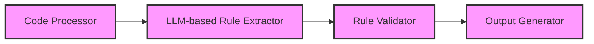
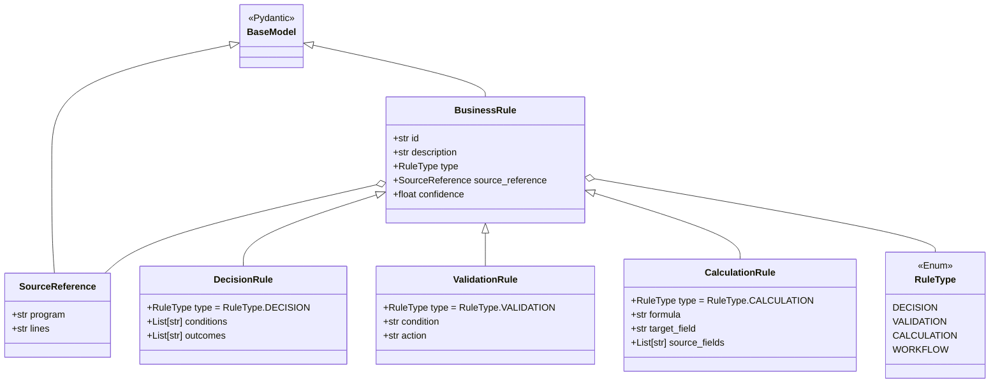
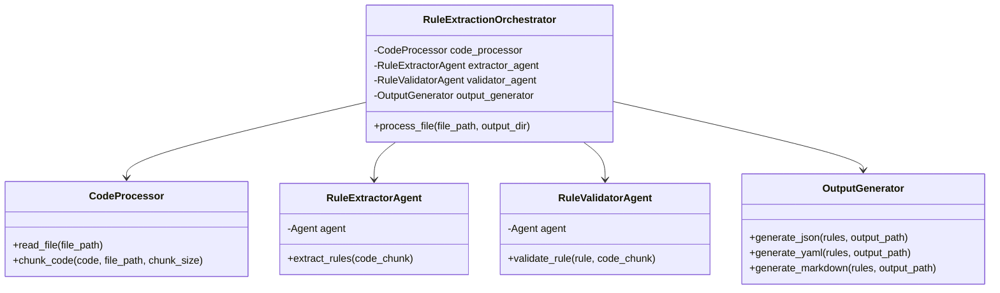
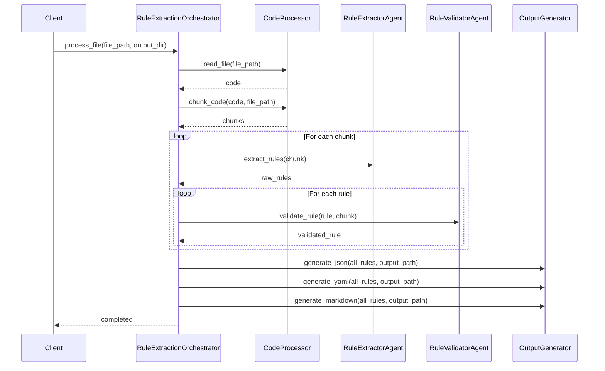
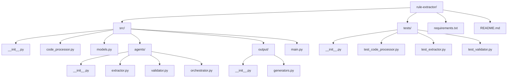
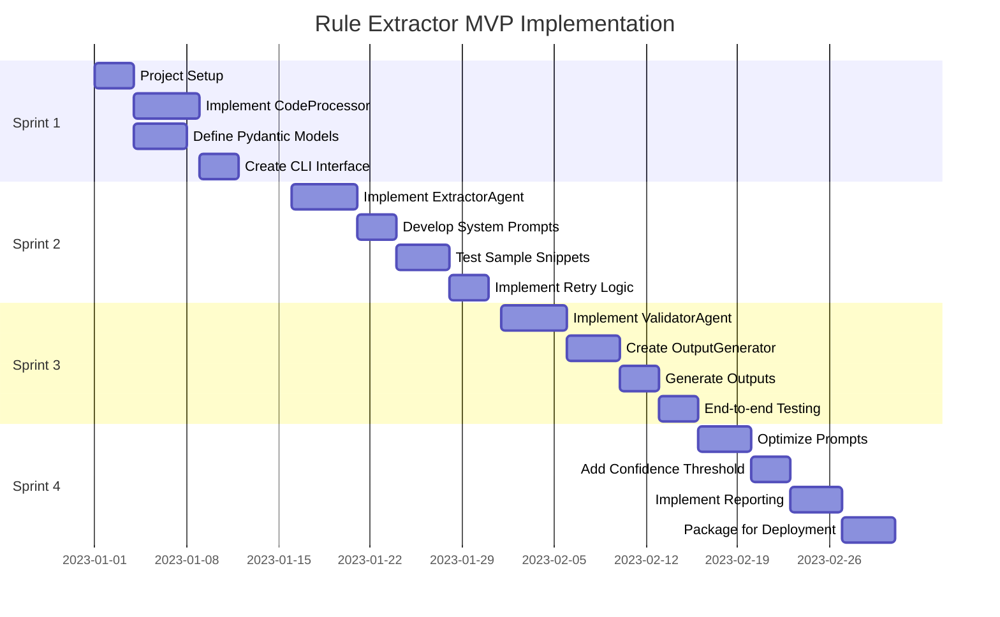
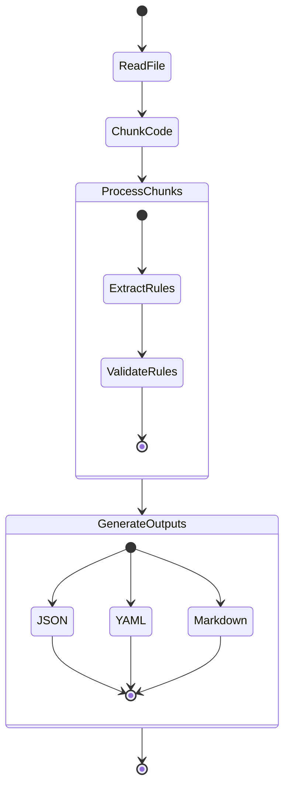
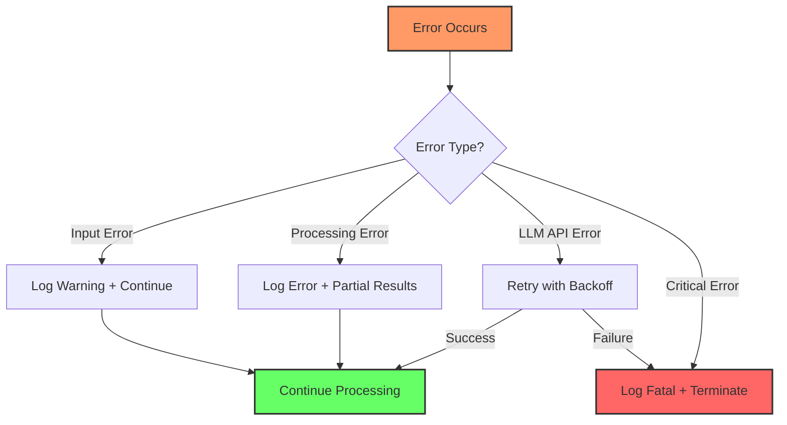

# agentic-rule-extractor-implementation-guide.md

# Technical Implementation Guide: PydanticAI-Based Rule Extractor MVP

## 1. Introduction

This document provides technical implementation details for the Rule Extractor MVP using PydanticAI. It translates high-level design into actionable development guidance for the MVP. The implementation follows the KISS, DRY, and YAGNI principles to deliver a minimally viable solution with clear extension paths.

## 2. System Architecture

The MVP architecture focuses on four essential components arranged in a pipeline:



For MVP simplicity, we'll implement these components as PydanticAI agents with clearly defined interfaces between them. Each agent will have a specific responsibility, following the Single Responsibility Principle.

## 3. Component Specification

### 3.1. Code Processor

**Purpose:** Ingest, preprocess, and segment source code for LLM consumption.

**Implementation Details:**
- Create a minimal `CodeProcessor` class that handles:
  - Reading source files (COBOL/RPG)
  - Splitting code into manageable chunks (by line count)
  - Basic filtering of comments and boilerplate

**Code Structure:**
```python
from pydantic import BaseModel
from typing import List, Optional

class CodeChunk(BaseModel):
    content: str
    source_file: str
    start_line: int
    end_line: int
    
class CodeProcessor:
    def read_file(self, file_path: str) -> str:
        # Read file content
        pass
        
    def chunk_code(self, 
                  code: str, 
                  file_path: str, 
                  chunk_size: int = 300) -> List[CodeChunk]:
        # Split code into chunks
        pass
```

**MVP Constraints:**
- Hardcode input file paths or take simple command-line arguments
- Use basic line-by-line splitting without advanced parsing
- Focus on basic character handling and encoding conversion if needed

### 3.2. LLM-based Rule Extractor

**Purpose:** Identify business rules in code chunks using PydanticAI agents.

**Implementation Details:**
- Create a `RuleExtractorAgent` using PydanticAI
- Define Pydantic models for business rules
- Configure prompts for rule extraction
- Implement the agent's execution logic

**Code Structure:**
```python
from pydantic import BaseModel, Field
from pydantic_ai import Agent, RunContext
from typing import List, Optional, Dict, Any

class BusinessRule(BaseModel):
    id: str 
    description: str
    type: str = Field(..., description="Type of rule: 'decision', 'validation', etc.")
    source_reference: str
    confidence: float = 1.0

class RuleExtractorAgent:
    def __init__(self, llm_model: str = "openai:gpt-4"):
        self.agent = Agent(
            llm_model,
            result_type=List[BusinessRule],
            result_retries=2
        )
        
        @self.agent.system_prompt
        def system_prompt(ctx: RunContext):
            return """
            You are an expert at identifying business rules in legacy code.
            Analyze the provided code and extract all business rules.
            For each rule, provide an ID, description, type, and source reference.
            """
            
        @self.agent.tool
        def get_code_context(ctx: RunContext, chunk: CodeChunk) -> str:
            # Return the code chunk for analysis
            return chunk.content
    
    def extract_rules(self, code_chunk: CodeChunk) -> List[BusinessRule]:
        # Use the agent to extract rules
        return self.agent.run_sync(chunk=code_chunk)
```

**MVP Constraints:**
- Use a single, powerful LLM (e.g., GPT-4) via API for simplicity
- Define minimal but complete rule schema
- Focus on few-shot example prompting over fine-tuning
- Keep system prompt clear and concise but effective

### 3.3. Rule Validator

**Purpose:** Verify extracted rules and assign confidence scores.

**Implementation Details:**
- Create a `RuleValidatorAgent` using PydanticAI
- Implement simple validation checks
- Use an LLM to verify rule accuracy

**Code Structure:**
```python
from pydantic_ai import Agent, RunContext

class ValidatedRule(BusinessRule):
    validation_notes: Optional[str] = None

class RuleValidatorAgent:
    def __init__(self, llm_model: str = "openai:gpt-4"):
        self.agent = Agent(
            llm_model,
            result_type=ValidatedRule
        )
        
        @self.agent.system_prompt
        def system_prompt(ctx: RunContext):
            return """
            You are a business rule validator. Your job is to verify if the 
            extracted rule accurately represents the code.
            Assign a confidence score (0-1) and provide any validation notes.
            """
            
    def validate_rule(self, rule: BusinessRule, code_chunk: CodeChunk) -> ValidatedRule:
        # Use the agent to validate the rule
        validated_rule = self.agent.run_sync(rule=rule, code=code_chunk.content)
        return validated_rule
```

**MVP Constraints:**
- Implement minimal validation (LLM-based review)
- Focus on identifying low-confidence rules
- Keep validation logic simple but scalable

### 3.4. Output Generator

**Purpose:** Format validated rules as structured output files.

**Implementation Details:**
- Create an `OutputGenerator` class
- Implement YAML/JSON output formatting
- Generate simple Markdown reports

**Code Structure:**
```python
import json
import yaml
from typing import List

class OutputGenerator:
    def generate_json(self, rules: List[ValidatedRule], output_path: str) -> None:
        # Output rules as JSON
        with open(output_path, 'w') as f:
            json.dump([rule.dict() for rule in rules], f, indent=2)
    
    def generate_yaml(self, rules: List[ValidatedRule], output_path: str) -> None:
        # Output rules as YAML
        with open(output_path, 'w') as f:
            yaml.dump([rule.dict() for rule in rules], f)
            
    def generate_markdown(self, rules: List[ValidatedRule], output_path: str) -> None:
        # Generate a markdown report
        with open(output_path, 'w') as f:
            f.write("# Extracted Business Rules\n\n")
            # Generate summary stats
            f.write(f"Total Rules: {len(rules)}\n")
            f.write(f"Low Confidence Rules: {sum(1 for r in rules if r.confidence < 0.7)}\n\n")
            
            # Write each rule
            for rule in rules:
                f.write(f"## {rule.id}: {rule.description}\n")
                f.write(f"- **Type:** {rule.type}\n")
                f.write(f"- **Source:** {rule.source_reference}\n")
                f.write(f"- **Confidence:** {rule.confidence}\n")
                if rule.validation_notes:
                    f.write(f"- **Notes:** {rule.validation_notes}\n")
                f.write("\n")
```

**MVP Constraints:**
- Focus on simple, well-formatted outputs
- Include minimal reporting (counts, confidence flags)
- Ensure machine-readability of JSON/YAML outputs

## 4. Data Models

The MVP will use Pydantic models to ensure type safety and validation throughout the pipeline. These models form the backbone of data transfer between components.

### 4.1. Core Models



```python
from pydantic import BaseModel, Field
from typing import List, Optional, Dict, Union
from enum import Enum

class RuleType(str, Enum):
    DECISION = "decision"
    VALIDATION = "validation"
    CALCULATION = "calculation"
    WORKFLOW = "workflow"

class SourceReference(BaseModel):
    program: str
    lines: str
    
class BusinessRule(BaseModel):
    id: str
    description: str
    type: RuleType
    source_reference: SourceReference
    confidence: float = 1.0
    
class DecisionRule(BusinessRule):
    type: RuleType = RuleType.DECISION
    conditions: List[str]
    outcomes: List[str]
    
class ValidationRule(BusinessRule):
    type: RuleType = RuleType.VALIDATION
    condition: str
    action: str
    
class CalculationRule(BusinessRule):
    type: RuleType = RuleType.CALCULATION
    formula: str
    target_field: str
    source_fields: List[str]
```

### 4.2. Agent Dependencies

```python
class ExtractionDependencies(BaseModel):
    model_name: str = "openai:gpt-4"
    chunk_size: int = 300
    max_tokens: int = 4000
    temperature: float = 0.1
```

## 5. Agent Design

The MVP will implement a minimal multi-agent structure following PydanticAI principles.

### 5.1. Agent Structure



```python
from pydantic_ai import Agent, RunContext

# Simplified agent design - in actual implementation, each agent would be more complete
class RuleExtractionOrchestrator:
    def __init__(self):
        self.code_processor = CodeProcessor()
        self.extractor_agent = RuleExtractorAgent()
        self.validator_agent = RuleValidatorAgent()
        self.output_generator = OutputGenerator()
        
    def process_file(self, file_path: str, output_dir: str) -> None:
        # Process a single file through the pipeline
        code = self.code_processor.read_file(file_path)
        chunks = self.code_processor.chunk_code(code, file_path)
        
        all_rules = []
        for chunk in chunks:
            # Extract rules
            raw_rules = self.extractor_agent.extract_rules(chunk)
            
            # Validate each rule
            validated_rules = []
            for rule in raw_rules:
                validated_rule = self.validator_agent.validate_rule(rule, chunk)
                validated_rules.append(validated_rule)
            
            all_rules.extend(validated_rules)
        
        # Generate outputs
        self.output_generator.generate_json(all_rules, f"{output_dir}/rules.json")
        self.output_generator.generate_yaml(all_rules, f"{output_dir}/rules.yaml")
        self.output_generator.generate_markdown(all_rules, f"{output_dir}/rules_report.md")
```

### 5.2. Processing Sequence



### 5.3. PydanticAI Principles Application

Following the principles from the PydanticAI document:

1. **Model Agnosticism:**
   ```python
   def __init__(self, llm_model: str = "openai:gpt-4"):
       # Support different LLM providers through a configurable parameter
       self.agent = Agent(llm_model, result_type=BusinessRule)
   ```

2. **Validation and Structure:**
   ```python
   # Define explicit schemas for all data transfers
   class BusinessRule(BaseModel):
       id: str
       description: str
       # ... other fields with types
   
   # Agent with enforced result_type
   self.agent = Agent(llm_model, result_type=List[BusinessRule], result_retries=2)
   ```

3. **Simplicity:**
   ```python
   # Start with a single agent and minimal components for MVP
   # Avoid premature multi-agent complexity
   def process_file(self, file_path: str, output_dir: str) -> None:
       # Linear, straightforward processing flow
       # ...
   ```

4. **Error Handling:**
   ```python
   # Use PydanticAI's retry mechanism
   self.agent = Agent(llm_model, result_type=BusinessRule, result_retries=2)
   
   # Handle validation failures
   try:
       validated_rule = self.validator_agent.validate_rule(rule, chunk)
   except Exception as e:
       # Log error and continue with default
       logging.error(f"Validation failed for rule {rule.id}: {str(e)}")
       validated_rule = ValidatedRule(**rule.dict(), confidence=0.5, 
                                    validation_notes="Validation failed")
   ```

## 6. Implementation Guidelines

### 6.1. Project Structure



### 6.2. Dependency Management

```
# requirements.txt
pydantic>=2.0.0
pydantic-ai>=0.0.10
openai>=1.0.0
anthropic>=0.3.0  # Optional for Claude support
PyYAML>=6.0
```

### 6.3. Development Workflow

1. **Start with models and interfaces**
   - Define all Pydantic models first
   - Create interfaces for components

2. **Implement one component at a time**
   - Begin with the CodeProcessor
   - Then implement the Extractor Agent
   - Follow with Validator and Output Generator

3. **Test with actual code samples**
   - Use a small, representative COBOL/RPG sample
   - Test end-to-end as soon as possible

4. **Iterate based on results**
   - Refine prompts based on initial output
   - Adjust chunk sizes if needed
   - Enhance validation as patterns emerge

## 7. MVP Implementation Plan

### 7.1. Implementation Timeline



### 7.2. Sprint 1: Core Infrastructure

- Set up project structure
- Implement CodeProcessor
- Define all Pydantic models
- Create basic CLI interface

### 7.3. Sprint 2: Extraction Pipeline

- Implement Extractor Agent
- Develop initial system prompts
- Test with sample code snippets
- Implement retry logic for failures

### 7.4. Sprint 3: Validation and Output

- Implement Validator Agent
- Create Output Generator
- Generate JSON/YAML/Markdown outputs
- End-to-end testing with sample code

### 7.5. Sprint 4: Refinement

- Optimize prompts based on test results
- Add confidence thresholding
- Implement basic reporting
- Package for deployment

## 8. Key Technical Considerations

### 8.1. Processing Flow Activity Diagram



### 8.2. LLM Integration

```python
# Use PydanticAI's model agnostic approach
from pydantic_ai import Agent

# Configurable LLM provider
def create_extraction_agent(model: str = "openai:gpt-4"):
    agent = Agent(
        model,
        result_type=List[BusinessRule],
        result_retries=2,
        # Optional additional config
        max_tokens=4000,
        temperature=0.1
    )
    return agent
```

### 8.3. Prompt Engineering

Focus on clear, deterministic prompts:

```python
@agent.system_prompt
def system_prompt(ctx: RunContext):
    return """
    You are an expert at identifying business rules in legacy COBOL/RPG code.
    
    A business rule is a statement that defines or constrains some aspect of business logic.
    Examples include:
    - Validation rules (e.g., "Customer age must be 18 or above")
    - Decision rules (e.g., "If credit score > 700, approve loan")
    - Calculation rules (e.g., "Interest is calculated as principal * rate * time / 100")
    
    For each rule you identify, provide:
    1. A unique ID (e.g., RULE-001)
    2. A clear description in business language
    3. The rule type (validation, decision, calculation, workflow)
    4. Source reference (line numbers)
    
    Focus only on actual business logic, not technical implementation details.
    If you're uncertain about a rule, indicate lower confidence.
    """
```

### 8.4. Error Handling and Logging

Implement robust error handling with a structured approach:



#### 8.4.1 Error Classification and Strategy

| Error Type | Description | Strategy | Example |
|------------|-------------|----------|---------|
| Input Error | Invalid/malformed input files | Log warning, skip file | Unreadable COBOL file |
| Processing Error | Error during normal processing | Log error, continue with partial results | Failed to extract some rules |
| LLM API Error | Temporary API failures | Implement exponential backoff and retry | OpenAI rate limit |
| Critical Error | Unrecoverable system error | Log fatal error and terminate gracefully | Out of disk space |

#### 8.4.2 Implementation Example

```python
import logging
import time
from typing import Optional, List, Callable
from functools import wraps

# Configure structured logging
logging.basicConfig(
    level=logging.INFO,
    format='%(asctime)s - %(name)s - %(levelname)s - %(message)s',
    handlers=[
        logging.FileHandler("rule_extractor.log"),
        logging.StreamHandler()
    ]
)

logger = logging.getLogger("rule_extractor")

# Error handling decorator with retry capability
def with_error_handling(max_retries: int = 3, backoff_factor: float = 1.5):
    def decorator(func: Callable):
        @wraps(func)
        def wrapper(*args, **kwargs):
            retries = 0
            last_exception = None
            
            while retries <= max_retries:
                try:
                    return func(*args, **kwargs)
                except Exception as e:
                    last_exception = e
                    retries += 1
                    
                    # Classify error type
                    if isinstance(e, (FileNotFoundError, PermissionError)):
                        logger.warning(f"Input error: {str(e)}")
                        # Skip this file and continue with others
                        return None
                    elif "rate limit" in str(e).lower() or "timeout" in str(e).lower():
                        # API error - apply backoff and retry
                        wait_time = backoff_factor ** retries
                        logger.info(f"API error, retrying in {wait_time:.1f}s: {str(e)}")
                        time.sleep(wait_time)
                        continue
                    elif isinstance(e, Exception) and retries <= max_retries:
                        # General processing error, retry
                        logger.error(f"Processing error (attempt {retries}/{max_retries}): {str(e)}")
                        continue
                    else:
                        # Critical or max retries reached
                        logger.critical(f"Critical error or max retries reached: {str(e)}")
                        raise
            
            # If we got here, we exceeded retries
            raise last_exception
        return wrapper
    return decorator

# Example usage
class RuleExtractionOrchestrator:
    @with_error_handling(max_retries=3)
    def process_file(self, file_path: str, output_dir: str) -> Optional[List[ValidatedRule]]:
        logger.info(f"Processing file: {file_path}")
        
        # Processing logic as before
        # ...
        
        logger.info(f"Successfully processed file: {file_path}")
        return all_rules  # Return results if successful
        
    def process_files_safely(self, file_paths: List[str], output_dir: str) -> dict:
        """Process multiple files with error isolation."""
        results = {
            "successful": [],
            "failed": [],
            "partial": []
        }
        
        for file_path in file_paths:
            try:
                file_rules = self.process_file(file_path, output_dir)
                if file_rules:
                    results["successful"].append(file_path)
                else:
                    results["partial"].append(file_path)
            except Exception as e:
                logger.error(f"Failed to process {file_path}: {str(e)}")
                results["failed"].append(file_path)
                
        # Generate summary report
        logger.info(f"Processing summary: {len(results['successful'])} successful, "
                   f"{len(results['partial'])} partial, {len(results['failed'])} failed")
                   
        return results
```

#### 8.4.3 Error Telemetry

For production deployments, implement telemetry to track error patterns:

```python
def log_structured_error(error_type: str, message: str, context: dict = None):
    """Log structured error information for telemetry."""
    error_data = {
        "error_type": error_type,
        "message": message,
        "timestamp": time.time(),
        "context": context or {}
    }
    
    # Log to structured logging system
    logger.error(f"{error_type}: {message}", extra={"error_data": error_data})
    
    # In production, you might send to telemetry service
    # send_to_telemetry(error_data)
```

This approach ensures robust error handling throughout the pipeline, minimizing the impact of failures and providing valuable diagnostic information for debugging and improvement.