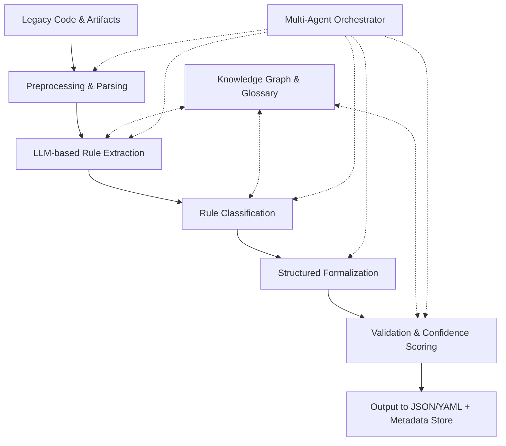
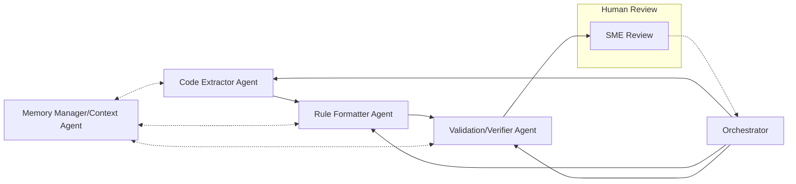
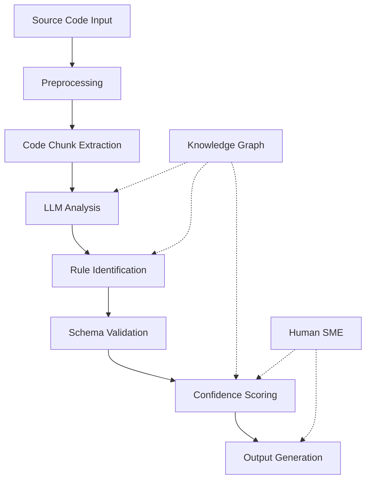
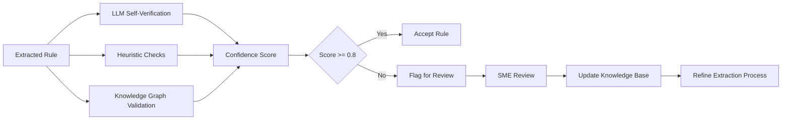
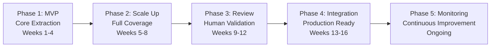

# Rule Extractor Design Diagrams

This document contains the visual diagrams representing different aspects of the Rule Extractor design.

## System Architecture Overview

## Multi-Agent Workflow

## Rule Extraction Pipeline

## Validation and Verification Process

## Implementation Phases

