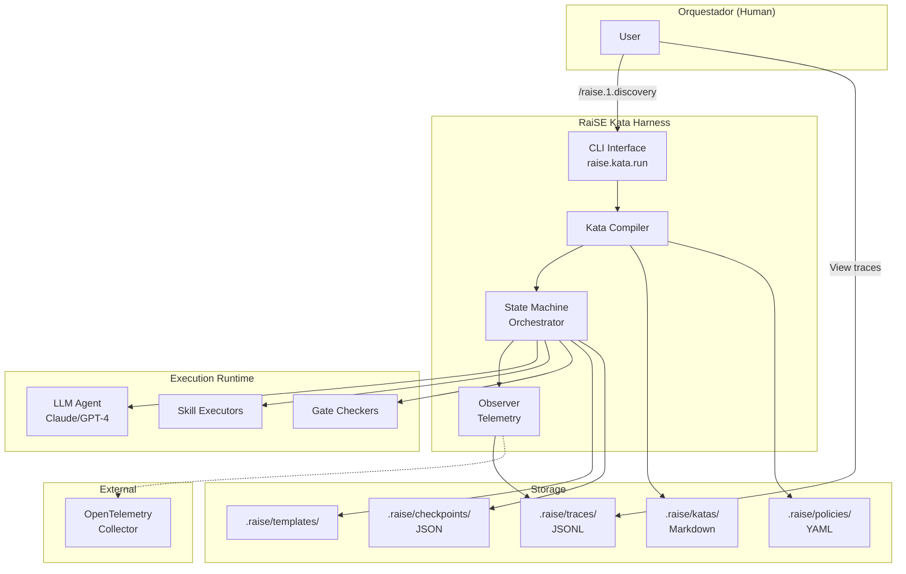
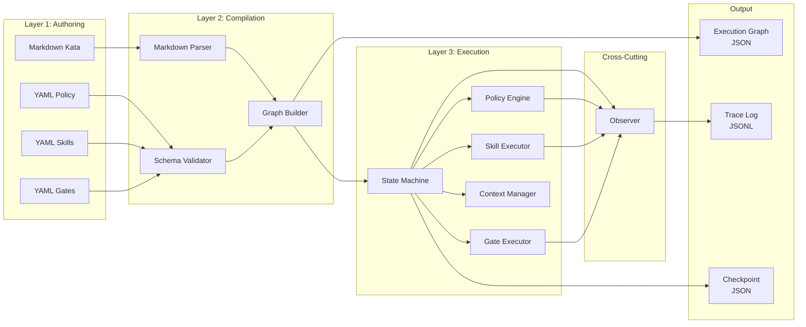
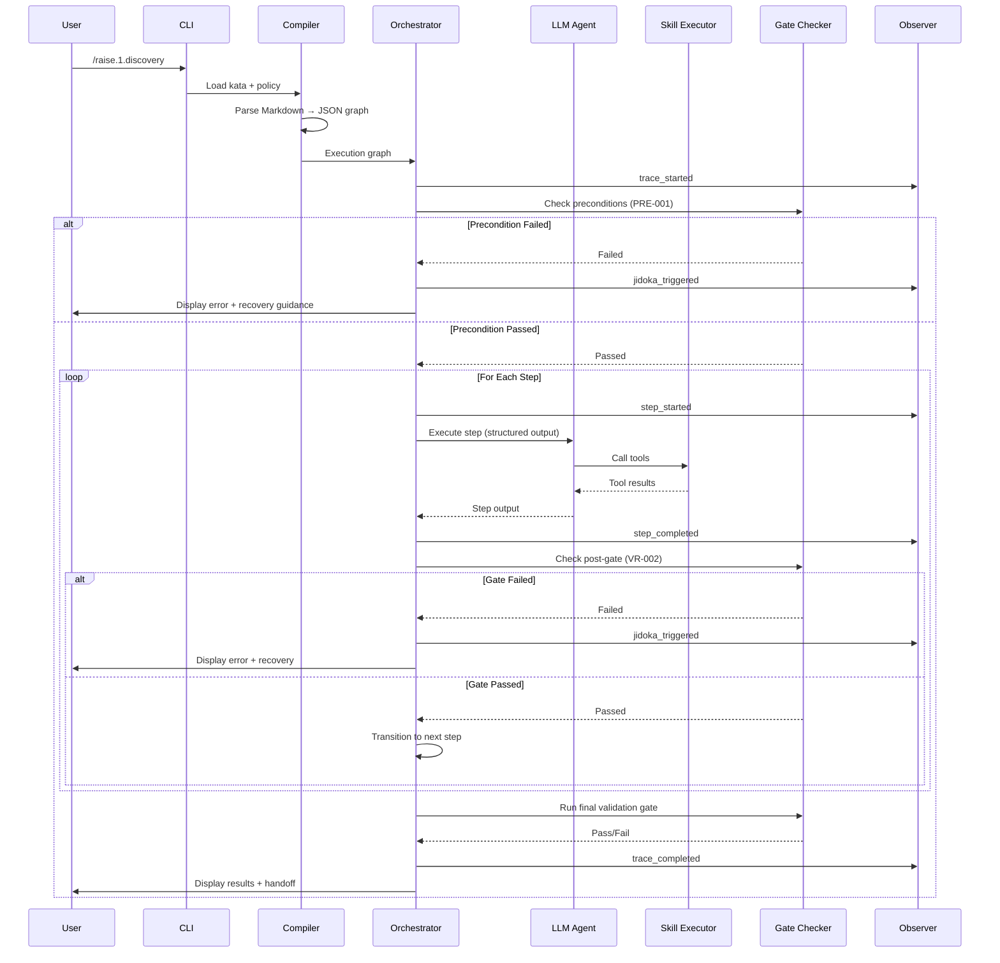
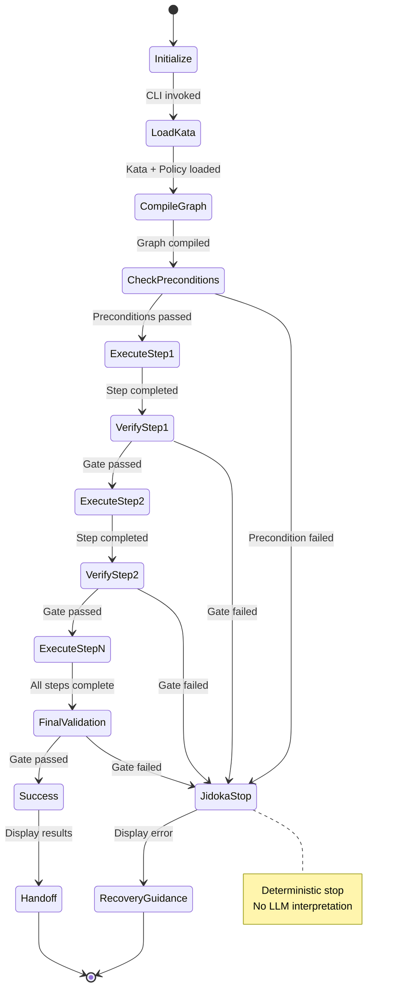

# RaiSE Kata Harness: Comprehensive Design Recommendation

## Executive Summary

This document synthesizes findings from five research questions to propose a comprehensive architecture for the RaiSE Kata Harness - the execution engine that will transform RaiSE Katas from interpreted Markdown documents into governable, observable, and enforceable workflows.

### The Core Challenge

**Current State**: RaiSE Katas are Markdown documents interpreted by LLMs. Success depends on the LLM's ability to follow instructions, verify conditions, and trigger Jidoka appropriately.

**Gap**: No enforcement mechanism exists. The LLM may:
- Skip steps or reorder them
- Hallucinate verification results
- Ignore Jidoka triggers
- Lose context across multi-step workflows

**Desired State**: A harness that **enforces** governance while preserving the pedagogical value and accessibility of Markdown-based Katas.

### Key Finding: The "Deterministic" Paradox

Traditional workflow engines (Temporal, Prefect) achieve determinism through explicit state machines. LLM-based systems are inherently probabilistic. The research reveals:

**"Deterministic" is the wrong goal.** Better targets:
- **Verifiable**: Every execution path is traceable and auditable
- **Observable**: Complete visibility into decisions and state transitions
- **Governable**: Policies enforced by the harness, not suggested to the LLM

### Recommended Architecture: 3-Layer Compiled Kata DSL

```
┌────────────────────────────────────────────────────────┐
│  LAYER 1: AUTHORING (Human-Facing)                     │
│  Markdown Katas + YAML Policies + YAML Skills         │
│  - Accessible to non-developers                        │
│  - Version-controlled in Git                           │
│  - Pedagogically structured (ShuHaRi alignment)        │
└────────────────────────────────────────────────────────┘
                        ↓
                [Kata Compiler]
                        ↓
┌────────────────────────────────────────────────────────┐
│  LAYER 2: EXECUTION PLAN (Machine-Readable)            │
│  JSON Execution Graph                                  │
│  - Steps with dependencies                             │
│  - Gates with executable checks                        │
│  - Jidoka triggers with conditions                     │
│  - Context requirements                                │
└────────────────────────────────────────────────────────┘
                        ↓
            [Kata Harness Runtime]
                        ↓
┌────────────────────────────────────────────────────────┐
│  LAYER 3: STATE MACHINE EXECUTION (Enforcement)        │
│  Orchestrator enforces:                                │
│  - Step ordering (cannot skip)                         │
│  - Pre-execution gates (fail fast)                     │
│  - Post-execution validation (blocking)                │
│  - Jidoka stops (automatic, not LLM-interpreted)       │
│  - Full observability (JSONL traces)                   │
└────────────────────────────────────────────────────────┘
```

### What Changes

| Aspect | Current (Markdown + LLM) | Recommended (Harness) |
|--------|--------------------------|----------------------|
| **Step Ordering** | LLM interprets sequence | State machine enforces |
| **Gates** | Suggested checklists | Blocking pre/post gates |
| **Jidoka** | Prompt-embedded logic | Policy-triggered stops |
| **Resumability** | Manual (progress.md) | Automatic checkpoints |
| **Observability** | Ad-hoc logging | Built-in JSONL traces |
| **Governance** | Suggested to LLM | Enforced by harness |
| **Context Management** | LLM manages | Explicit context budget |
| **Debugging** | Hard (LLM black box) | Replay from traces |

### Strategic Alignment with RaiSE Principles

| Principle | How Harness Honors It |
|-----------|----------------------|
| **§1. Humanos Definen** | Markdown authoring remains primary interface |
| **§2. Governance as Code** | Policies are versioned YAML artifacts |
| **§4. Validation Gates** | Gates enforced by harness, not suggested |
| **§7. Jidoka** | Automatic halt on gate failure (deterministic) |
| **§7. Kaizen** | Traces enable systematic improvement |
| **§8. Observable Workflow** | Full MELT stack (metrics, events, logs, traces) |

### Competitive Differentiation

No existing framework combines:
1. **Markdown-first authoring** (accessible to non-developers)
2. **Compiled enforcement** (governance guaranteed, not suggested)
3. **Lean principles as primitives** (Jidoka, Kaizen built-in)
4. **Heutagogical design** (teach while executing)
5. **Local-first observability** (no cloud dependency)

LangGraph, CrewAI, AutoGen focus on developer productivity. RaiSE focuses on **reliable governance for enterprise AI adoption**.

### MVP Scope (Weeks 1-4)

**Goal**: Prove the 3-layer architecture with a single Kata.

**Deliverables**:
1. Kata Compiler (Markdown → JSON)
2. State Machine Orchestrator (enforce steps, gates)
3. 3 Core Skills (file/load, llm/call, gate/run)
4. JSONL trace logging
5. Demo Kata: flujo-01-discovery (3 steps, 1 gate)

**Success Criteria**:
- ✅ Kata executes deterministically (same input → same path)
- ✅ Gate failure halts execution (Jidoka)
- ✅ Can resume from checkpoint
- ✅ Trace log shows complete history

### Implementation Roadmap

| Phase | Timeline | Focus | Key Deliverables |
|-------|----------|-------|------------------|
| **Phase 1 (MVP)** | Weeks 1-4 | Proof of Concept | Compiler, basic orchestrator, 1 kata |
| **Phase 2 (Expansion)** | Weeks 5-8 | All Work Cycles | Branching, loops, parallel, all katas |
| **Phase 3 (Observability)** | Weeks 9-12 | MELT Stack | Metrics, OpenTelemetry export, dashboard |
| **Phase 4 (Production)** | Weeks 13-16 | Hardening | Error recovery, performance, DX |

---

## 1. Research Synthesis

### 1.1 RQ1: First Principles - Execution Primitives

**Key Findings**:

1. **8 Fundamental Primitives** identified for agentic workflow execution:
   - **Operation**: Atomic unit of work (deterministic or probabilistic)
   - **Step**: Operation + pre/post conditions + observability
   - **Transition**: Control flow between steps (sequential, conditional, parallel)
   - **State**: Persistent data shared across steps
   - **Workflow**: Directed graph of steps
   - **Gate**: Validation checkpoint (blocking or advisory)
   - **Context Manager**: Token budget and memory allocation
   - **Observer**: Telemetry and audit trail

2. **Mapping to RaiSE Ontology**:

| Generic Primitive | RaiSE v2.3 Term | Implementation Status | Gap |
|-------------------|-----------------|----------------------|-----|
| Operation | Skill | YAML planned | ✅ Concept exists |
| Step | Kata step | Markdown H3 | ⚠️ No enforcement |
| Transition | (implicit) | LLM interprets | ❌ Not formalized |
| State | Context/Golden Data | Files in LLM context | ⚠️ No explicit state mgmt |
| Workflow | Kata | Markdown document | ⚠️ No execution semantics |
| Gate | Validation Gate | Markdown checklist | ⚠️ Advisory, not blocking |
| Context Manager | MVC retrieval | Planned skill | ✅ Concept exists |
| Observer | Observable Workflow | § principle only | ❌ No telemetry layer |

3. **Critical Gap Identified**: RaiSE has strong conceptual primitives but lacks an **execution harness** to interpret and enforce them.

**Implications for Design**:
- Harness must formalize transitions (explicit state machine)
- State management must be explicit (not implicit in LLM context)
- Gates must become blocking checkpoints (enforcement layer)
- Observer must be built from scratch (JSONL traces → OpenTelemetry)

---

### 1.2 RQ2: Market Landscape - Agent Frameworks

**Key Findings**:

1. **Three Execution Paradigms** observed:

   a. **Explicit Orchestration** (LangGraph, Temporal):
      - State graph with defined transitions
      - Deterministic flow control
      - Checkpointing and resumability
      - **Relevance to RaiSE**: HIGH (best pattern for governance)

   b. **Conversational Emergence** (AutoGen):
      - Multi-agent dialog until consensus
      - Implicit flow (turn-taking)
      - **Relevance to RaiSE**: LOW (too flexible for governance)

   c. **Collaborative Execution** (CrewAI):
      - Task delegation to specialized agents
      - Sequential/hierarchical processes
      - **Relevance to RaiSE**: MEDIUM (useful for parallel steps)

2. **Industry Pattern: "Thin LLM, Thick Orchestrator"**

   ```
   Orchestrator (Controls Flow) → LLM (Decides) → Tools (Execute)
   ```

   - **Orchestrator**: Enforces step ordering, gates, state transitions
   - **LLM**: Makes decisions ("which path?", "is this sufficient?")
   - **Tools**: Execute atomic operations (deterministic)

   **Benefit**: Governance enforced by orchestrator, not suggested to LLM.

3. **LangGraph as Gold Standard** for structured agent workflows:
   - State graphs provide enforcement (not just suggestions)
   - Checkpointing enables resumption without re-execution
   - Conditional edges formalize decision points
   - Type schemas provide verification before runtime
   - LangSmith integration for observability

4. **Temporal for Durable Execution**:
   - Event sourcing for perfect audit trails
   - Activity isolation prevents cascading failures
   - Durable state across server restarts
   - Explicit retries and timeouts

**Implications for Design**:
- Adopt **state graph pattern** (LangGraph model) for Kata flow control
- Implement **checkpointing** (Temporal model) for resumability
- Separate **planning (LLM)** from **execution (harness)**
- Use **type-safe state** (JSON Schema validation)

---

### 1.3 RQ3: Determinism Patterns

**Key Findings**:

1. **Determinism Spectrum** (not binary):

   ```
   Pure Stochastic ←――――――――――――――――――――→ Pure Deterministic
   │                                              │
   LLM temp=1.0    Structured Output    Grammar-Constrained    State Machine
   ```

   - **Reproducible ≠ Deterministic**: Same input may yield same output within a model version (temperature=0), but not guaranteed forever
   - **Best achievable**: "Governance-grade determinism" (>95% reproducibility)

2. **Pattern Recommendations by Priority**:

| Pattern | Applicability | Priority | Complexity |
|---------|--------------|----------|------------|
| **Structured Output (Tool Use)** | All validation gates | P0 | LOW |
| **State Machine (XState)** | Kata flow control | P1 | MEDIUM |
| **Thin LLM Architecture** | LLM plans, code executes | P0 | MEDIUM |
| **Verification Layer (Guardrails)** | Safety net | P2 | LOW |
| **Program Synthesis (DSPy)** | Too complex for now | P3 | HIGH |

3. **Structured Output Enforcement**:
   - **Tool/Function Calling**: LLM outputs conform to typed schemas (95-99% compliance)
   - **Grammar-Constrained Generation**: Token-level enforcement (100% compliance, but 2-10x slower, local models only)
   - **Schema Validation + Retry**: Allow free-form output, retry on validation failure (90%+ eventual compliance)

4. **State Machine Approaches**:
   - **XState + LLM Integration**: Define workflow as statechart, LLM provides input to transitions
   - **Guarantees**: 100% flow determinism, full state history, explicit error states
   - **Trade-off**: Upfront modeling effort, reduced flexibility

5. **Hybrid "Thin LLM" Architecture** (recommended):

   ```
   ┌─────────────────────────────────────────┐
   │  State Machine Orchestrator             │
   │  - Controls flow                        │
   │  - Enforces gates                       │
   │  - Manages state                        │
   └─────────────────────────────────────────┘
                   ↓
   ┌─────────────────────────────────────────┐
   │  LLM (Decision Layer)                   │
   │  - Decides which tool to call           │
   │  - Generates content                    │
   │  - Outputs structured data              │
   └─────────────────────────────────────────┘
                   ↓
   ┌─────────────────────────────────────────┐
   │  Tools (Execution Layer)                │
   │  - Deterministic file operations        │
   │  - API calls                            │
   │  - Gate checks                          │
   └─────────────────────────────────────────┘
   ```

**Implications for Design**:
- **Layer 1 (Orchestrator)**: State machine enforces flow (deterministic)
- **Layer 2 (LLM)**: Structured outputs only (tool use, JSON mode)
- **Layer 3 (Tools)**: All side effects happen here (deterministic, unit-testable)
- **Verification**: Add guardrails as safety net (not primary mechanism)

---

### 1.4 RQ4: Observability Patterns

**Key Findings**:

1. **LLM Observability Ecosystem** has converged on:
   - **Hierarchical span model**: Traces → Runs → Steps → Tool Calls
   - **OpenTelemetry** as emerging standard (OTLP for LLMs)
   - **LangSmith** (LangChain) as production reference

2. **Major Gap**: Existing tools focus on **performance optimization** (latency, cost), NOT **governance enforcement** (gates, policies, Jidoka).

3. **Recommended Data Model for RaiSE**:

   **Format**: JSONL (JSON Lines)
   **Storage**: `.raise/traces/{date}.jsonl` (local-first, per ADR-008)
   **Retention**: 30 days (configurable)

   **Event Types**:
   - `trace_started/completed`: Kata execution lifecycle
   - `step_started/completed/failed`: Kata step execution
   - `llm_call`: LLM invocation with token usage
   - `tool_call`: Skill execution
   - `gate_check`: Validation gate (pass/fail + criteria details)
   - `jidoka_triggered`: Stop-the-line event (CRITICAL for RaiSE)
   - `jidoka_resumed`: Execution resumed after intervention

4. **Governance-First Observability** (RaiSE-specific):

   **Jidoka-Centric Metrics**:
   - **Stop Rate**: % of executions stopped (target: <10%)
   - **Top Stop Conditions**: Which checks fail most
   - **Gate Pass Rate**: % passing per gate (target: >90%)
   - **Kata Quality Trend**: Weekly improvement tracking

   **Example Jidoka Event**:
   ```json
   {
     "event_type": "jidoka_triggered",
     "trigger": "verification_failed",
     "gate_id": "gate-discovery",
     "criteria_failed": ["VR-002: >= 5 functional requirements"],
     "action": "stop_execution",
     "recovery_guidance": [
       "Review context documents for more requirements",
       "Ask user for additional scope"
     ],
     "timestamp": "2026-01-29T10:35:20Z"
   }
   ```

5. **Audit Requirements** (Compliance: SOC2, EU AI Act):
   - ✅ Immutable audit trail (hash-chained events)
   - ✅ Who-What-When-Why (capture all governance decisions)
   - ✅ Queryability (support compliance queries)
   - ✅ Deterministic replay (reproduce execution from trace)
   - ✅ PII protection (anonymize user IDs, never log code content)

6. **OpenTelemetry Compatibility**:
   - Export command: `rai export otlp --input .raise/traces/2026-01-29.jsonl`
   - Custom OTLP attributes for RaiSE-specific events:
     ```json
     {
       "attributes": [
         {"key": "raise.kata.id", "value": "flujo-001-discovery"},
         {"key": "raise.gate.status", "value": "failed"},
         {"key": "raise.jidoka.triggered", "value": true}
       ]
     }
     ```

**Implications for Design**:
- **Phase 1 (MVP)**: Basic JSONL traces (trace start/end, steps, Jidoka events)
- **Phase 2**: Gate observability (detailed check results)
- **Phase 3**: CLI dashboard (Jidoka trends, gate pass rates)
- **Phase 4**: OpenTelemetry export (enterprise integration)

---

### 1.5 RQ5: Governance-as-Code Patterns

**Key Findings**:

1. **Policy-Mechanism Separation is Feasible**:
   - Modern frameworks (OPA, NeMo Guardrails, Guardrails AI) successfully separate policy definition from enforcement mechanism
   - **Policy**: WHAT should be enforced (declarative rules)
   - **Mechanism**: HOW to enforce (execution engine)

2. **Enforcement Timing Matters**:

| Timing | Description | RaiSE Current State | Gap |
|--------|-------------|---------------------|-----|
| **Pre-execution** | Validate BEFORE step runs | None | ❌ Missing |
| **Runtime (continuous)** | Monitor DURING execution | None | ❌ Missing |
| **Post-execution** | Validate AFTER step completes | Markdown gates | ⚠️ Not automated |

   **Critical Gap**: No pre-execution gates → wasted tokens on doomed executions

3. **Executable Policies Beat Descriptive Text**:
   - **Deterministic formats**: OPA Rego, Cedar, JSON Schema, Custom YAML DSL
   - **Heuristic formats**: Markdown checklists, natural language guidelines
   - **Result**: Executable policies achieve enforcement; text relies on LLM compliance (unreliable)

4. **Trade-off: Strict vs Flexible**:

   ```
   100% Strict              Sweet Spot              100% Flexible
   │                            │                           │
   No LLM autonomy       70% rules / 30% heuristic    LLM does anything
   Deterministic         Pre/post gates + guidelines   No enforcement
   ```

   **RaiSE Position**: **70-80% Strict, 20-30% Flexible**

   **Strict (Enforced)**:
   - File existence checks
   - Schema validation (frontmatter, sections)
   - Dependency checks (kata prerequisites)
   - Artifact completeness (min requirements)

   **Flexible (Heuristic)**:
   - Writing style
   - Example selection
   - Diagram style
   - Section organization

5. **Recommended Custom DSL for RaiSE** (YAML-based):

   **Advantages over OPA/Cedar**:
   - Domain-specific (optimized for katas, not general authorization)
   - No new language (YAML familiar to developers)
   - LLM-friendly (agent can read/explain policies)
   - Evolvable (add new policy types as needs emerge)

   **Example Policy**:
   ```yaml
   # .raise/policies/discovery-policy.yaml
   policy_id: discovery-policy
   policy_version: 2.0.0
   kata_id: flujo-01-discovery

   preconditions:
     - check_id: PRE-001
       description: Context documents exist
       validator: file_exists_any
       params:
         paths: [docs/context.md, docs/product-brief.md]
       severity: warning
       on_fail:
         action: log_warning
         message: "No context found. PRD will be based on user input only."

   step_policies:
     - step_id: step-2-identify-requirements
       validations:
         - rule_id: VR-002
           description: ">= 5 functional requirements"
           check:
             type: count
             selector: "## Requisitos Funcionales > list items"
             operator: ">="
             threshold: 5
           severity: error
           on_fail:
             action: stop_execution
             message: "Insufficient functional requirements"
             recovery: "Add more requirements to reach minimum of 5"

   post_validation:
     gate: gate-discovery
     gate_policy: gate-discovery-policy.yaml
   ```

6. **Jidoka Enforcement Through Policy** (not LLM prompts):

   **Current Approach** (embedded in Markdown):
   ```markdown
   > **Si no puedes continuar**: Missing Vision → **JIDOKA**: Run /raise.2.vision
   ```
   **Problem**: Relies on LLM to interpret and stop. Not deterministic.

   **Proposed Approach** (policy-enforced):
   ```yaml
   preconditions:
     - check_id: CHK-001
       name: Solution Vision exists
       validator: file_exists
       params:
         path: specs/main/solution_vision.md
       severity: error
       on_fail:
         action: stop_execution  # JIDOKA: Deterministic stop
         message: "Solution Vision not found. Tech Design cannot proceed."
         recovery_guidance:
           - "Run /raise.2.vision to create Solution Vision"
           - "Re-run /raise.4.tech-design"
   ```

   **Result**: Harness detects violation and stops automatically. No LLM interpretation needed.

7. **Policy Versioning** (SemVer):
   ```yaml
   policy_version: 2.1.0  # MAJOR.MINOR.PATCH
   changelog:
     - version: 2.1.0
       date: 2026-01-29
       changes:
         - "Added precondition: check for solution_vision.md existence"
         - "Relaxed VR-003 severity from error to warning"
   ```

**Implications for Design**:
- **Three-layer separation**: Kata (Markdown) | Policy (YAML) | Harness (engine)
- **Pre-execution gates**: Add before MVP release
- **Policy DSL**: Custom YAML (not OPA/Cedar)
- **Jidoka**: Policy-triggered, not prompt-embedded
- **Graceful violations**: Informative errors + recovery guidance

---

## 2. Proposed Architecture

### 2.1 System Context Diagram



**Description**:
- **User** invokes kata via CLI
- **Compiler** parses Markdown + YAML → JSON execution graph
- **Orchestrator** executes graph (state machine)
- **LLM** makes decisions, generates content (structured outputs)
- **Skills** execute deterministic operations
- **Gates** validate preconditions and outputs
- **Observer** logs all events to JSONL traces
- **Checkpoints** enable resumability

---

### 2.2 Component Architecture



---

### 2.3 Data Flow Diagram



---

### 2.4 Execution State Machine



---

## 3. Detailed Component Specifications

### 3.1 Kata Compiler

**Purpose**: Parse Markdown Katas and YAML Policies into executable JSON graphs.

**Inputs**:
- Kata Markdown file (`.raise/katas/flujo-01-discovery.md`)
- Policy YAML file (`.raise/policies/discovery-policy.yaml`)
- Skill YAML definitions (`.raise/skills/**/*.yaml`)
- Gate YAML definitions (`.raise/gates/**/*.yaml`)

**Output**:
- Execution Graph JSON (`.raise/harness/plans/discovery-{timestamp}.json`)

**Parsing Logic** (TypeScript pseudocode):

```typescript
interface ExecutionGraph {
  kata_id: string;
  version: string;
  initial_context: Record<string, any>;
  preconditions: PreConditionCheck[];
  steps: ExecutionStep[];
  final_validation: GateReference;
}

interface ExecutionStep {
  id: string;              // "paso-1"
  description: string;     // "Cargar PRD"
  skill: string;           // "context/get-mvc"
  inputs: Record<string, any>;
  verification?: {
    gate: string;          // "gate-prd-loaded"
    blocking: boolean;
  };
  on_failure: 'retry' | 'escalate' | 'skip';
  max_retries?: number;
  next: string | string[] | ConditionalTransition;
}

class KataCompiler {
  async compile(kataPath: string): Promise<ExecutionGraph> {
    // 1. Load artifacts
    const kata = await this.loadMarkdown(kataPath);
    const policy = await this.loadPolicy(kata.frontmatter.policy);

    // 2. Parse Markdown structure
    const { frontmatter, outline } = this.parseKataMarkdown(kata);

    // 3. Extract steps from "## Pasos" section
    const rawSteps = this.extractSteps(outline);

    // 4. Compile steps with policy enrichment
    const steps = rawSteps.map(step => this.compileStep(step, policy));

    // 5. Build execution graph
    return {
      kata_id: frontmatter.id,
      version: frontmatter.version,
      initial_context: {},
      preconditions: policy.preconditions || [],
      steps: steps,
      final_validation: { gate: policy.post_validation.gate }
    };
  }

  private compileStep(stepMarkdown: string, policy: Policy): ExecutionStep {
    // Extract step metadata from Markdown
    const description = extractHeading(stepMarkdown);
    const actions = extractBulletPoints(stepMarkdown);
    const verificationText = extractVerification(stepMarkdown);
    const jidokaText = extractJidokaBlock(stepMarkdown);

    // Map actions to skills (heuristic or explicit)
    const skill = this.mapActionsToSkill(actions);

    // Find policy for this step
    const stepPolicy = policy.step_policies?.find(p =>
      p.step_id === generateStepId(description)
    );

    // Build execution step
    return {
      id: generateStepId(description),
      description,
      skill,
      inputs: this.extractInputs(actions),
      verification: stepPolicy?.validations ? {
        gate: `gate-${kata_id}-${step_id}`,
        blocking: true
      } : undefined,
      on_failure: jidokaText.includes('escalate') ? 'escalate' : 'retry',
      next: 'next_step'  // Simplified; actual logic detects sequence
    };
  }
}
```

**Example Compilation**:

**Input** (Markdown):
```markdown
### Paso 1: Cargar PRD

- Cargar `specs/main/prd.md`
- Verificar que existe

**Verificación**: El archivo existe y tiene frontmatter YAML

> **Si no puedes continuar**: PRD no encontrado → Ejecutar `/raise.discovery`
```

**Output** (JSON):
```json
{
  "id": "paso-1",
  "description": "Cargar PRD",
  "skill": "file/load",
  "inputs": { "path": "specs/main/prd.md" },
  "verification": {
    "gate": "gate-prd-loaded",
    "blocking": true
  },
  "on_failure": "escalate",
  "next": "paso-2"
}
```

---

### 3.2 State Machine Orchestrator

**Purpose**: Execute the compiled graph with enforcement guarantees.

**Implementation** (Python pseudocode):

```python
class KataHarness:
    def __init__(self):
        self.state: ExecutionState = None
        self.observer: Observer = Observer()
        self.skill_executors: Dict[str, SkillExecutor] = {}
        self.gate_checkers: Dict[str, GateChecker] = {}

    async def execute(
        self,
        graph: ExecutionGraph,
        user_input: str,
        resume_from: Optional[str] = None
    ) -> ExecutionResult:
        # 1. Initialize or restore state
        self.state = (
            await self.load_checkpoint(resume_from)
            if resume_from
            else self.initialize_state(graph, user_input)
        )

        # 2. Start trace
        trace_id = self.observer.start_trace(graph.kata_id)

        try:
            # 3. Pre-execution gates
            await self.run_preconditions(graph.preconditions)

            # 4. Execute steps sequentially
            current_step_id = resume_from or graph.steps[0].id

            while current_step_id:
                step = self.find_step(graph.steps, current_step_id)

                # Execute step with enforcement
                result = await self.execute_step(step)

                # Checkpoint after each step
                await self.save_checkpoint(self.state)

                # Determine next step
                current_step_id = self.resolve_next(step, result)

            # 5. Final validation gate
            await self.run_gate(graph.final_validation.gate)

            # 6. Complete trace
            self.observer.complete_trace(trace_id, 'success')

            return ExecutionResult(status='success', trace_id=trace_id)

        except JidokaError as e:
            # Stop-the-line: record and halt
            self.observer.jidoka_triggered(trace_id, e)
            self.observer.complete_trace(trace_id, 'jidoka_stopped', e)
            raise

        except Exception as e:
            # Unexpected error
            self.observer.complete_trace(trace_id, 'failed', e)
            raise

    async def execute_step(self, step: ExecutionStep) -> StepResult:
        self.observer.step_started(step.id)

        try:
            # 1. Pre-step gate (if exists)
            if step.pre_gate:
                await self.run_gate(step.pre_gate)

            # 2. Execute skill
            skill_executor = self.skill_executors.get(step.skill)
            if not skill_executor:
                raise ValueError(f"Skill {step.skill} not found")

            result = await skill_executor.execute(
                step.inputs,
                self.state.context
            )

            # 3. Post-step gate (verification)
            if step.verification:
                gate_result = await self.run_gate(step.verification.gate)

                if not gate_result.passed:
                    if step.verification.blocking:
                        raise GateFailedError(
                            gate_id=step.verification.gate,
                            reason=gate_result.reason
                        )
                    else:
                        self.observer.warning(
                            f"Gate {step.verification.gate} failed (non-blocking)"
                        )

            # 4. Update state
            self.state.context.update(result.outputs)

            self.observer.step_completed(step.id, result)

            return StepResult(status='success', outputs=result.outputs)

        except Exception as error:
            self.observer.step_failed(step.id, error)

            # Apply retry or escalation logic
            if step.on_failure == 'retry' and self.state.retries < (step.max_retries or 3):
                self.state.retries += 1
                return await self.execute_step(step)  # Retry
            elif step.on_failure == 'escalate':
                raise EscalationError(
                    f"Step {step.id} requires human intervention",
                    original_error=error
                )
            else:
                raise

    async def run_gate(self, gate_id: str) -> GateResult:
        checker = self.gate_checkers.get(gate_id)
        if not checker:
            raise ValueError(f"Gate {gate_id} not found")

        result = await checker.check(self.state.context)

        self.observer.gate_checked(gate_id, result)

        return result

    async def run_preconditions(self, preconditions: List[PreCondition]):
        for check in preconditions:
            result = await self.evaluate_check(check)

            if not result.passed:
                self.handle_precondition_failure(check)

    def handle_precondition_failure(self, check: PreCondition):
        if check.on_fail.action == 'stop_execution':
            raise JidokaError(
                trigger='precondition_failed',
                check_id=check.check_id,
                message=check.on_fail.message,
                recovery_guidance=check.on_fail.recovery_guidance
            )
        elif check.on_fail.action == 'log_warning':
            self.observer.warning(check.on_fail.message)
```

**Guarantees Provided**:
1. ✅ **Step ordering enforced**: Cannot skip steps
2. ✅ **Gates are mandatory**: Blocking gates halt execution
3. ✅ **Jidoka compliance**: Errors trigger escalation or retry
4. ✅ **Checkpointing**: State persisted after each step
5. ✅ **Observability**: Every action logged
6. ✅ **Resumability**: Can restart from any checkpoint

---

### 3.3 Skill Executors

**Purpose**: Execute atomic operations with defined inputs/outputs.

**Skill Definition** (YAML):

```yaml
# .raise/skills/file/load.yaml
id: file/load
description: Load a file from the filesystem
inputs:
  - name: path
    type: string
    required: true
    description: Path to file relative to project root
outputs:
  - name: content
    type: string
    description: File contents
  - name: exists
    type: boolean
    description: Whether file was found
implementation:
  type: typescript
  handler: ./handlers/file-load.ts
```

**Handler Implementation** (TypeScript):

```typescript
// handlers/file-load.ts
import fs from 'fs/promises';

export async function execute(
  inputs: { path: string },
  context: ExecutionContext
): Promise<{ content: string; exists: boolean }> {
  const fullPath = `${context.projectRoot}/${inputs.path}`;

  try {
    const content = await fs.readFile(fullPath, 'utf-8');
    return { content, exists: true };
  } catch (error) {
    if (error.code === 'ENOENT') {
      return { content: '', exists: false };
    }
    throw error;
  }
}
```

**Key Skills for MVP**:

| Skill ID | Purpose | Inputs | Outputs |
|----------|---------|--------|---------|
| `file/load` | Load file content | path | content, exists |
| `file/write` | Write file | path, content | success |
| `context/get-mvc` | Retrieve Minimum Viable Context | task, scope | primary_rules, context_rules |
| `llm/call` | Call LLM with prompt | prompt, model, temperature | response, tokens_used |
| `gate/run` | Execute validation gate | gate_id | passed, reason, criteria_results |
| `parse/yaml-frontmatter` | Extract YAML frontmatter | content | frontmatter, body |

---

### 3.4 Gate Checkers

**Purpose**: Execute validation gates with deterministic checks.

**Gate Definition** (YAML):

```yaml
# .raise/gates/gate-discovery.yaml
gate_id: gate-discovery
gate_version: 2.0.0
applies_to: flujo-01-discovery
artifact: specs/main/project_requirements.md

validations:
  - validation_id: VAL-001
    criterion: "Título del proyecto claro"
    description: "Frontmatter must have 'titulo' field with non-empty value"
    check:
      type: frontmatter_field_exists
      field: titulo
    automated: true
    severity: error

  - validation_id: VAL-002
    criterion: ">= 5 requisitos funcionales"
    description: "Section must have >= 5 list items starting with FR-"
    check:
      type: count
      selector: "## Requisitos Funcionales > list items[starts-with='FR-']"
      operator: ">="
      threshold: 5
    automated: true
    severity: error

  - validation_id: VAL-003
    criterion: "Cada requisito con criterios de aceptación"
    description: "Each FR-* section must have subsection 'Criterios de Aceptación'"
    check:
      type: pattern_match_all
      selector: "### FR-* > subsection[heading='Criterios de Aceptación']"
      match_all: true
    automated: true
    severity: error
```

**Gate Executor** (Python):

```python
class GateChecker:
    def __init__(self, gate_definition: GateDefinition):
        self.gate = gate_definition
        self.validators = load_validators()

    async def check(self, context: ExecutionContext) -> GateResult:
        # Load artifact
        artifact_path = f"{context.projectRoot}/{self.gate.artifact}"
        artifact_content = await load_file(artifact_path)

        results = []

        for validation in self.gate.validations:
            # Get validator
            validator = self.validators[validation.check.type]

            # Execute check
            result = await validator.validate(
                artifact_content,
                validation.check
            )

            results.append({
                'validation_id': validation.validation_id,
                'criterion': validation.criterion,
                'passed': result.passed,
                'evidence': result.evidence
            })

        # Determine overall result
        all_passed = all(r['passed'] for r in results if r.get('severity') == 'error')

        return GateResult(
            gate_id=self.gate.gate_id,
            passed=all_passed,
            validations=results
        )
```

**Built-in Validators**:

```python
class FrontmatterFieldExistsValidator:
    async def validate(self, content: str, params: dict) -> ValidationResult:
        frontmatter = extract_yaml_frontmatter(content)
        field = params['field']

        if field not in frontmatter or not frontmatter[field]:
            return ValidationResult(
                passed=False,
                evidence=f"Field '{field}' missing or empty in frontmatter"
            )

        return ValidationResult(passed=True, evidence=f"Field '{field}' present")

class CountValidator:
    async def validate(self, content: str, params: dict) -> ValidationResult:
        selector = params['selector']
        operator = params['operator']
        threshold = params['threshold']

        # Extract elements matching selector (simplified)
        elements = extract_by_selector(content, selector)
        count = len(elements)

        passed = self.compare(count, operator, threshold)

        return ValidationResult(
            passed=passed,
            evidence=f"Found {count} items, expected {operator} {threshold}"
        )

    def compare(self, value, operator, threshold):
        if operator == '>=':
            return value >= threshold
        elif operator == '==':
            return value == threshold
        # ... other operators
```

---

### 3.5 Observer (Telemetry)

**Purpose**: Capture execution traces for observability and audit.

**Implementation** (TypeScript):

```typescript
class ExecutionObserver {
  private currentTrace: ExecutionTrace | null = null;
  private logFile: string;

  startTrace(kataId: string): string {
    const traceId = `${kataId}-${Date.now()}-${randomUUID()}`;

    this.currentTrace = {
      trace_id: traceId,
      kata_id: kataId,
      started_at: new Date().toISOString(),
      status: 'running',
      steps: [],
      context: {
        total_tokens_used: 0,
        escalations: 0,
        warnings: []
      }
    };

    this.flushToLog();

    return traceId;
  }

  stepStarted(stepId: string): void {
    if (!this.currentTrace) return;

    this.currentTrace.steps.push({
      step_id: stepId,
      started_at: new Date().toISOString(),
      status: 'running',
      actions: []
    });

    this.flushToLog();
  }

  stepCompleted(stepId: string, result: StepResult): void {
    const step = this.findStep(stepId);
    if (!step) return;

    step.completed_at = new Date().toISOString();
    step.status = 'success';
    step.outputs = result.outputs;

    this.flushToLog();
  }

  stepFailed(stepId: string, error: Error): void {
    const step = this.findStep(stepId);
    if (!step) return;

    step.status = 'failed';
    step.error = {
      message: error.message,
      stack: error.stack
    };

    this.flushToLog();
  }

  gateChecked(gateId: string, result: GateResult): void {
    const currentStep = this.currentTrace?.steps[this.currentTrace.steps.length - 1];
    if (!currentStep) return;

    currentStep.gate_check = {
      gate_id: gateId,
      status: result.passed ? 'passed' : 'failed',
      validations: result.validations
    };

    this.flushToLog();
  }

  jidokaTriggered(traceId: string, error: JidokaError): void {
    if (!this.currentTrace) return;

    this.currentTrace.jidoka_events = this.currentTrace.jidoka_events || [];
    this.currentTrace.jidoka_events.push({
      event_type: 'jidoka_triggered',
      trigger: error.trigger,
      check_id: error.check_id,
      message: error.message,
      recovery_guidance: error.recovery_guidance,
      timestamp: new Date().toISOString()
    });

    this.currentTrace.context.escalations += 1;

    this.flushToLog();
  }

  completeTrace(traceId: string, status: 'success' | 'failed' | 'jidoka_stopped', error?: Error): void {
    if (!this.currentTrace) return;

    this.currentTrace.status = status;
    this.currentTrace.completed_at = new Date().toISOString();

    if (error) {
      this.currentTrace.error = {
        message: error.message,
        stack: error.stack
      };
    }

    this.flushToLog();
    this.currentTrace = null;
  }

  private flushToLog(): void {
    // Append to JSONL file (.raise/traces/{date}.jsonl)
    const line = JSON.stringify(this.currentTrace) + '\n';
    fs.appendFileSync(this.logFile, line);
  }

  private findStep(stepId: string): Step | undefined {
    return this.currentTrace?.steps.find(s => s.step_id === stepId);
  }
}
```

**Output Format** (JSONL):

```jsonl
{"trace_id":"discovery-f14-1738151445-abc123","kata_id":"flujo-01-discovery","started_at":"2026-01-29T10:30:45Z","status":"running","steps":[{"step_id":"paso-1","started_at":"2026-01-29T10:30:50Z","status":"success","completed_at":"2026-01-29T10:31:10Z","gate_check":{"gate_id":"gate-prd-loaded","status":"passed","validations":[{"validation_id":"VAL-001","passed":true}]}}],"context":{"total_tokens_used":1250,"escalations":0,"warnings":[]}}
{"trace_id":"discovery-f14-1738151445-abc123","kata_id":"flujo-01-discovery","started_at":"2026-01-29T10:30:45Z","status":"success","completed_at":"2026-01-29T10:35:20Z","steps":[...],"context":{"total_tokens_used":4567,"escalations":0,"warnings":[]}}
```

---

### 3.6 Context Manager

**Purpose**: Manage LLM context window and token budget allocation.

**Challenge**: Multi-step workflows face token window constraints:
- Each step consumes tokens
- Context can drift across steps
- Budget allocation critical

**Solution**: Explicit context manager (inspired by RaiSE's MVC retrieval).

**Implementation** (Conceptual):

```typescript
class ContextManager {
  private maxTokens: number = 100000;
  private budgetPerStep: Record<string, number> = {};
  private currentContext: ContextWindow = {
    constitution: null,
    golden_data: [],
    step_history: [],
    current_state: {}
  };

  async allocateContext(step: ExecutionStep): Promise<ContextWindow> {
    const budget = this.budgetPerStep[step.id] || 10000;

    // 1. Load always-present context (constitution, glossary)
    const constitution = await this.loadConstitution();

    // 2. Load step-specific golden data (MVC retrieval)
    const goldenData = await this.getMVC(step.skill, budget);

    // 3. Include recent step history (last 3 steps)
    const recentHistory = this.currentContext.step_history.slice(-3);

    // 4. Prune if exceeds budget
    const context = this.pruneToFit({
      constitution,
      golden_data: goldenData,
      step_history: recentHistory,
      current_state: this.currentContext.current_state
    }, budget);

    return context;
  }

  updateContext(step: ExecutionStep, result: StepResult): void {
    // Add step to history
    this.currentContext.step_history.push({
      step_id: step.id,
      description: step.description,
      output: result.outputs
    });

    // Update current state
    Object.assign(this.currentContext.current_state, result.outputs);
  }

  private async getMVC(skill: string, budget: number): Promise<GoldenData[]> {
    // Use context/get-mvc skill
    // Returns most relevant rules for this skill
    // Implementation delegates to RaiSE's semantic search
    return await this.contextRetrieval.retrieve(skill, budget);
  }

  private pruneToFit(context: ContextWindow, budget: number): ContextWindow {
    // Calculate current size
    let size = this.estimateTokens(context);

    // Prune step history if needed
    while (size > budget && context.step_history.length > 0) {
      context.step_history.shift();  // Remove oldest
      size = this.estimateTokens(context);
    }

    // Prune golden data if still exceeds
    while (size > budget && context.golden_data.length > 0) {
      context.golden_data.pop();  // Remove lowest priority
      size = this.estimateTokens(context);
    }

    return context;
  }
}
```

---

## 4. MVP Scope and Implementation Plan

### 4.1 MVP Definition (Weeks 1-4)

**Goal**: Prove the 3-layer architecture with a single Kata (flujo-01-discovery).

**In Scope**:

1. **Kata Compiler** (Minimal):
   - Parse single Kata Markdown → JSON execution graph
   - Support sequential steps only (no branching, loops, parallel)
   - Extract skills, gates from Markdown structure
   - Load and merge YAML policy

2. **State Machine Orchestrator** (Core):
   - Execute steps sequentially (enforce ordering)
   - Run pre-execution gates (preconditions)
   - Run post-execution gates (validations)
   - Checkpoint after each step (JSON file in `.raise/checkpoints/`)
   - Handle Jidoka triggers (deterministic stops)

3. **3 Core Skills**:
   - `file/load`: Load file content
   - `llm/call`: Call LLM with structured output
   - `gate/run`: Execute validation gate

4. **1 Gate Definition** (YAML):
   - `gate-discovery.yaml`: Validate PRD structure
   - 3 automated checks (frontmatter, count, pattern)

5. **Observer** (Basic):
   - Log to JSONL file (`.raise/traces/{date}.jsonl`)
   - Capture: trace started, step started/completed/failed, gate checked, jidoka triggered, trace completed

6. **CLI** (Minimal):
   - `rai kata run flujo-01-discovery`
   - `rai trace show <trace-id>`

**Out of Scope (Phase 2+)**:
- Branching, loops, parallel execution
- Runtime monitoring (file watchers, token budgets)
- OpenTelemetry export
- Dashboard UI
- Advanced error recovery
- Multiple katas

**Success Criteria**:

| Criterion | Verification Method |
|-----------|---------------------|
| ✅ **Deterministic path**: Same input → same step sequence | Run kata twice with same input, compare traces |
| ✅ **Gate failure halts**: Failing precondition stops execution | Delete PRD, run kata, verify stop before step 1 |
| ✅ **Resumability**: Can resume from checkpoint | Stop mid-execution, resume, verify continues from checkpoint |
| ✅ **Trace completeness**: Full execution history in JSONL | Parse trace, verify all events present |
| ✅ **Jidoka enforcement**: Policy violation triggers deterministic stop | Trigger gate failure, verify automatic halt |

---

### 4.2 Phase Breakdown

#### Phase 1: MVP (Weeks 1-4)

**Week 1: Foundation**
- [ ] Define execution graph JSON schema
- [ ] Define policy YAML schema (v1.0)
- [ ] Define gate YAML schema (v1.0)
- [ ] Implement Markdown parser (basic)
- [ ] Implement YAML validator (JSON Schema)

**Week 2: Compiler + Orchestrator**
- [ ] Implement Kata Compiler (Markdown + Policy → JSON)
- [ ] Implement State Machine Orchestrator (sequential execution)
- [ ] Implement checkpoint save/load
- [ ] Implement Jidoka error handling

**Week 3: Skills + Gates**
- [ ] Implement `file/load` skill
- [ ] Implement `llm/call` skill (with structured output)
- [ ] Implement `gate/run` skill
- [ ] Convert `gate-discovery.md` → `gate-discovery.yaml`
- [ ] Implement gate executor (3 validators: frontmatter, count, pattern)

**Week 4: Integration + Testing**
- [ ] Implement Observer (JSONL logging)
- [ ] Implement CLI (`rai kata run`, `rai trace show`)
- [ ] End-to-end test: Run flujo-01-discovery
- [ ] Verify all 5 success criteria
- [ ] Documentation (architecture, usage)

**Deliverables**:
- Working Kata Harness (basic)
- 1 compiled kata (flujo-01-discovery)
- 1 executable gate (gate-discovery)
- 3 skills (file/load, llm/call, gate/run)
- JSONL trace logs
- CLI interface

---

#### Phase 2: Expansion (Weeks 5-8)

**Goal**: Support all Work Cycles and control flow patterns.

**Week 5: Control Flow**
- [ ] Conditional branching (if/else)
- [ ] Loops (retry up to N times)
- [ ] Parallel execution (fan-out/fan-in)
- [ ] Update compiler to support control flow

**Week 6: Additional Skills**
- [ ] `context/get-mvc` (MVC retrieval integration)
- [ ] `file/write` (write artifacts)
- [ ] `parse/yaml-frontmatter` (extract metadata)
- [ ] `validate/schema` (JSON Schema validation)

**Week 7: All Gates**
- [ ] Convert all Markdown gates → YAML
- [ ] `gate-vision.yaml`
- [ ] `gate-design.yaml`
- [ ] `gate-backlog.yaml`
- [ ] `gate-code.yaml`

**Week 8: All Katas**
- [ ] Compile all Work Cycle katas
- [ ] `flujo-01-discovery` ✅ (done in Phase 1)
- [ ] `flujo-02-vision`
- [ ] `flujo-03-design`
- [ ] `flujo-04-backlog`
- [ ] `flujo-05-plan`
- [ ] `flujo-06-implement`

**Deliverables**:
- Control flow support (branching, loops, parallel)
- 6 additional skills
- 4 additional gates
- 6 compiled katas (all Work Cycles)

---

#### Phase 3: Observability (Weeks 9-12)

**Goal**: Full MELT stack for debugging and improvement.

**Week 9: Metrics Collection**
- [ ] Token usage per step
- [ ] Latency breakdown (step time, LLM time, gate time)
- [ ] Gate pass/fail rates
- [ ] Escalation frequency
- [ ] Store metrics in time-series format

**Week 10: CLI Dashboard**
- [ ] `rai metrics --kata flujo-01-discovery`
- [ ] `rai audit query --event-type gate_check --status failed`
- [ ] `rai dashboard` (CLI-based, live updates)
- [ ] Weekly/monthly reports (Markdown format)

**Week 11: Trace Replay**
- [ ] Store LLM responses in traces
- [ ] Implement replay logic (use cached responses)
- [ ] `rai trace replay <trace-id>`
- [ ] Diff expected vs actual execution

**Week 12: OpenTelemetry Export**
- [ ] Implement OTLP exporter
- [ ] `rai export otlp --input traces/*.jsonl --output /tmp/traces.otlp`
- [ ] Test with Jaeger/Zipkin
- [ ] Document enterprise integration

**Deliverables**:
- Metrics collection (tokens, latency, gates)
- CLI dashboard (Jidoka trends, gate pass rates)
- Trace replay capability
- OpenTelemetry export

---

#### Phase 4: Production Hardening (Weeks 13-16)

**Goal**: Battle-tested harness for real projects.

**Week 13: Error Handling**
- [ ] Graceful degradation (partial execution)
- [ ] Timeout management (prevent infinite hangs)
- [ ] Error recovery strategies
- [ ] Human-in-the-loop escalation

**Week 14: Performance Optimization**
- [ ] Parallel step execution (where dependencies allow)
- [ ] LLM response caching
- [ ] Context pruning (manage token budgets)
- [ ] Lazy loading (don't load all katas upfront)

**Week 15: Developer Experience**
- [ ] VSCode extension (Kata syntax highlighting)
- [ ] CLI autocomplete
- [ ] Policy testing CLI (`rai policy test`)
- [ ] Gate testing CLI (`rai gate test`)

**Week 16: Production Readiness**
- [ ] Unit tests (all components)
- [ ] Integration tests (all katas)
- [ ] Performance benchmarks
- [ ] Security audit
- [ ] Documentation site

**Deliverables**:
- Production-grade error handling
- Performance optimizations
- Enhanced developer experience
- Complete test coverage
- Documentation site

---

### 4.3 Technology Stack

| Component | Technology | Rationale |
|-----------|-----------|-----------|
| **Compiler** | TypeScript | Type safety, JSON Schema validation, fast iteration |
| **Orchestrator** | TypeScript or Python | Python for LLM ecosystem compatibility, TS for type safety |
| **Skills** | TypeScript/Python | Handlers in either language (polyglot support) |
| **Gates** | TypeScript/Python | Validator library in TS/Python |
| **Observer** | TypeScript | Performance-critical (JSONL logging) |
| **CLI** | TypeScript (Commander.js) | Cross-platform, fast, good DX |
| **Storage** | JSONL files + SQLite | Local-first (ADR-008), easy querying |
| **State Machines** | XState (TS) or python-statemachine | Battle-tested, visualizable |

**Dependencies**:
- Markdown parser: `marked` or `remark`
- YAML parser: `js-yaml`
- JSON Schema validation: `ajv`
- LLM SDK: `@anthropic-ai/sdk`, `openai`
- CLI framework: `commander` (TS) or `click` (Python)
- State machine: `xstate` (TS)
- Testing: `vitest` (TS) or `pytest` (Python)

---

## 5. Key Decisions and Trade-offs

### 5.1 Decision 1: Compiled vs Interpreted Katas

**Options**:
- **A. Interpreted**: LLM reads Markdown directly, interprets steps
- **B. Compiled**: Parse Markdown → JSON → Execute

**Decision**: **Compiled (Option B)**

**Rationale**:
- **Pro (Compiled)**:
  - Enforcement: State machine guarantees ordering
  - Observable: JSON graph is inspectable
  - Testable: Graph can be unit-tested
  - Cacheable: Reuse compiled graphs
- **Con (Compiled)**:
  - Complexity: Requires compiler/parser
  - Indirection: One more layer
  - Debugging: Harder to trace Markdown → JSON → Execution

**Mitigation**: Provide excellent error messages that reference original Markdown line numbers.

---

### 5.2 Decision 2: Policy DSL - Custom YAML vs OPA/Cedar

**Options**:
- **A. OPA/Rego**: Industry-standard policy language
- **B. Cedar (AWS)**: Simpler syntax, formally verified
- **C. Custom YAML DSL**: RaiSE-specific

**Decision**: **Custom YAML DSL (Option C)**

**Rationale**:
- **Pro (Custom)**:
  - Low learning curve (YAML familiar)
  - LLM-friendly (agent can read/explain)
  - Domain-specific (optimized for katas)
  - Evolvable (add policy types as needed)
- **Con (Custom)**:
  - No ecosystem (tools, community)
  - Implementation effort
  - Requires documentation

**Mitigation**: Borrow patterns from OPA/Guardrails AI. Provide JSON Schema for validation. Document extensively.

**Future Option**: If complexity grows, migrate to OPA later (policy is data, not code).

---

### 5.3 Decision 3: State Machine Library - XState vs Custom

**Options**:
- **A. XState**: Battle-tested, visualizable, hierarchical states
- **B. Custom FSM**: Lightweight, simple, RaiSE-specific

**Decision**: **XState (Option A) for TypeScript, python-statemachine for Python**

**Rationale**:
- **Pro (XState)**:
  - Production-ready (used by Microsoft, Adobe)
  - Visualizer (generate diagrams from code)
  - Hierarchical states (nested workflows)
  - Event sourcing support
- **Con (XState)**:
  - Learning curve
  - Overkill for simple katas

**Mitigation**: Start simple (linear state machines), adopt advanced features (parallel states, history) in Phase 2.

---

### 5.4 Decision 4: Observability - Local JSONL vs Cloud SaaS

**Options**:
- **A. Local JSONL**: Files in `.raise/traces/`, no cloud
- **B. Cloud SaaS**: LangSmith, Arize Phoenix, etc.

**Decision**: **Local JSONL (Option A) + optional OTLP export**

**Rationale**:
- **Pro (Local)**:
  - Privacy (ADR-008): No data leaves machine
  - Cost: Zero (no SaaS subscription)
  - Control: Full ownership of data
  - Offline: Works without internet
- **Con (Local)**:
  - No fancy UI (just CLI dashboard)
  - Manual analysis (jq, grep)
  - No advanced analytics (AI-powered insights)

**Mitigation**: Provide OTLP export for enterprises that want cloud integration. Build CLI dashboard for basic visualization.

---

### 5.5 Decision 5: LLM Integration - API Calls vs Local Models

**Options**:
- **A. API Calls**: OpenAI, Anthropic APIs
- **B. Local Models**: llama.cpp, Ollama

**Decision**: **Both (Option A + B) - pluggable LLM backend**

**Rationale**:
- **Pro (API)**:
  - Quality: Best models (GPT-4, Claude)
  - Low latency: No local GPU needed
  - Simplicity: Just API key
- **Pro (Local)**:
  - Privacy: No data sent to cloud
  - Cost: Free (after model download)
  - Control: Custom fine-tuning
- **Best of Both**: Pluggable backend (environment variable or config)

**Implementation**:
```typescript
interface LLMBackend {
  call(prompt: string, options: LLMOptions): Promise<LLMResponse>;
}

class AnthropicBackend implements LLMBackend { ... }
class OpenAIBackend implements LLMBackend { ... }
class OllamaBackend implements LLMBackend { ... }

// Select backend from config
const backend = config.llm_backend === 'anthropic'
  ? new AnthropicBackend()
  : new OllamaBackend();
```

---

## 6. Risk Analysis and Mitigation

### 6.1 Risk 1: Compiler Complexity Explosion

**Risk**: Parsing natural language Markdown into structured JSON is error-prone. Edge cases proliferate.

**Likelihood**: HIGH (parsing is hard)
**Impact**: HIGH (broken compiler = broken harness)

**Mitigation**:
1. **Start Simple**: Support only linear katas in MVP (no branching, loops)
2. **Test-Driven**: Build parser test suite with 50+ examples
3. **Fail Gracefully**: If parsing fails, show helpful error (line number, context)
4. **Escape Hatch**: Allow manual JSON graphs (bypass compiler)

---

### 6.2 Risk 2: LLM Non-Determinism Breaks Gates

**Risk**: Even with temperature=0, LLM outputs may vary across runs. Gates that rely on exact matching will fail.

**Likelihood**: MEDIUM (temperature=0 helps but doesn't guarantee)
**Impact**: MEDIUM (gate flakiness frustrates users)

**Mitigation**:
1. **Structural Checks Only**: Gates validate structure (file exists, section present), NOT content quality
2. **Fuzzy Matching**: For text checks, use similarity thresholds (≥90% match)
3. **Deterministic Tools**: File operations, schema validation are deterministic
4. **Retry Logic**: Allow 1-2 retries for flaky gates

---

### 6.3 Risk 3: Context Window Exhaustion

**Risk**: Long katas with deep step history exceed LLM context window (even 200k tokens).

**Likelihood**: MEDIUM (for complex katas with many steps)
**Impact**: HIGH (execution fails mid-kata)

**Mitigation**:
1. **Context Pruning**: Keep only last 3 steps in history
2. **Checkpointing**: Save state after each step; resume with fresh context
3. **Context Budget**: Allocate tokens per step (10k default)
4. **MVC Retrieval**: Load only relevant golden data (not entire constitution)

---

### 6.4 Risk 4: User Adoption - Learning Curve

**Risk**: Users resist new architecture ("Why not just use Markdown?")

**Likelihood**: MEDIUM (change is hard)
**Impact**: HIGH (low adoption = wasted effort)

**Mitigation**:
1. **Incremental Migration**: Keep Markdown katas working in parallel
2. **Clear Benefits**: Show side-by-side comparison (enforced vs suggested)
3. **Documentation**: Excellent onboarding guides
4. **Quick Wins**: Demonstrate Jidoka enforcement with simple example
5. **Heutagogy**: Teach users through execution (observability as learning tool)

---

### 6.5 Risk 5: Maintenance Burden - Policy Drift

**Risk**: Policies (YAML) and Katas (Markdown) drift out of sync. Policy references non-existent steps.

**Likelihood**: MEDIUM (requires discipline)
**Impact**: MEDIUM (broken policies → broken enforcement)

**Mitigation**:
1. **Compiler Validation**: Detect broken references at compile time
2. **Policy Versioning**: SemVer for policies, deprecation warnings
3. **CI/CD Integration**: Run `rai policy test` in CI, fail PR on errors
4. **Linting**: Policy linter checks for common issues

---

## 7. Competitive Landscape and Positioning

### 7.1 Comparison with Existing Frameworks

| Framework | Focus | Execution Model | Governance | Observability | RaiSE Advantage |
|-----------|-------|----------------|------------|---------------|----------------|
| **LangGraph** | Developer Productivity | State graph | Low | LangSmith | Markdown authoring, Jidoka primitives |
| **CrewAI** | Multi-Agent Collaboration | Task delegation | Low | Basic logs | Kata-based learning, governance-first |
| **AutoGen** | Conversational AI | Dialog rounds | Low | Message logs | Deterministic flow, blocking gates |
| **Temporal** | Durable Workflows | Event-sourced FSM | Medium | Full traces | LLM integration, accessibility |
| **Prefect** | Data Pipelines | DAG | Low | Dashboard | Pedagogical design, Lean principles |

**RaiSE's Unique Value Proposition**:

1. **Markdown-First Authoring**: Accessible to non-developers (PMs, designers, analysts)
2. **Governance-as-Code**: Policies are first-class citizens (not afterthoughts)
3. **Lean Principles**: Jidoka, Kaizen, ShuHaRi built into architecture
4. **Heutagogical Design**: Execution is also a learning experience
5. **Local-First**: No cloud dependency, privacy by design

**Target Audience**: Enterprises adopting AI who need:
- **Reliability** (Jidoka stops prevent bad outputs)
- **Auditability** (full trace logs for compliance)
- **Governance** (enforce policies, not suggest)
- **Accessibility** (non-coders can author katas)

---

### 7.2 Market Positioning

**RaiSE Kata Harness** is not a "general-purpose agent framework." It's a **governed SDLC automation engine** for enterprises.

**Positioning Statement**:
> "RaiSE transforms AI-assisted software development from a hope-based process into a governed, observable, and reliable practice. Where other frameworks optimize for developer flexibility, RaiSE optimizes for enterprise trust."

**Competitive Differentiation**:

| What Others Say | What RaiSE Says |
|-----------------|-----------------|
| "Empower developers with AI" | "Ensure AI follows governance" |
| "Agents can do anything" | "Agents do what we allow" |
| "Flexible workflows" | "Enforced workflows" |
| "Let LLM decide" | "Policy decides, LLM executes" |
| "Optimize for speed" | "Optimize for reliability" |

---

## 8. Success Metrics

### 8.1 MVP Success Criteria (Quantitative)

| Metric | Target | Measurement Method |
|--------|--------|-------------------|
| **Determinism Rate** | >95% | Run same kata 20x, compare traces |
| **Gate Enforcement** | 100% | Trigger 10 violations, verify all halt |
| **Checkpoint Success** | 100% | Interrupt 10 executions, resume all |
| **Trace Completeness** | 100% | All events logged (no gaps) |
| **Parse Success** | >90% | Parse 10 real katas, count failures |

### 8.2 Phase 2+ Success Criteria (Qualitative)

| Metric | Target | Measurement Method |
|--------|--------|-------------------|
| **User Satisfaction** | 8/10 | Survey after 1 month usage |
| **Jidoka Value** | >80% find useful | Survey: "Did Jidoka save you time?" |
| **Gate Clarity** | >90% understand errors | Survey: "Were error messages actionable?" |
| **Learning Effect** | >70% report learning | Survey: "Did traces help you learn?" |

### 8.3 Kaizen Metrics (Continuous Improvement)

| Metric | Baseline (Month 1) | Target (Month 6) |
|--------|-------------------|------------------|
| **Gate Pass Rate** | 70% | >90% |
| **Jidoka Stop Rate** | 20% | <10% |
| **Token Efficiency** | 5000/kata | <3000/kata |
| **Execution Time** | 5 min/kata | <3 min/kata |

**How to Improve**:
- Analyze failed gates → refine policies
- Analyze Jidoka stops → improve preconditions
- Analyze token usage → optimize context pruning
- Analyze slow steps → parallelize where possible

---

## 9. Next Steps and Roadmap

### 9.1 Immediate Actions (Week 0)

1. **Review & Approve**: RaiSE team reviews this document
2. **Prioritize MVP Scope**: Confirm Phase 1 deliverables
3. **Assign Team**: Identify developers for compiler, orchestrator, skills
4. **Setup Project**: Initialize Git repo, CI/CD, issue tracker
5. **Spike**: Build proof-of-concept compiler (parse 1 kata to JSON)

### 9.2 MVP Milestones (Weeks 1-4)

| Week | Milestone | Demo |
|------|-----------|------|
| **Week 1** | Foundation complete | Show compiled JSON from Markdown |
| **Week 2** | Orchestrator works | Execute simple 2-step workflow |
| **Week 3** | Skills + Gates work | Run gate-discovery on real PRD |
| **Week 4** | End-to-end MVP | Run flujo-01-discovery, show trace |

### 9.3 Post-MVP Roadmap

**Q2 2026** (Months 2-3):
- Phase 2: All Work Cycles, control flow
- Beta testing with 3 internal projects
- Collect feedback, iterate

**Q3 2026** (Months 4-6):
- Phase 3: Observability (MELT stack)
- Enterprise pilot (external customer)
- Publish case study

**Q4 2026** (Months 7-9):
- Phase 4: Production hardening
- Public release (v1.0)
- Conference presentation

**2027**:
- Advanced features (runtime monitoring, visual policy editor)
- Ecosystem growth (third-party skills, community gates)
- SaaS offering (optional cloud version)

---

## 10. Appendices

### Appendix A: Glossary

| Term | Definition |
|------|------------|
| **Kata** | Multi-step SDLC workflow (Markdown document) |
| **Skill** | Atomic operation (YAML definition + handler code) |
| **Gate** | Validation checkpoint (YAML definition + checks) |
| **Policy** | Governance rules (YAML document) |
| **Harness** | Execution engine (state machine orchestrator) |
| **Jidoka** | Stop-the-line on defects (Lean principle) |
| **Kaizen** | Continuous improvement (Lean principle) |
| **MVC** | Minimum Viable Context (semantic search for relevant docs) |
| **MELT** | Metrics, Events, Logs, Traces (observability stack) |
| **OTLP** | OpenTelemetry Protocol (telemetry standard) |

### Appendix B: File Structure

```
raise-commons/
├── .raise/
│   ├── katas/               # Layer 1: Markdown katas
│   │   ├── flujo-01-discovery.md
│   │   ├── flujo-02-vision.md
│   │   └── flujo-03-design.md
│   ├── policies/            # Layer 2: YAML policies
│   │   ├── discovery-policy.yaml
│   │   ├── vision-policy.yaml
│   │   └── design-policy.yaml
│   ├── skills/              # Skill definitions (YAML)
│   │   ├── file/
│   │   │   ├── load.yaml
│   │   │   └── write.yaml
│   │   ├── context/
│   │   │   └── get-mvc.yaml
│   │   └── llm/
│   │       └── call.yaml
│   ├── gates/               # Gate definitions (YAML)
│   │   ├── gate-discovery.yaml
│   │   ├── gate-vision.yaml
│   │   └── gate-design.yaml
│   ├── templates/           # Artifact templates
│   │   └── solution/
│   │       └── project_requirements.md
│   ├── traces/              # Execution traces (JSONL)
│   │   └── 2026-01-29.jsonl
│   ├── checkpoints/         # Resumable state (JSON)
│   │   └── kata-discovery-f14-20260129-abc123.json
│   └── harness/             # Layer 3: Execution engine
│       ├── compiler/
│       │   ├── markdown-parser.ts
│       │   ├── policy-loader.ts
│       │   └── graph-builder.ts
│       ├── orchestrator/
│       │   ├── state-machine.ts
│       │   ├── policy-engine.ts
│       │   └── checkpoint-manager.ts
│       ├── skills/
│       │   ├── file-load.ts
│       │   ├── llm-call.ts
│       │   └── gate-run.ts
│       ├── gates/
│       │   ├── gate-executor.ts
│       │   └── validators/
│       │       ├── frontmatter.ts
│       │       ├── count.ts
│       │       └── pattern-match.ts
│       └── observer/
│           ├── tracer.ts
│           └── jsonl-writer.ts
```

### Appendix C: Example Trace (JSONL)

```json
{
  "trace_id": "discovery-f14-1738151445-abc123",
  "kata_id": "flujo-01-discovery",
  "started_at": "2026-01-29T10:30:45Z",
  "status": "running",
  "steps": [
    {
      "step_id": "paso-1",
      "description": "Cargar PRD",
      "started_at": "2026-01-29T10:30:50Z",
      "status": "running"
    }
  ],
  "context": {
    "total_tokens_used": 0,
    "escalations": 0,
    "warnings": []
  }
}
```

```json
{
  "trace_id": "discovery-f14-1738151445-abc123",
  "kata_id": "flujo-01-discovery",
  "started_at": "2026-01-29T10:30:45Z",
  "status": "running",
  "steps": [
    {
      "step_id": "paso-1",
      "description": "Cargar PRD",
      "started_at": "2026-01-29T10:30:50Z",
      "completed_at": "2026-01-29T10:31:10Z",
      "status": "success",
      "actions": [
        {
          "type": "skill_call",
          "skill": "file/load",
          "inputs": {"path": "specs/main/prd.md"},
          "result": {"content": "...", "exists": true},
          "tokens_used": 0
        }
      ],
      "gate_check": {
        "gate_id": "gate-prd-loaded",
        "status": "passed",
        "validations": [
          {"validation_id": "VAL-001", "criterion": "File exists", "passed": true},
          {"validation_id": "VAL-002", "criterion": "Has frontmatter", "passed": true}
        ]
      }
    }
  ],
  "context": {
    "total_tokens_used": 1250,
    "escalations": 0,
    "warnings": []
  }
}
```

```json
{
  "trace_id": "discovery-f14-1738151445-abc123",
  "kata_id": "flujo-01-discovery",
  "started_at": "2026-01-29T10:30:45Z",
  "completed_at": "2026-01-29T10:35:20Z",
  "status": "success",
  "steps": [
    {
      "step_id": "paso-1",
      "description": "Cargar PRD",
      "started_at": "2026-01-29T10:30:50Z",
      "completed_at": "2026-01-29T10:31:10Z",
      "status": "success"
    },
    {
      "step_id": "paso-2",
      "description": "Extraer Requirements",
      "started_at": "2026-01-29T10:31:15Z",
      "completed_at": "2026-01-29T10:33:45Z",
      "status": "success"
    },
    {
      "step_id": "paso-3",
      "description": "Validar Completitud",
      "started_at": "2026-01-29T10:33:50Z",
      "completed_at": "2026-01-29T10:35:15Z",
      "status": "success"
    }
  ],
  "context": {
    "total_tokens_used": 4567,
    "escalations": 0,
    "warnings": []
  }
}
```

### Appendix D: References

**Research Documents** (This Synthesis):
- RQ1: `kata-harness-first-principles-taxonomy.md`
- RQ2: `agent-frameworks-architecture-comparison.md`
- RQ3: `determinism-patterns-catalog.md`
- RQ4: `observability-executive-summary.md`
- RQ5: `governance-patterns-research.md`

**RaiSE Framework Documents**:
- Constitution: `docs/framework/v2.1/model/00-constitution-v2.md`
- Glossary: `docs/framework/v2.1/model/20-glossary-v2.1.md`
- ADR-008: Observable Workflow (Local)
- Kata Structure Rule: `.claude/rules/100-kata-structure-v2.1.md`

**Industry References**:
- LangGraph: https://python.langchain.com/docs/langgraph
- CrewAI: https://docs.crewai.com/
- Temporal: https://docs.temporal.io/
- XState: https://xstate.js.org/
- OpenTelemetry: https://opentelemetry.io/
- Guardrails AI: https://www.guardrailsai.com/

---

## Conclusion

The RaiSE Kata Harness represents a paradigm shift from **hope-based agent execution** to **governance-enforced workflows**. By adopting a 3-layer compiled architecture (Markdown → JSON → State Machine), RaiSE can deliver on its promise of reliable, observable, and governable AI-assisted SDLC.

**Key Takeaways**:

1. **"Deterministic" is the wrong goal** - aim for "verifiable" and "observable"
2. **Separation of concerns** - Kata (process) | Policy (governance) | Harness (enforcement)
3. **Lean principles as primitives** - Jidoka and Kaizen built into architecture
4. **Local-first observability** - JSONL traces, no cloud dependency
5. **Heutagogical design** - execution teaches while enforcing

**The Path Forward**:

- **Phase 1 (MVP)**: Prove the architecture with 1 kata (4 weeks)
- **Phase 2 (Expansion)**: Support all Work Cycles (4 weeks)
- **Phase 3 (Observability)**: Full MELT stack (4 weeks)
- **Phase 4 (Production)**: Battle-tested harness (4 weeks)

**Total Timeline**: 16 weeks to production-ready harness.

**Strategic Impact**: RaiSE becomes the only framework combining markdown-based authoring, compiled enforcement, and Lean-inspired governance - a genuine competitive differentiator for enterprise AI adoption.

---

**Document Version**: 1.0.0
**Last Updated**: 2026-01-29
**Author**: Claude Sonnet 4.5 (Research Agent)
**Status**: Complete - Ready for Review
**Next Action**: Team review and MVP kickoff
