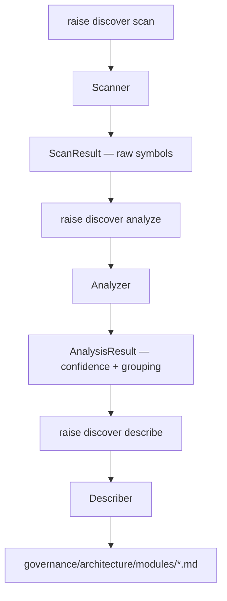

# Story: Architecture Knowledge Layer

> **Standalone** — F&F critical path | **Complexity**: complex | **SP**: 8

---

## 1. What & Why

**Problem**: Rai has 300 components and 787 graph concepts but zero module-level dependency edges. Every session, Rai re-discovers module relationships, data flows, and architectural constraints — costing 5-15 minutes of context-building that should be pre-computed.

**Value**: A dual-purpose architecture knowledge layer that serves humans (onboarding, drift prevention) AND AI (semantic density, deterministic retrieval). Architecture documentation as **technical governance** — preventing structural drift, not just describing structure.

---

## 2. Approach

**How we'll solve it**: Add `raise discover describe` command that generates per-module architecture docs in `governance/architecture/`. Each doc uses Markdown + YAML frontmatter — human-readable body with machine-parseable metadata. The frontmatter integrates into the unified graph as new `module` node type with `depends_on` edges.

**Components affected**:
- **`src/raise_cli/discovery/describer.py`**: Create — core generation logic
- **`src/raise_cli/cli/commands/discover.py`**: Modify — add `describe` subcommand
- **`src/raise_cli/context/models.py`**: Modify — add `module` to NodeType, `depends_on` to EdgeType
- **`src/raise_cli/context/builder.py`**: Modify — extract architecture docs into graph
- **`src/raise_cli/output/formatters/discover.py`**: Modify — add describe formatter
- **`governance/architecture/`**: Create — output directory for generated docs
- **`.claude/skills/discover-describe/`**: Create — skill orchestration
- **Jinja2 template**: Create — module doc template

---

## 3. Interface / Examples

### CLI Usage

```bash
# Generate architecture docs for all modules
raise discover describe

# Generate for specific module(s)
raise discover describe --module discovery --module context

# Generate compact index only (for quick context loading)
raise discover describe --index-only

# Specify output directory (default: governance/architecture/)
raise discover describe --output-dir governance/architecture/

# JSON output for programmatic consumption
raise discover describe --output json
```

### Expected Output (Human)

```
Architecture Knowledge Layer
─────────────────────────────

  Modules described: 11
  Components mapped: 309
  Dependencies:      23 edges
  Constraints:       8

  Output: governance/architecture/
  ├── index.md           (1,847 tokens)
  ├── modules/cli.md
  ├── modules/config.md
  ├── modules/context.md
  ├── modules/core.md
  ├── modules/discovery.md
  ├── modules/governance.md
  ├── modules/memory.md
  ├── modules/onboarding.md
  ├── modules/output.md
  ├── modules/schemas.md
  └── modules/telemetry.md

  ✓ Graph-ready: YAML frontmatter parseable
  ✓ Compact index: <2K tokens (session-loadable)
```

### Generated Module Doc Example

```markdown
---
type: module
name: discovery
purpose: "Codebase analysis — scanning, confidence scoring, validation, and drift detection"
status: current
depends_on: [core, schemas]
depended_by: [cli, context]
entry_points:
  - "raise discover scan"
  - "raise discover analyze"
  - "raise discover describe"
  - "raise discover drift"
  - "raise discover build"
public_api:
  - "Scanner.scan_directory"
  - "Analyzer.analyze"
  - "DriftDetector.detect_drift"
  - "Describer.describe"
components: 42
constraints:
  - "Independent of governance module — no cross-imports"
  - "All analysis is deterministic — no AI inference in CLI"
last_validated: "2026-02-07"
---

## Purpose

The discovery module extracts structural knowledge from source code
and transforms it into validated, graph-ready components. It answers
"what exists in this codebase and how is it organized?" without
requiring AI inference — all signals are deterministic.

## Architecture



**Key files:**
- `scanner.py` — Tree-sitter symbol extraction (551 symbols from raise-commons)
- `analyzer.py` — Confidence scoring, path categorization, module grouping (99% coverage)
- `describer.py` — Architecture doc generation from analysis + components
- `drift.py` — Baseline comparison for structural drift detection

## Dependencies

| Depends On | Why |
|-----------|-----|
| `core` | File operations, git utilities |
| `schemas` | Pydantic models for scan results |

| Depended By | Why |
|------------|-----|
| `cli.commands.discover` | CLI entry points |
| `context.builder` | Graph integration of components |

## Non-Goals

- **Not a code generator** — describes structure, doesn't create it
- **Not an AI analysis tool** — all scoring is deterministic
- **Not a documentation platform** — generates files, doesn't serve them

## Conventions

- All public functions return Pydantic models (not dicts)
- Scanner output is language-agnostic (Symbol model)
- Analyzer categories are path-based, configurable via YAML
```

### Compact Index Example (governance/architecture/index.md)

```markdown
---
type: architecture_index
project: raise-cli
generated: "2026-02-07"
modules: 11
components: 309
token_estimate: 1847
---

# raise-cli Architecture

> Compact index for AI context loading (~1.8K tokens).
> Full module docs: `governance/architecture/modules/`

## System Overview

raise-cli is a Python CLI toolkit for the RaiSE framework. It provides
deterministic governance operations, codebase discovery, and memory
management for AI-assisted software engineering.

## Module Map

| Module | Purpose | Depends On | Components |
|--------|---------|-----------|------------|
| `cli` | Typer CLI commands and entry points | all modules | 45 |
| `config` | Settings cascade (CLI → env → file → defaults) | core | 12 |
| `context` | Unified graph: build, query, traverse | governance, memory, schemas | 38 |
| `core` | Shared utilities: git, file ops, paths | — | 15 |
| `discovery` | Code scanning, analysis, drift detection | core, schemas | 42 |
| `governance` | Markdown extraction → concept graph | core, schemas | 35 |
| `memory` | Pattern/calibration JSONL management | core, schemas | 28 |
| `onboarding` | Bootstrap, skills install, profile setup | core, config | 34 |
| `output` | Formatters: human, json, table | schemas | 22 |
| `schemas` | Pydantic models for all data structures | — | 18 |
| `telemetry` | Local signal emission (JSONL append) | core | 11 |

## Data Flows

```
Governance files → extractor → concept nodes → graph
Source code → scanner → analyzer → components → graph
Patterns/sessions → JSONL → memory loader → graph
                                              ↓
                                        unified graph
                                              ↓
                                     raise memory query
```

## Constraints

- `core` and `schemas` have no internal dependencies (leaf modules)
- `cli` depends on all other modules but nothing depends on `cli`
- `governance` and `discovery` are independent of each other
- All CLI output goes through `output` formatters
```

### Data Structures

```python
# New Pydantic model in describer.py
class ModuleDescription(BaseModel):
    """Description of a single module for architecture docs."""
    name: str
    purpose: str
    status: Literal["current", "deprecated", "planned"] = "current"
    depends_on: list[str] = Field(default_factory=list)
    depended_by: list[str] = Field(default_factory=list)
    entry_points: list[str] = Field(default_factory=list)
    public_api: list[str] = Field(default_factory=list)
    components: int = 0
    constraints: list[str] = Field(default_factory=list)
    files: list[str] = Field(default_factory=list)

class DescribeResult(BaseModel):
    """Result of describe operation."""
    modules: list[ModuleDescription]
    total_components: int
    total_dependencies: int
    total_constraints: int
    index_tokens: int
    output_dir: str
```

---

## 4. Acceptance Criteria

### Must Have

- [ ] `raise discover describe` generates `governance/architecture/index.md`
- [ ] `raise discover describe` generates per-module docs in `governance/architecture/modules/`
- [ ] YAML frontmatter is valid and parseable (type, name, purpose, depends_on, depended_by, entry_points, public_api, constraints)
- [ ] `module` added to NodeType in context/models.py; `depends_on` added to EdgeType
- [ ] Graph builder extracts architecture docs into graph as `module` nodes with `depends_on` edges
- [ ] Compact index fits under 2K tokens
- [ ] Tests pass with >90% coverage on new code
- [ ] Dogfood: generated docs for raise-commons are accurate and useful

### Should Have

- [ ] Mermaid diagrams in module docs (dependency flow)
- [ ] `--module` flag for targeted generation
- [ ] `/discover-describe` skill for orchestrated workflow

### Must NOT

- [ ] **MUST NOT** require AI inference — all generation is deterministic (templates + data)
- [ ] **MUST NOT** overwrite human-authored sections if they exist (merge strategy)
- [ ] **MUST NOT** add Jinja2 as hard dependency — use string templates if simpler

---

<details>
<summary><h2>5. Detailed Scenarios</h2></summary>

### Scenario 1: First-time generation

```gherkin
Given a project with components-validated.json (309 components)
And no existing governance/architecture/ directory
When I run `raise discover describe`
Then governance/architecture/index.md is created
And governance/architecture/modules/*.md are created (one per module)
And each module doc has valid YAML frontmatter
And the compact index is under 2K tokens
```

### Scenario 2: Re-generation preserves human edits

```gherkin
Given existing governance/architecture/modules/discovery.md
And the human has added a "## Design Rationale" section
When I run `raise discover describe`
Then the YAML frontmatter is updated with current data
And the auto-generated sections are refreshed
And the human-authored "## Design Rationale" section is preserved
```

### Scenario 3: Graph integration

```gherkin
Given governance/architecture/ docs exist with YAML frontmatter
When I run `raise memory build`
Then the unified graph contains `module` nodes for each documented module
And `depends_on` edges connect modules per their frontmatter
And `raise memory query "discovery dependencies"` returns module relationships
```

</details>

---

<details>
<summary><h2>6. Algorithm / Logic</h2></summary>

### Module Detection & Dependency Extraction

```python
def detect_modules(project_root: Path) -> list[ModuleDescription]:
    """Detect modules from source tree and extract dependencies.

    Strategy:
    1. Walk src/raise_cli/ — each subdirectory with __init__.py = module
    2. For each module, collect components from components-validated.json
    3. Extract imports between modules (deterministic AST or grep)
    4. Derive entry_points from CLI commands that import the module
    5. Derive public_api from exported symbols (non-underscore-prefixed)
    6. Derive constraints from existing ADRs mentioning the module
    """
    ...

def render_module_doc(module: ModuleDescription, template: str) -> str:
    """Render a module description using template.

    Sections:
    - YAML frontmatter: auto-generated from ModuleDescription
    - Purpose: from module __init__.py docstring or components
    - Architecture: Mermaid diagram of internal structure
    - Dependencies: table from depends_on/depended_by
    - Non-Goals: from constraints + inverse of purpose
    - Conventions: from ADRs + patterns mentioning module
    """
    ...
```

### Human Section Preservation

```python
def merge_with_existing(generated: str, existing: str) -> str:
    """Merge auto-generated content with human-authored sections.

    Rules:
    1. YAML frontmatter: always replace with generated
    2. Known sections (Purpose, Architecture, Dependencies): replace
    3. Unknown sections (human-added): preserve at end
    4. If no existing file: use generated as-is
    """
    ...
```

**Rationale**: Two-layer model — auto-generated structure refreshes freely, human intent is preserved.

</details>

---

<details>
<summary><h2>7. Constraints</h2></summary>

| Type | Constraint | Rationale |
|------|-----------|-----------|
| **Performance** | Generate all 11 modules in <5 seconds | CLI responsiveness |
| **Token budget** | Compact index <2K tokens | Session-loadable without bloat |
| **Dependencies** | No new PyPI dependency if avoidable | F&F simplicity — use f-strings or textwrap over Jinja2 |
| **Backward compat** | New NodeType/EdgeType must not break existing graphs | PAT-152: schema changes invalidate cached graphs |
| **Determinism** | Zero AI inference in CLI command | Constitution principle: deterministic governance tools |

</details>

---

## References

**Research**: `work/research/architecture-knowledge-layer/` (RES-ARCH-KNOWLEDGE-001)
- 36 sources, 50+ URLs, 5 triangulated findings
- Key pattern: Two-layer model (auto structure + human intent)

**Related ADRs**:
- ADR-019: Unified Context Graph Architecture
- ADR-012: Skills + Toolkit Architecture
- ADR-011: Three-Directory Model

**Related Patterns**:
- PAT-152: Schema Literal changes invalidate cached graphs
- PAT-134: Domain-centric CLI organization
- PAT-163: Dogfooding surfaces real deficiencies
- PAT-168: Discovery pipeline is the product; docs are the last mile

**Prior art**:
- Aider repo-map (PageRank, 1K token budget)
- C4 Model (Context > Container > Component > Code)
- llms.txt (index + full content)
- CLAUDE.md (dual-purpose markdown)

---

**Template Version**: 2.0 (Lean Feature Spec)
**Created**: 2026-02-07
