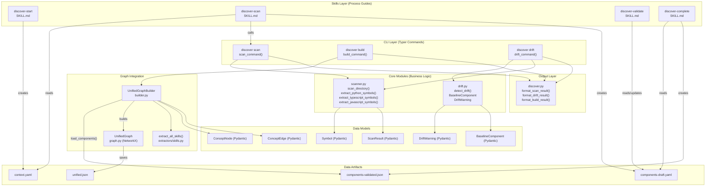
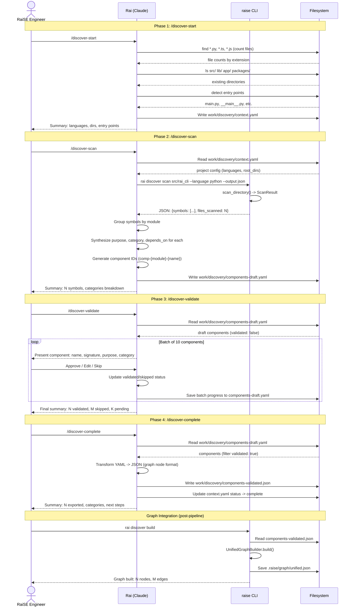
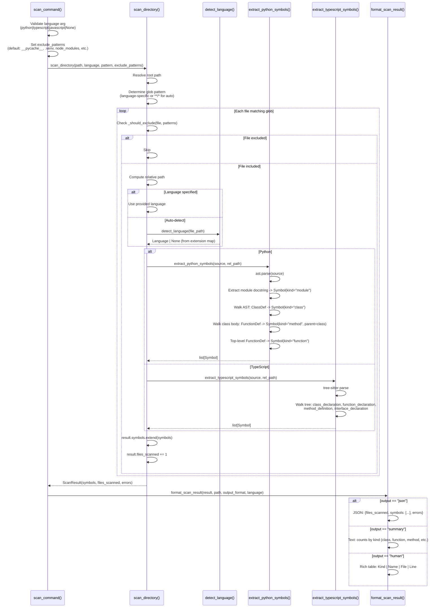
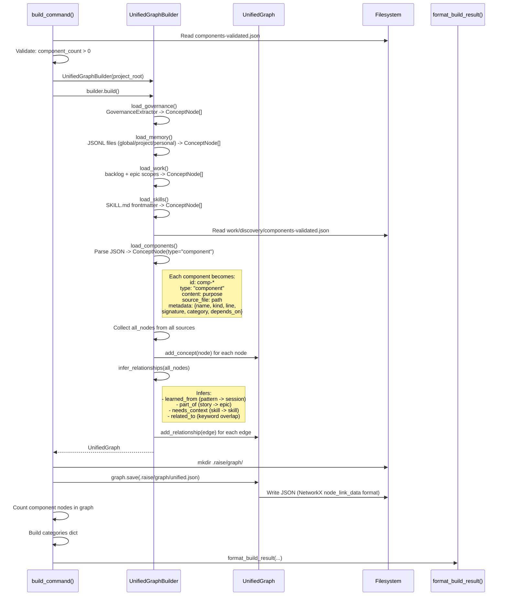

# Discovery Pipeline: Current Architecture Report

> **Generated:** 2026-02-07
> **Context:** Architecture analysis to inform discover-validate scaling story
> **Source:** All files read from implementation, not documentation

---

## 1. Pipeline Overview

The raise-cli discovery pipeline is a four-phase process that transforms raw source code into a queryable component catalog within the unified context graph. Each phase is orchestrated by a skill (markdown process guide) that instructs the AI assistant, which in turn calls deterministic CLI commands.

**Pipeline phases:**

| Phase | Skill | CLI Command | Output Artifact |
|-------|-------|-------------|-----------------|
| 1. Start | `/discover-start` | *(manual file detection)* | `work/discovery/context.yaml` |
| 2. Scan | `/discover-scan` | `rai discover scan` | `work/discovery/components-draft.yaml` |
| 3. Validate | `/discover-validate` | *(AI-human interaction loop)* | Updated `components-draft.yaml` |
| 4. Complete | `/discover-complete` | *(AI file transformation)* | `work/discovery/components-validated.json` |

Post-pipeline, a fifth step integrates validated components into the unified graph:

| Step | CLI Command | Output |
|------|-------------|--------|
| Build | `rai discover build` | `.raise/graph/unified.json` |

Additionally, `rai discover drift` provides ongoing architectural compliance checks against the validated baseline.

**Key architectural decision:** Skills are process guides (markdown), not executable code. The AI assistant (Claude/Rai) reads the skill and executes it step-by-step, calling CLI tools and file operations as needed. This means phases 1, 3, and 4 have **no deterministic CLI implementation** -- they are entirely AI-orchestrated workflows.

---

## 2. Component Diagram



---

## 3. Sequence Diagrams

### 3a. Full Pipeline Flow



### 3b. Scan Detail



### 3c. Graph Integration



---

## 4. Data Model

### 4.1 Symbol (scanner.py)

The core extraction unit. Produced by `extract_python_symbols()`, `extract_typescript_symbols()`, and `extract_javascript_symbols()`.

```python
class Symbol(BaseModel):
    name: str           # e.g., "UserService", "get_user"
    kind: SymbolKind    # Literal["class", "function", "method", "module", "interface"]
    file: str           # Relative path to source file
    line: int           # Line number (1-indexed)
    signature: str      # e.g., "class UserService(BaseService)"  (default: "")
    docstring: str | None  # Symbol's docstring if present (default: None)
    parent: str | None  # Parent class name for methods (default: None)
```

**Key types:**
- `SymbolKind = Literal["class", "function", "method", "module", "interface"]`
- `Language = Literal["python", "typescript", "javascript"]`

### 4.2 ScanResult (scanner.py)

Aggregated result from scanning a directory.

```python
class ScanResult(BaseModel):
    symbols: list[Symbol]    # All extracted symbols
    files_scanned: int       # Number of files processed (default: 0)
    errors: list[str]        # Files that failed to parse (default: [])
```

### 4.3 ConceptNode (models.py)

The universal node in the unified context graph. All concept types share this schema.

```python
class ConceptNode(BaseModel):
    id: str              # Unique ID (e.g., "comp-scanner-symbol", "PAT-001", "/story-plan")
    type: NodeType       # Literal["pattern", "calibration", "session", "principle",
                         #         "requirement", "outcome", "project", "epic",
                         #         "story", "skill", "decision", "guardrail",
                         #         "term", "component"]
    content: str         # Main text content or description
    source_file: str | None  # Path to source file (default: None)
    created: str         # ISO timestamp
    metadata: dict[str, Any]  # Type-specific attributes (default: {})
```

For `type="component"`, the metadata dict contains:
```python
metadata = {
    "name": str,           # Symbol name
    "kind": str,           # class, function, method
    "line": int,           # Source line number
    "signature": str,      # Full signature
    "category": str,       # model, service, utility, etc.
    "depends_on": list[str],  # Key dependencies
    "validated_by": str,   # "human" or "bulk-approve"
    "validated_at": str,   # ISO timestamp
}
```

### 4.4 ConceptEdge (models.py)

Directed relationship between concepts.

```python
class ConceptEdge(BaseModel):
    source: str           # Source node ID
    target: str           # Target node ID
    type: EdgeType        # Literal["learned_from", "governed_by", "applies_to",
                          #         "needs_context", "implements", "part_of", "related_to"]
    weight: float         # Edge weight for ranking (default: 1.0)
    metadata: dict[str, Any]  # Additional attributes (default: {})
```

### 4.5 Drift Models (drift.py)

```python
class DriftWarning(BaseModel):
    file: str              # Path to file with drift
    issue: str             # Description of the drift issue
    severity: DriftSeverity  # Literal["info", "warning", "error"]
    suggestion: str        # Suggested fix (default: "")

class BaselineComponent(BaseModel):
    source_file: str       # Path to source file (default: "")
    content: str           # Component content/docstring (default: "")
    metadata: BaselineComponentMetadata  # {name: str, kind: str}
```

### 4.6 Data File Schemas

**context.yaml** (Phase 1 output):
```yaml
project:
  name: string           # From pyproject.toml, package.json, or dirname
  languages: string[]    # ["python", "typescript", "javascript"]
  root_dirs: string[]    # ["src/rai_cli"]
  entry_points: string[] # ["src/rai_cli/cli/main.py"]
  detected_at: string    # ISO timestamp
status: string           # "initialized" | "scanning" | "validated" | "complete"
```

**components-draft.yaml** (Phase 2 output, updated in Phase 3):
```yaml
generated_at: string
source_command: string
symbol_count: int        # Total symbols extracted (including internal)
public_count: int        # Public symbols only

components:
  - id: string           # comp-{module}-{name}
    name: string
    kind: string         # class | function | method | module
    file: string         # Relative path
    line: int
    signature: string
    purpose: string      # Synthesized by Rai
    category: string     # service | model | utility | handler | parser | builder | schema | command | test
    depends_on: string[]
    internal: boolean
    validated: boolean
    validated_by: string   # Added after validation
    validated_at: string   # Added after validation
    skipped: boolean       # Added if human skips
    skip_reason: string    # Added if human skips
```

**components-validated.json** (Phase 4 output):
```json
{
  "generated_at": "ISO timestamp",
  "source_file": "work/discovery/components-draft.yaml",
  "component_count": 156,
  "components": [
    {
      "id": "comp-{module}-{name}",
      "type": "component",
      "content": "purpose description",
      "source_file": "path/to/file.py",
      "created": "ISO timestamp",
      "metadata": {
        "name": "SymbolName",
        "kind": "class|function|method",
        "line": 123,
        "signature": "full signature",
        "category": "model|service|utility|...",
        "depends_on": ["dep1", "dep2"],
        "validated_by": "human|bulk-approve|auto-high-confidence",
        "validated_at": "ISO timestamp"
      }
    }
  ]
}
```

---

## 5. CLI Commands Detail

### 5.1 `rai discover scan`

**Function:** `scan_command()` in `src/rai_cli/cli/commands/discover.py`

| Parameter | Type | Default | Description |
|-----------|------|---------|-------------|
| `path` | `Path` (argument) | `.` | Directory to scan. Must exist, must be directory. |
| `--language, -l` | `str \| None` | `None` | Language filter: `python`, `typescript`, `javascript`. Auto-detect if not set. |
| `--output, -o` | `str` | `"human"` | Output format: `human` (Rich table), `json`, `summary`. |
| `--pattern, -p` | `str \| None` | `None` | Custom glob pattern. Uses language-specific default if not set. |
| `--exclude, -e` | `list[str] \| None` | `None` | Exclude patterns (repeatable). Defaults to `__pycache__`, `.venv`, `node_modules`, `dist`, `build`, `.git`. |

**Calls:** `scan_directory()` from `raise_cli.discovery.scanner`
**Input:** Directory path on filesystem
**Output:** Formatted to console (human table, JSON, or summary)

**Exit codes:**
- `0` -- Success
- `7` -- Invalid language argument

**JSON output schema:**
```json
{
  "files_scanned": 42,
  "symbols": [
    {
      "name": "Symbol",
      "kind": "class",
      "file": "scanner.py",
      "line": 44,
      "signature": "class Symbol(BaseModel)",
      "docstring": "A code symbol...",
      "parent": null
    }
  ],
  "errors": []
}
```

### 5.2 `rai discover build`

**Function:** `build_command()` in `src/rai_cli/cli/commands/discover.py`

| Parameter | Type | Default | Description |
|-----------|------|---------|-------------|
| `--input, -i` | `Path \| None` | `None` | Path to validated components JSON. Default: `work/discovery/components-validated.json` |
| `--project-root, -r` | `Path` | `.` | Project root directory. |
| `--output, -o` | `str` | `"human"` | Output format: `human`, `json`, `summary`. |

**Calls:** `UnifiedGraphBuilder.build()` from `raise_cli.context.builder`
**Input:** `components-validated.json` (and all other graph sources)
**Output:** `.raise/graph/unified.json` (full unified graph with all concept types)

**Exit codes:**
- `0` -- Success
- `4` -- Components file not found
- `1` -- No components in input file, or invalid JSON

**Important implementation detail:** `build_command()` first reads and validates the input JSON independently, then calls `UnifiedGraphBuilder.build()` which loads components *again* from the same default path. The builder method `load_components()` hardcodes the path `work/discovery/components-validated.json` relative to `project_root`. If `--input` points to a non-default path, the builder will still look at the default path. This is a potential discrepancy between the CLI's input validation and the builder's actual loading logic.

### 5.3 `rai discover drift`

**Function:** `drift_command()` in `src/rai_cli/cli/commands/discover.py`

| Parameter | Type | Default | Description |
|-----------|------|---------|-------------|
| `path` | `Path \| None` (argument) | `None` | Directory to scan. Default: `src/` under project root. |
| `--project-root, -r` | `Path` | `.` | Project root directory. |
| `--output, -o` | `str` | `"human"` | Output format: `human`, `json`, `summary`. |

**Calls:** `detect_drift()` from `raise_cli.discovery.drift`, `scan_directory()` from `raise_cli.discovery.scanner`
**Input:** `components-validated.json` as baseline + live directory scan
**Output:** List of drift warnings (location, naming, docstring drift)

**Exit codes:**
- `0` -- No drift (or no baseline/scan path)
- `1` -- Drift warnings detected

**Drift types detected:**
1. **Location drift:** Symbol kind found in directory not seen in baseline (e.g., a class in an unexpected module).
2. **Naming drift:** Class not PascalCase; function doesn't match established prefix patterns (requires 2+ occurrences of prefix in baseline).
3. **Docstring drift:** Public class or function missing docstring when >50% of baseline has docstrings.

---

## 6. Current Bottlenecks

### 6.1 Human Bottleneck in Validation (Critical)

The `/discover-validate` skill presents components **one at a time** in batches of 10. For the raise-cli codebase:
- **383 symbols extracted**, 156 public
- That is **~16 batches** of 10 for a full review
- Each component requires an approve/edit/skip decision

In practice (as noted in `scope.md`), this was mitigated by using `auto-high-confidence` bulk approval based on docstring presence. The `components-draft.yaml` header confirms: `validation_method: "auto-high-confidence (docstring-based)"` and all 156 components show `validated_by: auto-high-confidence`. **No actual per-component human validation occurred** -- the skill's designed interaction loop was bypassed entirely.

For brownfield projects (50-200K lines), the scope document estimates 200-500 batches -- clearly impractical.

### 6.2 Data Available But Not Used for Confidence Scoring

The scanner already produces several signals that could inform auto-categorization and confidence:

| Signal | Available in Symbol | Currently Used for Validation |
|--------|-------------------|-------------------------------|
| `docstring` | Yes (str \| None) | **No** -- skill doesn't reference |
| `signature` | Yes (includes types, return types) | **No** |
| `parent` | Yes (class name for methods) | **No** |
| `kind` | Yes (class/function/method/module/interface) | **No** -- only for display |
| `file` path | Yes (module location) | **No** -- not mapped to category |
| Line count / complexity | **Not extracted** | N/A |

**Specific missed opportunities:**
1. **Docstring presence** is a strong confidence signal. Symbols with docstrings have self-described purpose -- the synthesized description can be directly compared.
2. **File path conventions** encode category: `cli/commands/*.py` implies `command`, `**/models.py` implies `model/schema`, `governance/parsers/*.py` implies `parser`. This mapping is not implemented.
3. **Signature type annotations** indicate code quality and predictability. Fully-typed signatures correlate with well-maintained code.
4. **Parent class** for methods: methods in a known validated class don't need individual validation.

### 6.3 Scan Output That Could Inform Auto-Categorization

The scanner extracts raw data that the skill's synthesis step must interpret. Several patterns are already computable:

1. **Module-level grouping:** `_extract_module_symbol()` captures module docstrings. Modules with good docstrings can have their components auto-categorized as a batch.

2. **Class inheritance in signature:** `class FooError(RaiseError)` -- suffix `Error` + inherits `Exception`-chain = category `model` (or more precisely, `exception`). The current category set doesn't distinguish exceptions from models.

3. **Method vs function:** Methods always have a `parent` field set. If the parent class is validated, its methods could be batch-validated.

4. **Naming conventions already detected by drift module:** The `_extract_naming_patterns()` function in `drift.py` extracts prefix patterns (e.g., `extract_`, `_check_`, `format_`). These same patterns could be used to auto-categorize during scan synthesis.

### 6.4 Structural Gap: No CLI Command for Validate or Complete

Phases 1, 3, and 4 are entirely AI-orchestrated with no deterministic CLI backing. This means:
- **No reproducibility**: Two different AI sessions may produce different outputs.
- **No automation**: Cannot run validation in CI/CD.
- **No testing**: The validation logic lives in markdown, not in testable code.

Phase 2 has a solid `rai discover scan` command, and the post-pipeline has `rai discover build`. The middle phases (validate and complete) are manual.

### 6.5 Build Command Path Discrepancy

As noted in section 5.2, `build_command()` accepts a `--input` parameter for the components file, but `UnifiedGraphBuilder.load_components()` hardcodes the path to `work/discovery/components-validated.json`. If a user provides a custom input path, the builder ignores it. The CLI validates and counts from the custom path, but the actual graph loading reads from the default. This would silently produce incorrect results with custom paths.

---

## 7. Data Flow Summary

```mermaid
graph LR
    subgraph Phase1 ["Phase 1: Start"]
        A1[Project Files<br/>pyproject.toml<br/>*.py, *.ts, *.js] -->|"detect languages,<br/>dirs, entries"| A2[context.yaml<br/>status: initialized]
    end

    subgraph Phase2 ["Phase 2: Scan"]
        A2 -->|"read config"| B1[raise discover scan]
        B1 -->|"ast.parse /<br/>tree-sitter"| B2[ScanResult<br/>symbols: Symbol[]]
        B2 -->|"AI synthesis:<br/>purpose, category,<br/>depends_on"| B3[components-draft.yaml<br/>validated: false]
    end

    subgraph Phase3 ["Phase 3: Validate"]
        B3 -->|"present to human"| C1{Human Review<br/>Approve / Edit / Skip}
        C1 -->|"approve"| C2[components-draft.yaml<br/>validated: true]
        C1 -->|"skip"| C3[components-draft.yaml<br/>skipped: true]
        C1 -->|"edit"| C4[Updated purpose/category] --> C2
    end

    subgraph Phase4 ["Phase 4: Complete"]
        C2 -->|"filter validated"| D1[Transform:<br/>YAML → JSON<br/>graph node format]
        D1 --> D2[components-validated.json<br/>156 components]
    end

    subgraph Phase5 ["Graph Build"]
        D2 -->|"raise discover build"| E1[UnifiedGraphBuilder]
        E2[Governance<br/>Memory<br/>Work<br/>Skills] -->|"other sources"| E1
        E1 -->|"build + infer edges"| E3[unified.json<br/>NetworkX graph]
    end

    subgraph Ongoing ["Drift Detection"]
        D2 -->|"baseline"| F1[raise discover drift]
        F2[Live scan<br/>scan_directory()] -->|"current state"| F1
        F1 --> F3[DriftWarning[]<br/>location / naming / docstring]
    end
```

### Detailed Transform Chain

```
Phase 1 (AI-orchestrated):
  find/ls commands  →  context.yaml {name, languages, root_dirs, entry_points}

Phase 2 (CLI + AI):
  source files  →  [ast.parse / tree-sitter]  →  Symbol[]  →  [AI synthesis]  →  components-draft.yaml

Phase 3 (AI-orchestrated, human-in-loop):
  components-draft.yaml  →  [present batch]  →  [human decision]  →  updated components-draft.yaml

Phase 4 (AI-orchestrated):
  components-draft.yaml (validated=true)  →  [filter + transform]  →  components-validated.json

Graph Build (CLI):
  components-validated.json  →  ConceptNode(type="component")  →  UnifiedGraph  →  unified.json
  + governance, memory, work, skills                              + inferred edges

Drift Check (CLI):
  components-validated.json  →  BaselineComponent[]  ─┐
  scan_directory(path)       →  Symbol[]              ─┤→  detect_drift()  →  DriftWarning[]
```

### Key Discrepancies: Skills vs Implementation

| Skill Says | Implementation Does | Gap |
|------------|-------------------|-----|
| `/discover-start` creates context.yaml | No CLI command exists -- entirely AI writes to file | No deterministic implementation |
| `/discover-scan` calls `rai discover scan ... --output json` | CLI command exists and works correctly | Aligned |
| `/discover-scan` says AI synthesizes descriptions | No CLI support for synthesis -- AI does it inline | Synthesis is non-deterministic |
| `/discover-validate` presents batches of 10 | No CLI backing -- entirely AI interaction | No testable validation logic |
| `/discover-validate` saves progress per batch | AI must manually rewrite YAML | No atomic save mechanism |
| `/discover-complete` transforms YAML to JSON | No CLI command -- AI transforms and writes file | No deterministic implementation |
| `/discover-complete` says `rai discover build` integrates | `build_command()` exists and works | Aligned |
| Skills reference `components-validated.json` schema | Builder `load_components()` implements exact schema | Aligned |

---

*Report generated from source code analysis. All function signatures, types, and behaviors verified against implementation.*
